# Enterprise Cryptographic Management Guideline

**Classification:** Internal — Restricted  
**Version:** 1.5 (REDLINE DRAFT)  
**Date:** March 2026  
**Owner:** Information Security Architecture  
**Review Cycle:** Annual, or upon regulatory change, platform adoption, or key compromise event  
**Status:** REDLINE DRAFT — Pending Security Architect Review

---

## Revision History

| Version | Date | Change Summary |
|---------|------|----------------|
| 1.0 | March 2026 | Initial draft baseline |
| 1.1 | March 2026 | Redline update to strengthen auditable language, add inventory management and review process, add cryptographic design and approval process, add traceable numbered requirements, expand checklists, and tighten dependency vulnerability management controls |
| 1.2 | March 2026 | Added China / NIST / European cross-standard algorithm comparison tables, use-case mappings, equivalent algorithm notes, recommended-now and do-not-use tables, and linked reference updates |
| 1.3 | March 2026 | Assumed GCP adoption for planning, expanded GCP encryption and key management examples, and corrected Section 7 architecture diagram to show illustrative relationships only with Entra linked to on-premises rather than AWS KMS |
| 1.4 | March 2026 | Consolidated algorithm guidance by merging Chinese equivalents, PQC choices, and do-not-use notes into Section 3.2; reduced overlap with Section 5.6 and made Section 3.2 the primary single-reference algorithm catalogue |
| 1.5 | March 2026 | Made Section 3.2 operational with Mandatory / Permitted by Exception / Forbidden columns, reduced residual overlap with Section 5.6, and added algorithm traceability requirements to Appendix F |

---

## Table of Contents

- [1. Introduction & Purpose](#1-introduction--purpose)
  - [1.1 Document Purpose](#11-document-purpose)
  - [1.2 Applicability & Scope](#12-applicability--scope)
  - [1.3 Maintenance & Review Cycle](#13-maintenance--review-cycle)
  - [1.4 Normative Language & Requirement Traceability](#14-normative-language--requirement-traceability)
- [2. Regulatory & Standards Framework](#2-regulatory--standards-framework)
  - [2.1 Governing Regulatory Hierarchy](#21-governing-regulatory-hierarchy)
  - [2.2 HK CoP Cryptographic Requirements Mapping](#22-hk-cop-cryptographic-requirements-mapping)
  - [2.3 Compliance Calendar](#23-compliance-calendar)
- [3. Cryptographic Taxonomy & Definitions](#3-cryptographic-taxonomy--definitions)
  - [3.1 Terminology Glossary](#31-terminology-glossary)
  - [3.2 Cryptographic Function Types](#32-cryptographic-function-types)
  - [3.3 Forbidden & Deprecated Algorithm List](#33-forbidden--deprecated-algorithm-list)
- [4. Key Management Lifecycle](#4-key-management-lifecycle)
  - [4.1 Key Generation](#41-key-generation)
  - [4.2 Key Storage & Protection](#42-key-storage--protection)
  - [4.3 Key Distribution & Wrapping](#43-key-distribution--wrapping)
  - [4.4 Key Usage Controls](#44-key-usage-controls)
  - [4.5 Key Rotation](#45-key-rotation)
  - [4.6 Key Backup & Recovery](#46-key-backup--recovery)
  - [4.7 Key Revocation & Suspension](#47-key-revocation--suspension)
  - [4.8 Key Archival & Destruction](#48-key-archival--destruction)
  - [4.9 Inventory Management & Review Process](#49-inventory-management--review-process)
- [5. Algorithm Approval Policy & Cipher Suite Standards](#5-algorithm-approval-policy--cipher-suite-standards)
  - [5.1 Approved TLS Cipher Suites](#51-approved-tls-cipher-suites)
  - [5.2 SSH Configuration Standards](#52-ssh-configuration-standards)
  - [5.3 Data-at-Rest Encryption Standards](#53-data-at-rest-encryption-standards)
  - [5.4 Code Signing & Container Image Signing](#54-code-signing--container-image-signing)
  - [5.5 Certificate Authority Policy](#55-certificate-authority-policy)
  - [5.6 Algorithm Cross-Reference Note](#56-algorithm-cross-reference-note)
- [6. Quantum-Safe Migration Programme](#6-quantum-safe-migration-programme)
  - [6.1 Threat Timeline & Business Rationale](#61-threat-timeline--business-rationale)
  - [6.2 PQC Algorithm Adoption](#62-pqc-algorithm-adoption)
  - [6.3 Migration Phases](#63-migration-phases)
  - [6.4 Crypto-Agility Implementation Guidelines](#64-crypto-agility-implementation-guidelines)
- [7. Cryptographic Architecture — Technology Stack](#7-cryptographic-architecture--technology-stack)
  - [7.1 On-Premises HSM](#71-on-premises-hsm)
  - [7.2 CyberArk Vault & Conjur](#72-cyberark-vault--conjur)
  - [7.3 AWS KMS & Secrets Manager](#73-aws-kms--secrets-manager)
  - [7.4 Alibaba Cloud KMS](#74-alibaba-cloud-kms)
  - [7.5 Huawei Private Cloud — DEW & KMS](#75-huawei-private-cloud--dew--kms)
  - [7.6 Azure Key Vault & Entra ID](#76-azure-key-vault--entra-id)
  - [7.7 GCP Cloud KMS](#77-gcp-cloud-kms)
- [8. Developer Implementation Guide](#8-developer-implementation-guide)
  - [8.1 How to Use This Guide](#81-how-to-use-this-guide)
  - [8.2 Cryptographic Function Design Template](#82-cryptographic-function-design-template)
  - [8.3 Secrets Management for Applications](#83-secrets-management-for-applications)
  - [8.4 TLS/mTLS Implementation Patterns](#84-tlsmtls-implementation-patterns)
  - [8.5 JWT & Token Signing](#85-jwt--token-signing)
  - [8.6 Database & Storage Encryption](#86-database--storage-encryption)
  - [8.7 Container Image Signing](#87-container-image-signing)
- [9. Monitoring, Detection & SIEM Integration](#9-monitoring-detection--siem-integration)
  - [9.1 Cryptographic Events to Monitor](#91-cryptographic-events-to-monitor)
  - [9.2 Log Sources & SIEM Integration](#92-log-sources--siem-integration)
  - [9.3 Key SIEM Correlation Rules](#93-key-siem-correlation-rules)
- [10. Key Compromise & Incident Response](#10-key-compromise--incident-response)
  - [10.1 Compromise Indicators](#101-compromise-indicators)
  - [10.2 Emergency Revocation Procedures](#102-emergency-revocation-procedures)
  - [10.3 Regulatory Notification Obligations](#103-regulatory-notification-obligations)
  - [10.4 Post-Compromise Recovery](#104-post-compromise-recovery)
- [11. Roles, Responsibilities & Governance](#11-roles-responsibilities--governance)
  - [11.1 Role Definitions](#111-role-definitions)
  - [11.2 Separation of Duties & RACI](#112-separation-of-duties--raci)
- [12. Third-Party & Supply Chain Cryptography](#12-third-party--supply-chain-cryptography)
  - [12.1 External PKI & Certificate Authority Policy](#121-external-pki--certificate-authority-policy)
  - [12.2 Third-Party Integration Assessment Checklist](#122-third-party-integration-assessment-checklist)
  - [12.3 Open Source Library Governance](#123-open-source-library-governance)
- [13. Appendices](#13-appendices)
  - [Appendix A — Platform Integration Technical Reference](#appendix-a--platform-integration-technical-reference)
  - [Appendix B — Cryptographic Function Design Template](#appendix-b--cryptographic-function-design-template)
  - [Appendix C — Key Inventory Registry Template](#appendix-c--key-inventory-registry-template)
  - [Appendix D — Compliance Checklist](#appendix-d--compliance-checklist)
  - [Appendix E — Approved Algorithm Quick Reference Card](#appendix-e--approved-algorithm-quick-reference-card)
  - [Appendix F — Requirement Traceability Matrix](#appendix-f--requirement-traceability-matrix)
  - [Appendix G — Operational Checklists](#appendix-g--operational-checklists)
  - [Appendix H — China / NIST / Europe Algorithm Comparison](#appendix-h--china--nist--europe-algorithm-comparison)
- [14. References](#14-references)

---

## 1. Introduction & Purpose

### 1.1 Document Purpose

This Enterprise Cryptographic Management Guideline establishes the authoritative standards, policies, and implementation procedures for all cryptographic functions across the organisation. It serves a dual mandate: providing governance-level policy that satisfies Hong Kong regulatory obligations and developer-level implementation guidance enabling engineers to correctly and consistently apply cryptography across all platforms.

Cryptography is a foundational security control. Incorrectly implemented, it provides a false sense of security; correctly implemented, it protects confidentiality, integrity, authenticity, and non-repudiation. This document governs what cryptography must be used, how it must be managed, and who is responsible for each aspect of the cryptographic lifecycle.

This document is aligned to, and must be interpreted in the context of, the broader Information Security Policy. In the event of a conflict between this document and any other internal policy, this document takes precedence for all cryptographic matters.

### 1.2 Applicability & Scope

This guideline applies to all personnel — employees, contractors, and third parties — who design, build, operate, or maintain systems using cryptographic functions on behalf of the organisation.

**In-scope platforms:**

| Platform | Services Covered |
|----------|-----------------|
| AWS | KMS, Secrets Manager, CloudHSM, S3 SSE, RDS TDE, EC2, EKS |
| Alibaba Cloud | KMS, Secrets Manager, OSS SSE, RDS TDE, ECS, ACK |
| Azure / Microsoft 365 | Azure Key Vault, Entra ID token signing, M365 Customer Key, AKS |
| Huawei Private Cloud | DEW, KMS, Dedicated HSM, OBS SSE, EVS, CCE, ECS, RDS |
| GCP | Cloud KMS, Cloud HSM, Secret Manager, GCS CMEK, BigQuery CMEK, GKE Workload Identity |
| On-Premises | HSMs, internal CA, CyberArk Vault |
| Kubernetes | Secret encryption at rest, External Secrets Operator, CSI driver, mTLS |
| Virtual Machines | Hypervisor-level and guest OS cryptographic functions |
| CI/CD Pipelines | Secrets management, image signing, code signing |

### 1.3 Maintenance & Review Cycle

This document must be reviewed annually and also upon adoption of a new cloud platform or KMS service, publication of material algorithm deprecations or new standards, any cryptographic compromise event, or material changes to quantum threat timelines.

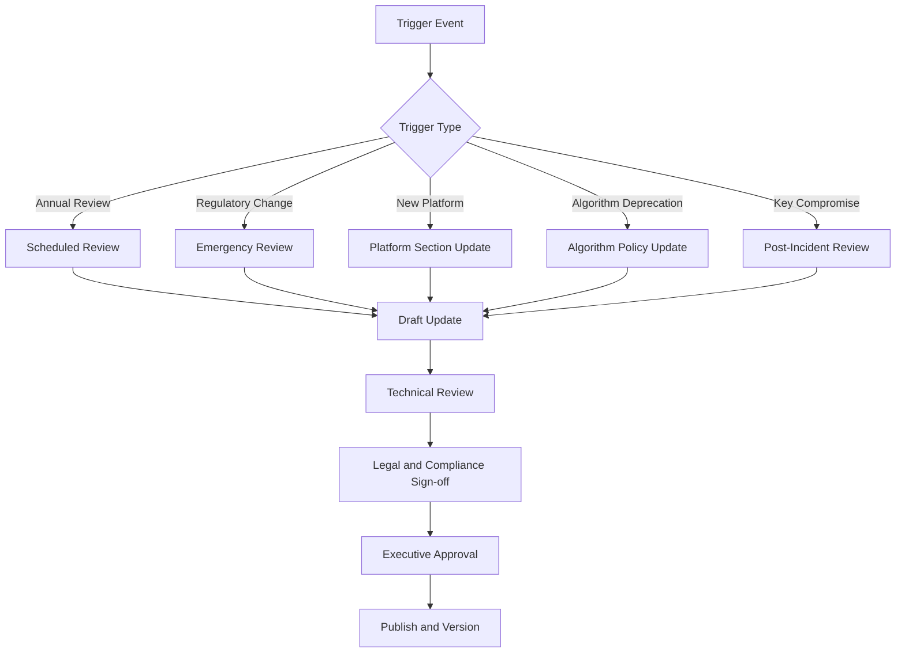


### 1.4 Normative Language \& Requirement Traceability

The following terms define control strength in this document:

- **MUST / SHALL**: mandatory control requirement.
- **SHOULD**: expected control unless a documented exception is approved.
- **MAY**: optional control or implementation choice.

All auditable requirements in this document use a traceable identifier in the format `CRYPTO-[DOMAIN]-[NUMBER]`. These identifiers are summarised in [Appendix F](#appendix-f--requirement-traceability-matrix) and are intended to support internal audit, compliance testing, and control evidence collection.


| Requirement ID | Requirement Summary | Primary Section |
| :-- | :-- | :-- |
| CRYPTO-GOV-001 | All production cryptographic implementations SHALL follow this guideline and complete design documentation before deployment. | [§8.2](#82-cryptographic-function-design-template) |
| CRYPTO-INV-001 | All production keys, certificates, and managed secrets SHALL be recorded in the approved inventory system. | [§4.9](#49-inventory-management--review-process), [Appendix C](#appendix-c--key-inventory-registry-template) |
| CRYPTO-ALG-001 | Forbidden algorithms and protocols SHALL NOT be used in production. | [§3.3](#33-forbidden--deprecated-algorithm-list) |
| CRYPTO-MON-001 | Cryptographic control-plane and key-usage events SHALL be logged and reviewed. | [§9](#9-monitoring-detection--siem-integration) |
| CRYPTO-OSL-001 | Approved libraries SHALL be tracked with dependency vulnerability scanning. | [§12.3](#123-open-source-library-governance) |


---

## 2. Regulatory \& Standards Framework

### 2.1 Governing Regulatory Hierarchy

All cryptographic controls in this document derive from the following hierarchy. Higher tiers take precedence. Within the same tier, Hong Kong-specific requirements take precedence over international standards.

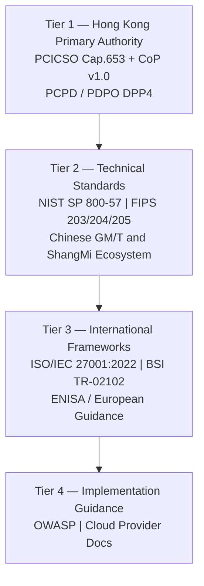

| Tier | Framework | Status | Core Relevance |
| :-- | :-- | :-- | :-- |
| 1 | HK PCICSO CoP v1.0 | Mandatory | Proper use of cryptography; define key management policy |
| 1 | HK PCICSO Cap. 653 | Mandatory | Governing legislation |
| 1 | PCPD data security guidance | Mandatory | Encrypt sensitive personal data |
| 2 | NIST SP 800-57 Part 1 Rev. 5 / Rev. 6 IPD | Normative | Full key lifecycle and cryptoperiod guidance |
| 2 | FIPS 203 / 204 / 205 | Normative | PQC standards |
| 2 | NIST SP 800-175B | Normative | Guidance on using cryptographic standards |
| 2 | PRC Cryptography Law and relevant ShangMi ecosystem standards | Conditional / jurisdictional | China interoperability and commercial cryptography context |
| 3 | ISO/IEC 27001:2022 | Certification control | Cryptographic policy and key management |
| 3 | ISO/IEC 19790 | Normative | HSM and cryptographic module requirements |
| 3 | BSI TR-02102 | European technical guidance | Key lengths, algorithm suitability, TLS guidance |
| 4 | OWASP Cryptographic Storage Cheat Sheet | Informative | Developer patterns |

### 2.2 HK CoP Cryptographic Requirements Mapping

| CoP Area | Requirement | Implementing Section |
| :-- | :-- | :-- |
| Proper use of cryptography | Apply effective cryptography aligned to current standards | [§3](#3-cryptographic-taxonomy--definitions), [§5](#5-algorithm-approval-policy--cipher-suite-standards) |
| Key management policy | Define lifecycle management policy | [§4](#4-key-management-lifecycle), [§11](#11-roles-responsibilities--governance) |
| Key protection | Protect and manage keys through lifecycle | [§4](#4-key-management-lifecycle) |
| Standards alignment | Use latest national / international standards | [§2.1](#21-governing-regulatory-hierarchy), [§6](#6-quantum-safe-migration-programme) |
| Monitoring | Log and monitor relevant security events | [§9](#9-monitoring-detection--siem-integration) |
| Incident reporting | Report significant cyber incidents | [§10.3](#103-regulatory-notification-obligations) |

### 2.3 Compliance Calendar

| Date / Milestone | Action Required |
| :-- | :-- |
| 2026 | Complete baseline cryptographic asset inventory |
| 2026 | Confirm no forbidden algorithms remain in production |
| 2027 | Deploy crypto-agility architecture for new systems |
| 2028 | Retire RSA-2048 for standard new use |
| 2030 | Complete high-priority hybrid / PQC migrations |
| 2031 | Target full PQC for priority asymmetric use cases |


---

## 3. Cryptographic Taxonomy \& Definitions

### 3.1 Terminology Glossary

| Term | Definition |
| :-- | :-- |
| Cryptoperiod | The approved period during which a key is authorised for use |
| CMK | Customer Master Key in KMS used to protect DEKs |
| DEK | Data Encryption Key used to encrypt application data |
| KEK | Key Encryption Key used to wrap other keys |
| Envelope Encryption | DEK encrypts data; CMK encrypts the DEK |
| HSM | Hardware Security Module providing strong protection for key material |
| KMS | Key Management System for centralised lifecycle management |
| CA | Certificate Authority issuing digital certificates |
| CRL | Certificate Revocation List |
| OCSP | Online Certificate Status Protocol |
| Crypto-Agility | Ability to change algorithms with minimal system impact |
| PQC | Post-Quantum Cryptography |
| Hybrid Cryptography | Simultaneous use of classical and PQC algorithms during transition |
| Zeroization | Sanitising key material so it cannot be recovered |
| ShangMi / SM | Chinese commercial cryptography ecosystem including SM2, SM3, and SM4 |

### 3.2 Cryptographic Function Types

This section is the **primary operational algorithm catalogue** for developers, architects, reviewers, and auditors. It is designed to answer, in one place, what is mandatory for new implementations, what is permitted only by exception, what Chinese equivalent may apply for China-specific interoperability, what PQC path should be considered, and what is forbidden.

**How to use this table:**

- **Mandatory** = required default for new systems and major redesigns.
- **Permitted by exception** = allowed only where there is a documented interoperability, regulatory, platform, or migration constraint approved through the design and exception process.
- **Forbidden** = must not be used in production.
- **Chinese equivalent / option** = use only where mainland China interoperability, customer requirement, or regulatory context requires ShangMi or related Chinese commercial cryptography alignment.
- **PQC / crypto-agility note** = what to design for now so migration is practical later.


#### 3.2.1 Operational Algorithm Decision Table

| Function Type / Use Case | Mandatory | Permitted by Exception | Chinese equivalent / option | PQC / crypto-agility note | Forbidden |
| :-- | :-- | :-- | :-- | :-- | :-- |
| Symmetric encryption — bulk data at rest / in transit | AES-256-GCM; 256-bit key; AEAD mandatory | ChaCha20-Poly1305 with 256-bit key where platform performance or hardware profile justifies it | SM4-GCM or SM4-CCM with 128-bit key where China-specific interoperability is required | No immediate PQC symmetric algorithm change required; store algorithm metadata and keep encryption service abstractions stable | DES, 3DES, RC4, AES-ECB, and unauthenticated CBC for new designs |
| Key exchange for TLS / mTLS / secure sessions | ECDHE over P-384 or X25519; use TLS 1.3-capable profiles | RSA-4096-based legacy interoperability only where replacement is not yet feasible and is formally excepted | SM2 key exchange in ShangMi TLS profiles where China-specific protocol compatibility is required | New designs should support hybrid migration with ML-KEM-768 and externalized algorithm identifiers | RSA key transport, static DH, weak curves, and obsolete TLS key-exchange patterns |
| Public-key encryption / small-payload key wrapping | Envelope encryption with KMS-managed DEKs and KEKs; avoid direct business-data encryption with public-key algorithms | RSA-4096 OAEP only for documented legacy interoperability | SM2 public-key encryption where China-focused ecosystem support requires it | Prefer KEM-style architecture and plan for ML-KEM-768 | RSA PKCS\#1 v1.5 encryption and RSA keys below 2048 bits |
| Digital signatures — apps, JWT, certificates | ECDSA P-384 preferred; Ed25519 where ecosystem support is mature | RSA-4096 / RSA-PSS only for documented legacy compatibility | SM2 signature with SM3 in China-specific certificate or application-signing ecosystems | Plan for ML-DSA-65; consider SLH-DSA for selected high-assurance or long-lived verification cases | DSA, SHA-1 signatures, and RSA PKCS\#1 v1.5 signatures for new implementations |
| Code signing / release signing | ECDSA P-384 or Ed25519 with HSM- or KMS-backed non-exportable keys | RSA-PSS 4096 only where downstream verifier compatibility requires it | SM2 signing where a China-specific distribution or trust ecosystem requires it | Long-lived artefacts should be prioritized for hybrid classical + ML-DSA planning | Private signing keys on developer laptops, exported private keys in CI, and SHA-1-signed releases |
| Hashing / integrity | SHA-256 minimum; SHA-384 preferred for longer-lived assurance; SHA-3-256 for selected use cases | SHA-512 where application design benefits from larger output or existing profile alignment | SM3 where China-specific interoperability requires it | Prefer designs that record hash algorithm identifiers to ease future change | MD5 and SHA-1 |
| Message authentication | HMAC-SHA256 or HMAC-SHA384 with 256-bit-class keys | HMAC-SHA512 where profile or implementation consistency requires it | HMAC-SM3 where ecosystem compatibility requires it | No immediate PQC change required; keep MAC selection configurable | HMAC-MD5 and HMAC-SHA1 for new designs |
| Password storage | Argon2id with memory-hard parameters | PBKDF2-SHA256 only in constrained FIPS or compatibility contexts, with high iteration counts and documented rationale | No separate Chinese baseline is defined in this policy for password storage | No immediate PQC change required; review parameters periodically | Unsalted hashes, reversible encryption, MD5, SHA-1-based storage, and direct encryption of passwords for verification |
| Key derivation | HKDF-SHA256; HKDF-SHA384 for higher-assurance or longer-lived contexts | PBKDF2 only where specifically required by compatibility or regulated environment constraints | SM3-based KDF constructions where a China-specific ecosystem explicitly requires them | Keep KDF use abstracted behind libraries or services so replacement is manageable | Ad hoc or home-grown derivation logic |
| TLS certificates and server auth | ECDSA P-384 certificates preferred; TLS 1.3 baseline | RSA-4096 certificates only for legacy interop; TLS 1.2 only by approved exception | SM2 certificates with SM3 in ShangMi TLS deployments under RFC 8998-related ecosystems | Keep PKI design agile; some deployments may require dual PKI or parallel certificate profiles | SHA-1-signed certs, RSA below 2048 bits, SSLv3, TLS 1.0, TLS 1.1, weak TLS 1.2 suites |
| SSH host / user authentication | Ed25519 host keys; ECDSA P-384 acceptable | RSA-4096 only where legacy client compatibility requires it | No mainstream ShangMi SSH profile is included in this policy | Track PQC SSH ecosystem maturity and automate host key lifecycle | DSA, small RSA keys, and weak MACs |
| Long-term PQC planning baseline | Use approved classical algorithms now, but require crypto-agility for new asymmetric designs | Classical-only operation may continue temporarily where transition is not yet feasible and is documented | No separate Chinese commercial PQC baseline is adopted in this policy | ML-KEM-768 for key establishment, ML-DSA-65 for signatures, and SLH-DSA for selected use cases | Long-term classical-only assumptions without a migration plan |

#### 3.2.2 Operational Requirements

- **CRYPTO-ALG-010** — New systems SHALL use the **Mandatory** column unless an approved exception exists.
- **CRYPTO-ALG-011** — Any selection from **Permitted by Exception** SHALL be documented in the design record, approved through exception governance, and linked to the inventory record.
- **CRYPTO-ALG-012** — If a **Chinese equivalent / option** is used, the design SHALL state the exact interoperability or regulatory driver and whether dual-stack or parallel trust models are required.
- **CRYPTO-ALG-013** — Any item listed in **Forbidden** SHALL NOT be used in production.
- **CRYPTO-ALG-014** — New asymmetric designs SHALL document their PQC transition path or crypto-agility approach at design time.


#### 3.2.3 Audit Checklist

- [ ] Confirm the implemented algorithm appears in the **Mandatory** column, or an approved exception exists. See **CRYPTO-ALG-010** and **CRYPTO-ALG-011**.
- [ ] Confirm key sizes and parameter sets match this section and deployed configuration.
- [ ] Confirm any ShangMi / Chinese selection has a documented business, interoperability, or regulatory justification. See **CRYPTO-ALG-012**.
- [ ] Confirm no production implementation uses a value listed in **Forbidden**. See **CRYPTO-ALG-013** and [§3.3](#33-forbidden--deprecated-algorithm-list).
- [ ] Confirm the design record identifies crypto-agility and, where relevant, PQC migration intent. See **CRYPTO-ALG-014** and [§8.2](#82-cryptographic-function-design-template).


### 3.3 Forbidden \& Deprecated Algorithm List

| Algorithm / Protocol | Status | Action |
| :-- | :-- | :-- |
| MD5 | Forbidden | Replace immediately |
| SHA-1 for signatures | Forbidden | Replace immediately |
| SSL 2.0 / 3.0 | Forbidden | Disable immediately |
| TLS 1.0 / 1.1 | Forbidden | Disable immediately |
| RC4 | Forbidden | Remove immediately |
| DES / 3DES | Forbidden | Replace immediately |
| RSA < 2048 | Forbidden | Regenerate |
| AES-ECB | Forbidden | Replace with AEAD |
| HMAC-SHA1 | Deprecated | Sunset by 2027 |
| RSA-2048 | Deprecated | Sunset by 2028 |
| ECDSA P-256 | Deprecated for new use | Prefer P-384 |
| AES-128 in high-security contexts | Deprecated for new use | Prefer AES-256 |


---

## 4. Key Management Lifecycle

All keys must be registered in the Key Inventory Registry in [Appendix C](#appendix-c--key-inventory-registry-template).

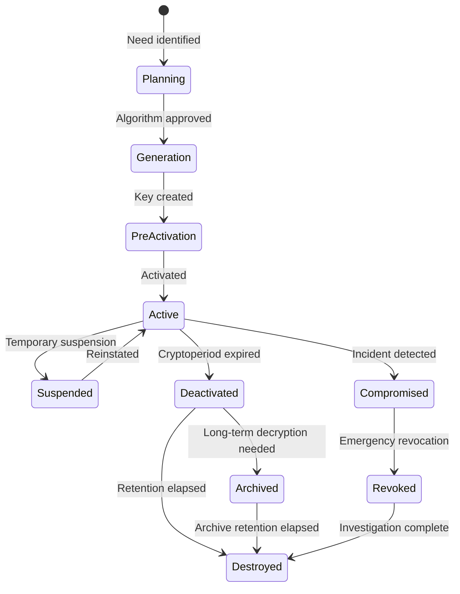


### 4.1 Key Generation

Production keys must be generated from approved entropy sources. HSM-generated keys are mandatory for root CA keys, externally trusted signing keys, and highly sensitive master keys. Software generation is acceptable only for ephemeral session keys or DEKs generated under a KMS control plane.

### 4.2 Key Storage \& Protection

Envelope encryption is mandatory for application data. Plaintext CMKs must never be exposed to applications. Root keys belong in the on-prem HSM or equivalent HSM-backed cloud service.

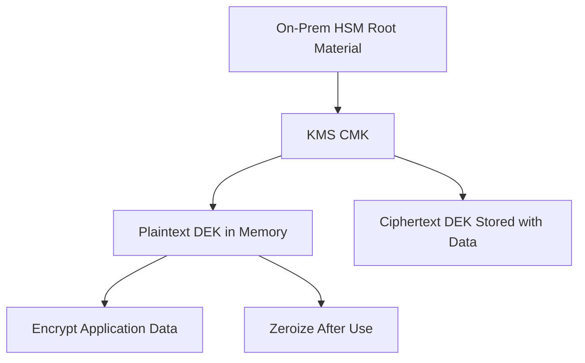


### 4.3 Key Distribution \& Wrapping

Key transport must use AES Key Wrap, platform-native import mechanisms, or an HSM-backed trust path. Plaintext key material must never traverse a network unprotected or be written to logs.

### 4.4 Key Usage Controls

Cryptoperiods must be defined by key type and enforced operationally.


| Key Type | Standard Cryptoperiod |
| :-- | :-- |
| DEK | Up to 2 years |
| Session key | Single session |
| TLS private key | 1 year |
| HMAC key | 1 year |
| KMS CMK | 1–3 years depending on platform and rotation policy |
| Root CA key | 10–25 years under offline protection |

### 4.5 Key Rotation

Automated rotation is preferred wherever supported by the platform. Manual rotation is permitted only with documented runbooks and evidence.

### 4.6 Key Backup \& Recovery

Key backups must be encrypted under a separate backup KEK and tested at least annually. RTO for production CMK recovery should be less than 1 hour unless formally excepted.

### 4.7 Key Revocation \& Suspension

Revocation triggers include confirmed or suspected key compromise, unauthorised use, staff departure affecting privileged key access, and third-party PKI compromise notifications.

### 4.8 Key Archival \& Destruction

Key destruction must follow NIST SP 800-88 style zeroization where applicable and be evidenced with a destruction record retained for audit.

### 4.9 Inventory Management \& Review Process

The organisation SHALL maintain a single approved inventory system for cryptographic assets and cryptographic design records. The inventory MAY be implemented in a CMDB, GRC platform, dedicated asset inventory system, or database-backed register, but it SHALL support version history, change accountability, evidence attachment, and periodic attestation.

#### 4.9.1 Minimum Scope of the Inventory System

The inventory system SHALL capture, at minimum, all of the following asset classes:

- Customer Master Keys, HSM root keys, and other master or wrapping keys.
- Data Encryption Keys where the system design requires persistent tracking.
- TLS server certificates, client certificates, code-signing certificates, and certificate authorities.
- Application signing keys, JWT signing keys, HMAC keys, SSH host keys, and SSH CA keys.
- Managed secrets used to retrieve or unlock cryptographic material.
- Cryptographic design records documenting which algorithms are used, why they were selected, and which systems depend on them.


#### 4.9.2 Minimum Required Inventory Fields

| Requirement ID | Required Inventory Field | Purpose | Reference |
| :-- | :-- | :-- | :-- |
| CRYPTO-INV-001 | Unique asset identifier | Unambiguous tracking of the key, certificate, or secret | [Appendix C](#appendix-c--key-inventory-registry-template) |
| CRYPTO-INV-002 | Asset type and algorithm | Determines applicable policy, lifecycle, and migration obligations | [§3.2](#32-cryptographic-function-types) |
| CRYPTO-INV-003 | Key length / curve / parameters | Confirms technical compliance and deprecation exposure | [§3.3](#33-forbidden--deprecated-algorithm-list) |
| CRYPTO-INV-004 | Purpose and protected system | Identifies business and technical dependency | [Appendix B](#appendix-b--cryptographic-function-design-template) |
| CRYPTO-INV-005 | Data classification and owner | Supports risk prioritisation and accountability | [§11](#11-roles-responsibilities--governance) |
| CRYPTO-INV-006 | Storage location and custody model | Identifies whether key control is in HSM, KMS, vault, or third party | [§7](#7-cryptographic-architecture--technology-stack) |
| CRYPTO-INV-007 | Lifecycle state and dates | Supports rotation, revocation, archival, and destruction review | [§4](#4-key-management-lifecycle) |
| CRYPTO-INV-008 | Rotation due date and last attestation date | Supports overdue rotation and review detection | [§4.5](#45-key-rotation) |
| CRYPTO-INV-009 | External dependencies and consumers | Supports impact analysis during outage or compromise | [§12.2](#122-third-party-integration-assessment-checklist) |
| CRYPTO-INV-010 | PQC priority and migration status | Supports forward-looking transition planning | [§6](#6-quantum-safe-migration-programme) |
| CRYPTO-INV-011 | Design record reference | Links operational asset to approved design rationale | [§8.2](#82-cryptographic-function-design-template) |
| CRYPTO-INV-012 | Exception reference, if any | Provides audit evidence for approved deviations | [Appendix D](#appendix-d--compliance-checklist) |

#### 4.9.3 Review and Attestation Process

| Requirement ID | Review Activity | Frequency | Responsible Role | Evidence |
| :-- | :-- | :-- | :-- | :-- |
| CRYPTO-INV-020 | New asset onboarding review | Before production deployment | System Owner + Security Architect | Approved design template and inventory entry |
| CRYPTO-INV-021 | Rotation due-date review | Monthly | Key Custodian | Rotation report |
| CRYPTO-INV-022 | Inventory completeness attestation | Quarterly | System Owner | Signed attestation / workflow approval |
| CRYPTO-INV-023 | Independent inventory audit | Quarterly | Crypto Auditor | Audit report |
| CRYPTO-INV-024 | Algorithm and deprecation review | Semi-annual | Security Architect | Standards review note |
| CRYPTO-INV-025 | PQC migration status review | Semi-annual | Crypto Officer | Migration dashboard / report |

#### 4.9.4 Inventory Workflow Example

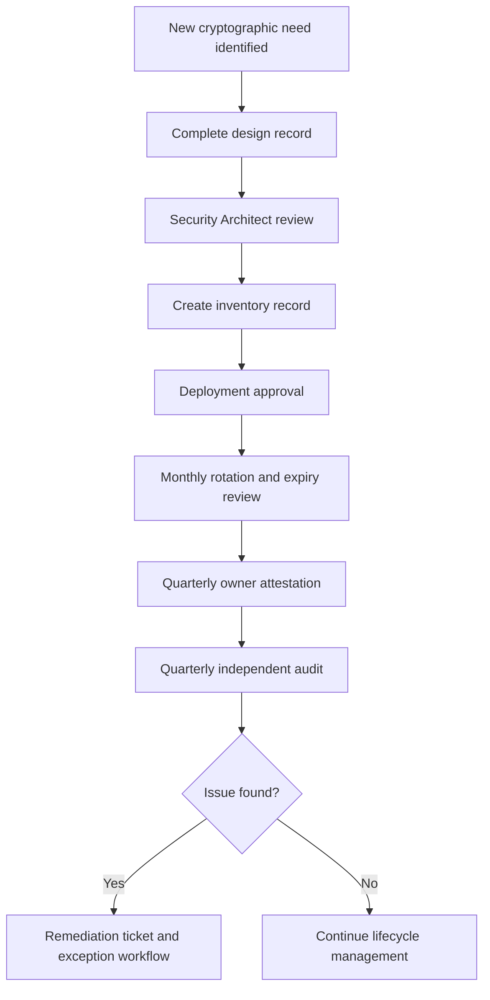


#### 4.9.5 Inventory Review Checklist

- [ ] Confirm all active keys, certificates, and managed secrets for the system are present in the inventory. See [Appendix C](#appendix-c--key-inventory-registry-template).
- [ ] Confirm algorithm, key length, and lifecycle state match deployed reality. See [§3.2](#32-cryptographic-function-types) and [§4](#4-key-management-lifecycle).
- [ ] Confirm each inventory record references an approved design record. See [§8.2](#82-cryptographic-function-design-template).
- [ ] Confirm rotation due dates, expiry dates, and attestation dates are current. See [§4.5](#45-key-rotation).
- [ ] Confirm exceptions are documented, approved, and not expired. See [Appendix D](#appendix-d--compliance-checklist).

---

## 5. Algorithm Approval Policy \& Cipher Suite Standards

### 5.1 Approved TLS Cipher Suites

TLS 1.3 is mandatory for all new service endpoints. TLS 1.2 is allowed only for documented legacy interop.

**TLS 1.3 preferred suites:**

```text
TLS_AES_256_GCM_SHA384
TLS_CHACHA20_POLY1305_SHA256
TLS_AES_128_GCM_SHA256
```

**TLS 1.2 legacy-approved suites:**

```text
TLS_ECDHE_ECDSA_WITH_AES_256_GCM_SHA384
TLS_ECDHE_RSA_WITH_AES_256_GCM_SHA384
TLS_ECDHE_ECDSA_WITH_CHACHA20_POLY1305_SHA256
```


### 5.2 SSH Configuration Standards

Approved SSH standards require Ed25519 or ECDSA host keys, modern key exchange, and password authentication disabled in production.

```text
HostKey /etc/ssh/ssh_host_ed25519_key
HostKey /etc/ssh/ssh_host_ecdsa_key
KexAlgorithms curve25519-sha256,ecdh-sha2-nistp384
Ciphers chacha20-poly1305@openssh.com,aes256-gcm@openssh.com
MACs hmac-sha2-512-etm@openssh.com,hmac-sha2-256-etm@openssh.com
PasswordAuthentication no
PermitRootLogin no
```


### 5.3 Data-at-Rest Encryption Standards

| Storage Type | Required Encryption | Key Management |
| :-- | :-- | :-- |
| AWS S3 | SSE-KMS with CMK | AWS KMS |
| AWS RDS | TDE with CMK | AWS KMS |
| Alibaba OSS | SSE-KMS | Alibaba KMS |
| Huawei OBS | SSE-KMS | Huawei DEW |
| GCS | CMEK | GCP Cloud KMS |
| BigQuery | CMEK | GCP Cloud KMS |
| Kubernetes etcd secrets | Envelope encryption | KMS plugin |
| On-prem databases | TDE or application-layer encryption | HSM-backed key |

### 5.4 Code Signing \& Container Image Signing

All container images promoted to production must be signed. Signing keys must be held in KMS or HSM-backed systems, never on developer workstations.

### 5.5 Certificate Authority Policy

Public certificates may be sourced only from approved public CAs. Internal PKI must use an HSM-backed root CA with offline protection. Wildcard certificates should be minimised and explicitly approved.

### 5.6 Algorithm Cross-Reference Note

The authoritative algorithm selection catalogue is [§3.2](#32-cryptographic-function-types). Section 3.2 consolidates enterprise baseline algorithms, Chinese equivalents, PQC options, key-size expectations, exception handling, and forbidden choices so developers, architects, and auditors can work from a single reference point.

Appendix H remains as a compact architecture and procurement crosswalk for comparing Western, Chinese, and European standards at a portfolio level.

---

## 6. Quantum-Safe Migration Programme

### 6.1 Threat Timeline \& Business Rationale

The organisation must plan for harvest-now-decrypt-later risk. Long-lived confidential data requires asymmetric protection that can survive the arrival of cryptographically relevant quantum computers.

### 6.2 PQC Algorithm Adoption

| Purpose | Current | Transition | Target |
| :-- | :-- | :-- | :-- |
| Key exchange | ECDH P-384 | ECDH + ML-KEM-768 | ML-KEM-768 |
| Signatures | ECDSA P-384 | ECDSA + ML-DSA-65 | ML-DSA-65 |
| Stateless signatures | RSA-PSS | RSA-PSS + SLH-DSA | SLH-DSA |
| Symmetric encryption | AES-256-GCM | No change | AES-256-GCM |

### 6.3 Migration Phases

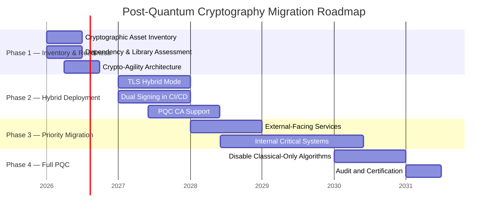


### 6.4 Crypto-Agility Implementation Guidelines

Applications must not hard-code algorithm choices inside business logic. Use provider abstractions, versioned key metadata, and libraries that support planned PQC transitions.

---

## 7. Cryptographic Architecture — Technology Stack

The following architecture views are **illustrative only**. They show example trust, integration, and dependency patterns that may exist across the enterprise, but they do not assert that every depicted connection exists in the current environment.

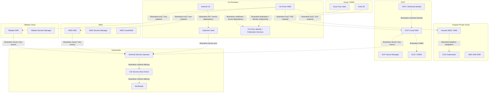


### 7.1 On-Premises HSM

Use cases include root CA storage, high-assurance signing keys, and trust anchoring for cross-cloud key strategies. Dual control and split knowledge are mandatory for administration.

### 7.2 CyberArk Vault \& Conjur

CyberArk is the strategic vault for privileged secrets, application secrets, and selected cryptographic key-adjacent materials across both VM and Kubernetes environments.

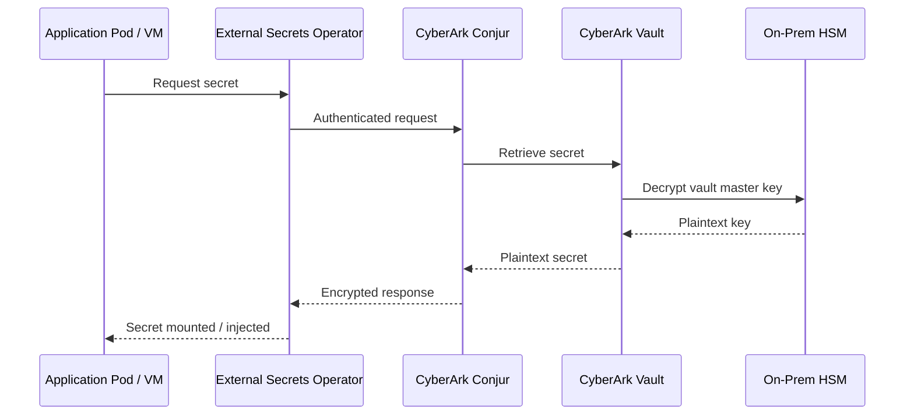


### 7.3 AWS KMS \& Secrets Manager

AWS KMS should manage CMKs per region and classification tier. Enable automatic rotation, CloudTrail logging, and CloudHSM-backed custom key stores for the most sensitive use cases.

### 7.4 Alibaba Cloud KMS

Alibaba KMS should be used for envelope encryption, CMK management, and integration with OSS, ECS, and RDS encryption controls.

### 7.5 Huawei Private Cloud — DEW \& KMS

Huawei DEW and Dedicated HSM should be used for private cloud key control, storage encryption, and CCE secret protection.

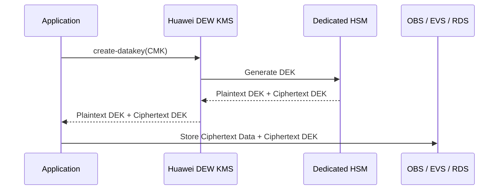


### 7.6 Azure Key Vault \& Entra ID

Azure Key Vault should manage certificates, secrets, and keys for Azure workloads, while Entra ID manages identity-driven access patterns and federation relationships with approved enterprise identity services.

### 7.7 GCP Cloud KMS

GCP is assumed to be an in-scope platform for planning and implementation. GCP workloads SHALL use Cloud KMS and, where sensitivity requires it, Cloud HSM-backed key protection for regulated or high-value data.

#### 7.7.1 GCP Key Management Model

| Requirement ID | Requirement | Example Implementation |
| :-- | :-- | :-- |
| CRYPTO-GCP-001 | GCP workloads handling Confidential or Restricted data SHALL use CMEK rather than provider-default encryption where the service supports it. | BigQuery, GCS, Persistent Disk, and selected AI services use Cloud KMS keys |
| CRYPTO-GCP-002 | Key rings and keys SHALL be separated by environment and data classification. | Separate key rings for `prod-restricted`, `prod-confidential`, and `nonprod` |
| CRYPTO-GCP-003 | Workloads SHALL use Workload Identity or equivalent short-lived identity federation rather than long-lived service account keys. | GKE Workload Identity bound to service accounts that can call Cloud KMS |
| CRYPTO-GCP-004 | Cloud Audit Logs for KMS operations SHALL be exported to the enterprise monitoring platform. | `Encrypt`, `Decrypt`, `AsymmetricSign`, `CreateCryptoKeyVersion` audited |
| CRYPTO-GCP-005 | GCP key inventory records SHALL be linked to the enterprise inventory and design record. | Cloud KMS key resource ID linked to Appendix C record |

#### 7.7.2 GCP Use Cases

| Use Case | Recommended GCP Control | Key Management Pattern |
| :-- | :-- | :-- |
| Object storage encryption | GCS with CMEK | Cloud KMS key referenced by bucket policy |
| VM / disk encryption | Persistent Disk CMEK | Cloud KMS key scoped by environment and project |
| GKE application encryption | Envelope encryption with Cloud KMS or Secret Manager | GKE workload identity retrieves keys or secrets at runtime |
| BigQuery sensitive datasets | CMEK-enabled datasets | Dataset-level encryption policy tied to Cloud KMS |
| Application signing / JWT signing | Cloud KMS asymmetric signing keys | Sign without exporting private key |
| Secrets management | Secret Manager with Cloud KMS-backed protection | Runtime retrieval via workload identity |

#### 7.7.3 GCP Illustrative Envelope Encryption Pattern

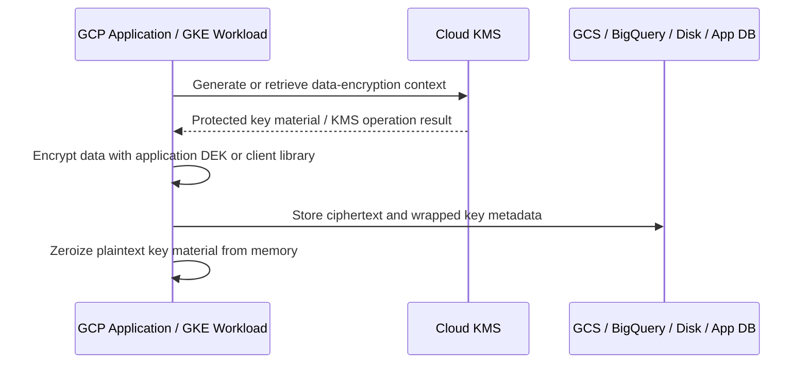


#### 7.7.4 GCP Terraform Example — Key Ring and CMEK

```hcl
resource "google_kms_key_ring" "prod_restricted" {
  name     = "prod-restricted-ring"
  location = "asia-east2"
}

resource "google_kms_crypto_key" "gcs_cmek" {
  name            = "gcs-restricted-cmek"
  key_ring        = google_kms_key_ring.prod_restricted.id
  rotation_period = "7776000s"

  version_template {
    algorithm        = "GOOGLE_SYMMETRIC_ENCRYPTION"
    protection_level = "HSM"
  }
}

resource "google_storage_bucket" "restricted_bucket" {
  name     = "example-prod-restricted-bucket"
  location = "ASIA-EAST2"

  encryption {
    default_kms_key_name = google_kms_crypto_key.gcs_cmek.id
  }
}
```


#### 7.7.5 GCP Example — Asymmetric Signing with Cloud KMS

```python
from google.cloud import kms

client = kms.KeyManagementServiceClient()
key_version_name = "projects/PROJECT/locations/asia-east2/keyRings/prod-restricted-ring/cryptoKeys/jwt-signing/cryptoKeyVersions/1"

digest = kms.Digest(sha384=b"<digest-bytes>")
response = client.asymmetric_sign(
    request={
        "name": key_version_name,
        "digest": digest,
    }
)
signature = response.signature
```


#### 7.7.6 GKE and Secret Retrieval Example

```yaml
apiVersion: v1
kind: ServiceAccount
metadata:
  name: app-sa
  namespace: production
  annotations:
    iam.gke.io/gcp-service-account: app-sa@example-project.iam.gserviceaccount.com
***
apiVersion: apps/v1
kind: Deployment
metadata:
  name: api
  namespace: production
spec:
  template:
    spec:
      serviceAccountName: app-sa
      containers:
        - name: api
          image: asia-east2-docker.pkg.dev/example-project/prod/api:1.0.0
```

Use Workload Identity so the pod can retrieve secrets from Secret Manager or invoke Cloud KMS without embedding long-lived credentials.

---

## 8. Developer Implementation Guide

### 8.1 How to Use This Guide

Use the decision process below before implementing a cryptographic control. Then complete the design template in [Appendix B](#appendix-b--cryptographic-function-design-template).

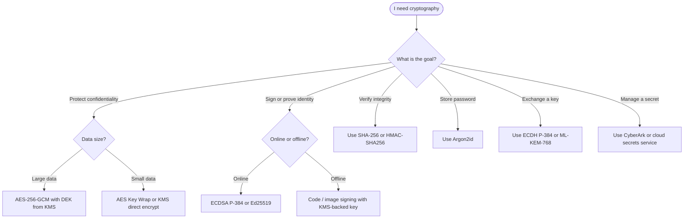


### 8.2 Cryptographic Function Design Template

Every new implementation SHALL complete the template in [Appendix B](#appendix-b--cryptographic-function-design-template) before production deployment. The design record is the formal artefact that documents what cryptography is used, why it was selected, how keys are managed, and which dependencies or interoperability constraints apply.

#### 8.2.1 Cryptographic Design and Approval Process

| Requirement ID | Requirement | Evidence |
| :-- | :-- | :-- |
| CRYPTO-GOV-001 | A cryptographic design record SHALL be created for every new production implementation and for any material change to an existing implementation. | Completed Appendix B template |
| CRYPTO-GOV-002 | The design record SHALL identify the cryptographic function type, approved algorithm, key length, and justification for selection. | Appendix B Sections B and C |
| CRYPTO-GOV-003 | The design record SHALL identify where keys are generated, stored, rotated, backed up, and destroyed. | Appendix B Section C |
| CRYPTO-GOV-004 | The design record SHALL identify all third-party, PKI, HSM, KMS, vault, and library dependencies. | Appendix B Sections D and E |
| CRYPTO-GOV-005 | The design record SHALL reference the inventory record created for the implementation. | Appendix B and Appendix C linkage |
| CRYPTO-GOV-006 | Security Architect approval SHALL be completed before production deployment. | Signed review workflow |

#### 8.2.2 Required Design Questions

The design process SHALL answer the following questions for each implementation:

1. What business problem requires cryptography?
2. Which cryptographic function type applies: encryption, signature, HMAC, hash, KDF, PKI, or secret management?
3. Which approved algorithm and parameter set are being used, and why?
4. Why are weaker or deprecated alternatives not being used?
5. Where will the key or secret be generated?
6. Where will it be stored and who controls it?
7. How will the application retrieve and use it at runtime?
8. What is the rotation frequency and how will zero-downtime rollover occur?
9. Which systems, services, or third parties depend on this cryptographic function?
10. What logs, alerts, and compromise actions are required?
11. What is the PQC migration impact or future replacement path?

#### 8.2.3 Example Design Record Summary

| Field | Example |
| :-- | :-- |
| Business purpose | Protect customer profile export files before transfer to third-party processor |
| Function type | Symmetric encryption + key wrapping |
| Selected algorithm | AES-256-GCM for file encryption; AWS KMS CMK for DEK protection |
| Why this choice | Approved AEAD algorithm, envelope encryption supported by platform, auditable KMS use |
| Key source | `GenerateDataKey` from AWS KMS |
| Key storage | Plaintext DEK in memory only; ciphertext DEK stored with file metadata |
| Rotation | CMK annual auto-rotation; per-file DEK generated per encryption event |
| Dependencies | AWS KMS, S3 SSE-KMS, third-party HTTPS endpoint, Python `cryptography` library |
| Monitoring | CloudTrail KMS events to SIEM; failed encryption alerts |
| PQC path | No immediate symmetric change; asymmetric transport dependencies tracked separately |

#### 8.2.4 Design Review Checklist

- [ ] Confirm the selected algorithm appears in the approved list. See [§3.2](#32-cryptographic-function-types).
- [ ] Confirm the design does not use any forbidden algorithm, mode, or protocol. See [§3.3](#33-forbidden--deprecated-algorithm-list).
- [ ] Confirm key generation, storage, and retrieval use approved platforms. See [§7](#7-cryptographic-architecture--technology-stack).
- [ ] Confirm monitoring, logging, and response requirements are identified. See [§9](#9-monitoring-detection--siem-integration) and [§10](#10-key-compromise--incident-response).
- [ ] Confirm the design links to an inventory record. See [§4.9](#49-inventory-management--review-process).


### 8.3 Secrets Management for Applications

Applications must retrieve secrets at runtime using workload identity and approved vault/KMS services. Secrets must not be embedded in code, images, or plaintext configuration files.

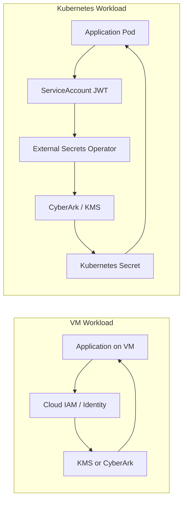


### 8.4 TLS/mTLS Implementation Patterns

Service-to-service traffic in Kubernetes should use strict mTLS via service mesh or cert-manager managed certificates. Certificates must auto-renew before expiry and use approved key types.

### 8.5 JWT \& Token Signing

**Approved JWT signing algorithms:**


| Algorithm | Status | Use Case |
| :-- | :-- | :-- |
| ES384 | Preferred | New JWT issuance |
| EdDSA (Ed25519) | Approved | Where ecosystem support exists |
| RS256 / RSA-PSS | Legacy only | Backward compatibility |
| HS256 | Restricted | Intra-service only |

**JWKS rotation flow:**

1. Generate new signing key in KMS.
2. Publish new `kid` in JWKS alongside old key.
3. Start issuing with the new key.
4. Wait for old token TTL to expire.
5. Remove old key from JWKS and disable old key material.

### 8.6 Database \& Storage Encryption

| Scenario | Recommended Approach | Rationale |
| :-- | :-- | :-- |
| Cloud-managed DB | TDE with CMK | Strong baseline with managed controls |
| Sensitive fields | Application-layer AES-256-GCM | Protects against DB admin access |
| Object storage | SSE-KMS / CMEK with CMK | Centralised lifecycle and auditing |
| On-prem DB | Application-layer or HSM-backed TDE | Aligns to HSM trust model |

Production and non-production environments must use separate keys.

### 8.7 Container Image Signing

All production container images must be signed and verified at admission.

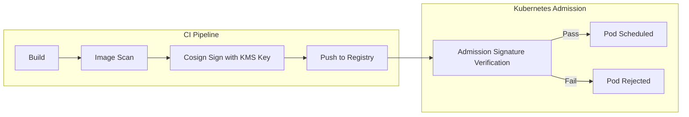


---

## 9. Monitoring, Detection \& SIEM Integration

Cryptographic events are high-value security telemetry and must be forwarded into enterprise monitoring pipelines.

### 9.1 Cryptographic Events to Monitor

| Event Category | Example Events | Severity | Action |
| :-- | :-- | :-- | :-- |
| Key access anomaly | Mass decrypt spike, off-hours access | High | Alert + ticket |
| Algorithm violation | Forbidden ciphers or protocols observed | Critical | Alert + contain |
| Certificate anomaly | Expiry, revoked cert presented | High | Alert + renew |
| Admin operation | Key deletion, policy change, new CMK | Medium | Notify Security |
| Rotation overdue | Cryptoperiod exceeded | High | Enforce remediation |
| HSM admin event | Admin login, tamper alert | Critical | Immediate escalation |

### 9.2 Log Sources \& SIEM Integration

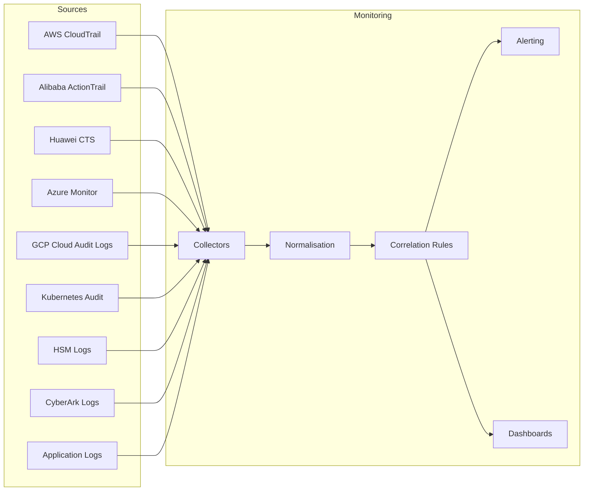


### 9.3 Key SIEM Correlation Rules

- Detect mass `Decrypt` spikes outside approved batch roles.
- Detect CMK administrative changes outside change windows.
- Alert on certificates with fewer than 30 days remaining.
- Alert on forbidden algorithms negotiated in network traffic or application telemetry.
- Alert on unexpected secret access principals.
- Alert on HSM tamper and administration events.

---

## 10. Key Compromise \& Incident Response

### 10.1 Compromise Indicators

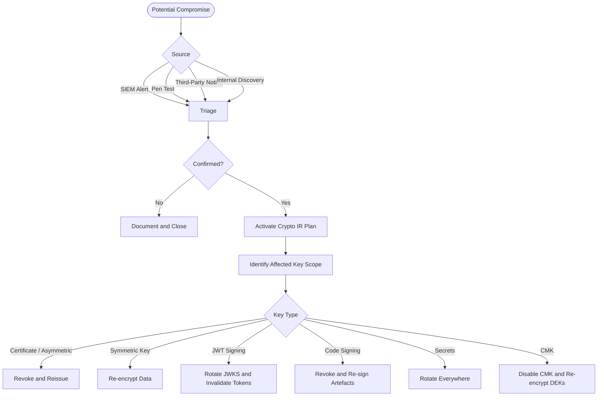


### 10.2 Emergency Revocation Procedures

| Platform | Immediate Action |
| :-- | :-- |
| AWS KMS | Disable key |
| Alibaba KMS | Disable CMK |
| Huawei DEW | Disable key version |
| Azure Key Vault | Disable key version |
| GCP Cloud KMS | Disable key version or crypto key as required |
| CyberArk | Rotate and disable affected account |
| X.509 PKI | Revoke via CRL + OCSP |
| JWKS / JWT | Remove old key and invalidate active tokens |
| Kubernetes Secret | Rotate source secret and restart workloads if required |

### 10.3 Regulatory Notification Obligations

Assess whether the incident is significant under HK critical infrastructure obligations and whether it affects personal data subject to PCPD expectations. Legal and compliance review is mandatory for regulated incidents.

### 10.4 Post-Compromise Recovery

Perform independent scoping, replace root material where needed, verify re-encryption completion, review root cause, document lessons learned, and update the Key Inventory Registry.

---

## 11. Roles, Responsibilities \& Governance

### 11.1 Role Definitions

| Role | Responsibilities |
| :-- | :-- |
| Crypto Officer | Owns policy, approves exceptions, chairs key ceremonies |
| Key Custodian | Operates rotation, inventory, backups, revocation steps |
| Security Architect | Reviews designs and platform implementations |
| Developer | Implements approved patterns; completes design template |
| Crypto Auditor | Independently reviews logs, rotations, and compliance |
| System Owner | Accountable for system-specific compliance |

### 11.2 Separation of Duties \& RACI

| Operation | Crypto Officer | Key Custodian | Security Architect | Developer | Crypto Auditor | CISO |
| :-- | :--: | :--: | :--: | :--: | :--: | :--: |
| Standard key generation | A | R | C | I | I | I |
| Root key ceremony | A/R | R | C | - | I | I |
| Rotation | A | R | C | I | I | - |
| Emergency revocation | A/R | R | C | I | I | I |
| Exception approval | A | - | C | I | - | C |
| Annual policy review | A | C | R | C | C | A |


---

## 12. Third-Party \& Supply Chain Cryptography

### 12.1 External PKI \& Certificate Authority Policy

Approved public CAs are restricted to named providers. Internal PKI must use HSM-backed roots and controlled subordinate issuance. CAA DNS records must be configured for organisation-managed domains.

### 12.2 Third-Party Integration Assessment Checklist

| Assessment Area | Requirement |
| :-- | :-- |
| Key custody | Customer-managed or BYOK preferred for sensitive data |
| Data residency | Must align to HK and contractual obligations |
| HSM validation | Minimum assurance defined by sensitivity tier |
| Algorithm support | Must support TLS 1.3 and published roadmap |
| Compliance | Validate relevant certifications |
| Exit strategy | Key portability and recovery must be defined |
| Notification SLA | Compromise notification timeline must be contractual |

### 12.3 Open Source Library Governance

All cryptographic implementations SHALL use approved libraries. Custom cryptographic algorithm implementations are strictly forbidden.

**Approved libraries by language:**


| Language | Approved Library | Notes |
| :-- | :-- | :-- |
| Python | `cryptography` (PyCA) | Use high-level APIs where possible |
| Java | Bouncy Castle, JDK crypto with approved provider | Bouncy Castle supports broader algorithm coverage |
| Go | Standard `crypto/*`, `golang.org/x/crypto` | Keep modules current |
| Node.js | Built-in `crypto` module | Avoid unmaintained packages |
| .NET | `System.Security.Cryptography` | Prefer framework-native primitives |
| Rust | `ring`, `rustls` | Review PQC support separately |

#### 12.3.1 Dependency Vulnerability Management Function

Dependency vulnerability management SHALL provide the following capabilities:


| Requirement ID | Capability | Minimum Expectation |
| :-- | :-- | :-- |
| CRYPTO-OSL-001 | Dependency discovery | Identify direct and transitive open-source dependencies used by the application |
| CRYPTO-OSL-002 | Vulnerability correlation | Detect publicly disclosed vulnerabilities affecting those dependencies |
| CRYPTO-OSL-003 | Developer notification | Notify developers and service owners when affected libraries are present |
| CRYPTO-OSL-004 | Remediation support | Provide update recommendations or automated pull requests where supported |
| CRYPTO-OSL-005 | Audit evidence | Retain scan history, findings, exceptions, and remediation status |

#### 12.3.2 Examples of Suitable Dependency / SCA Tools

| Tool | Primary Function | Typical Use |
| :-- | :-- | :-- |
| OWASP Dependency-Check | Scans dependencies and attempts to identify known CVEs in project libraries | CLI, Maven, Gradle, Jenkins, GitHub Actions |
| GitHub Dependabot | Generates dependency alerts and can create automated security or version update pull requests | GitHub repositories |
| Snyk Open Source | Detects vulnerable open-source dependencies and prioritises fixes | CI/CD pipelines and developer workflows |
| Mend / Renovate | Dependency update automation and policy-driven maintenance | Large multi-repo environments |
| Trivy | Scans dependencies, SBOMs, and containers for known vulnerabilities | CI and container workflows |
| Grype | Scans packages and SBOMs for vulnerabilities | CI pipelines and release review |

#### 12.3.3 Governance Requirements

- [ ] **CRYPTO-OSL-010** — Dependency scanning SHALL run at pull request, build, and scheduled repository scan intervals.
- [ ] **CRYPTO-OSL-011** — Critical vulnerabilities in cryptographic libraries SHALL be triaged immediately and patched within the defined security SLA.
- [ ] **CRYPTO-OSL-012** — Dependency manifests and lock files SHALL be committed and version controlled.
- [ ] **CRYPTO-OSL-013** — Exceptions for vulnerable libraries SHALL have documented approval, compensating controls, and an expiry date.
- [ ] **CRYPTO-OSL-014** — Findings affecting approved cryptographic libraries SHALL be linked to the owning service and design record. See [§8.2](#82-cryptographic-function-design-template) and [§4.9](#49-inventory-management--review-process).

---

## 13. Appendices

### Appendix A — Platform Integration Technical Reference

#### A.1 AWS KMS — Terraform CMK Example

```hcl
resource "aws_kms_key" "restricted_data" {
  description             = "CMK for Restricted data"
  enable_key_rotation     = true
  deletion_window_in_days = 30
}
```


#### A.2 Alibaba KMS — Envelope Encryption Pattern

```python
# Pseudocode example
plaintext_dek, ciphertext_dek = kms.generate_data_key(cmk_id)
ciphertext = aes_gcm_encrypt(plaintext_dek, plaintext)
store(ciphertext, ciphertext_dek)
zeroize(plaintext_dek)
```


#### A.3 Huawei DEW — Envelope Encryption Pattern

```python
# Pseudocode example
plaintext_dek, ciphertext_dek = dew.create_datakey(cmk_id)
ciphertext = aes_gcm_encrypt(plaintext_dek, plaintext)
store(ciphertext, ciphertext_dek)
zeroize(plaintext_dek)
```


#### A.4 CyberArk Conjur — External Secrets Operator Example

```yaml
apiVersion: external-secrets.io/v1beta1
kind: SecretStore
metadata:
  name: cyberark-conjur
spec:
  provider:
    conjur:
      url: https://conjur.internal.example.com
```


#### A.5 On-Prem HSM to AWS XKS Concept

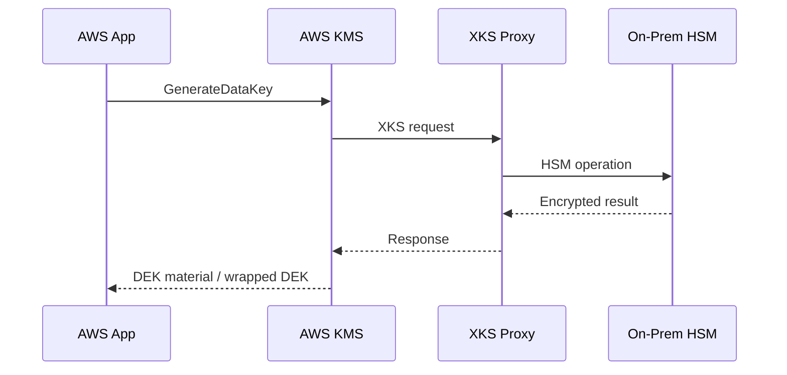


#### A.6 Azure Key Vault — Certificate Rotation Concept

```bicep
resource cert 'Microsoft.KeyVault/vaults/certificates@2023-07-01' = {
  name: 'production-tls'
}
```


#### A.7 GCP Cloud KMS and CMEK Examples

**Bucket with CMEK:**

```hcl
resource "google_storage_bucket" "analytics" {
  name     = "example-analytics-prod"
  location = "ASIA-EAST2"

  encryption {
    default_kms_key_name = google_kms_crypto_key.analytics_cmek.id
  }
}
```

**BigQuery dataset with CMEK:**

```hcl
resource "google_bigquery_dataset" "restricted" {
  dataset_id  = "restricted_dataset"
  location    = "asia-east2"

  default_encryption_configuration {
    kms_key_name = google_kms_crypto_key.analytics_cmek.id
  }
}
```

**Secret Manager access pattern:** store application secrets in Secret Manager and authorize access through Workload Identity-bound service accounts rather than distributing service account key files.

### Appendix B — Cryptographic Function Design Template

| Field | Value |
| :-- | :-- |
| Function name / description |  |
| System / microservice |  |
| Repository and module path |  |
| Data classification |  |
| Cryptographic function type |  |
| Selected algorithm |  |
| Key length / parameters |  |
| Justification |  |
| Key generation method |  |
| Key storage location |  |
| Rotation schedule |  |
| External dependencies |  |
| Library and version |  |
| Error handling |  |
| Logging check (no key material logged) |  |
| Developer sign-off |  |
| Security Architect sign-off |  |

### Appendix C — Key Inventory Registry Template

| Field | Description |
| :-- | :-- |
| Key ID | Unique identifier |
| Key Name / Alias | Human-readable name |
| Key Type | Symmetric / Asymmetric / HMAC / Secret / Certificate |
| Algorithm | Algorithm used |
| Key Length | Bits |
| Purpose | Protected function |
| Data Classification | Classification level |
| Owning System | System name |
| System Owner | Owner role |
| Key Custodian | Responsible role |
| Storage Location | ARN / path / vault location |
| Creation Date | Date created |
| Activation Date | Date activated |
| Rotation Due | Next rotation date |
| Last Rotation Date | Previous rotation date |
| Lifecycle State | Current state |
| PQC Migration Priority | Critical / High / Medium / Low |
| Exception Reference | Exception ID if any |

### Appendix D — Compliance Checklist

- [ ] Current cryptographic policy exists and has been reviewed within 12 months.
- [ ] All keys are recorded in the key inventory.
- [ ] No forbidden algorithms remain in production.
- [ ] Rotation is current for all production keys.
- [ ] KMS and vault audit logs are forwarded for monitoring.
- [ ] Certificate expiry monitoring is active.
- [ ] Container image signing is enforced in production.
- [ ] PQC migration priorities are assigned.


### Appendix E — Approved Algorithm Quick Reference Card

#### Use These

| Purpose | Algorithm |
| :-- | :-- |
| Data encryption | AES-256-GCM |
| Alternative symmetric | ChaCha20-Poly1305 |
| Key exchange | ECDH P-384 |
| Signatures | ECDSA P-384 / Ed25519 |
| Hash | SHA-256 / SHA-384 / SHA-3 |
| HMAC | HMAC-SHA256 |
| Password storage | Argon2id |

#### Never Use

| Algorithm | Reason |
| :-- | :-- |
| MD5 | Broken |
| SHA-1 | Broken for signatures |
| DES / 3DES | Obsolete |
| RC4 | Broken |
| AES-ECB | Unsafe mode |
| SSLv2 / SSLv3 / TLS1.0 / TLS1.1 | Obsolete protocols |
| DIY crypto | Unacceptable risk |

### Appendix F — Requirement Traceability Matrix

| Requirement ID | Control Summary | Primary Section | Evidence Example |
| :-- | :-- | :-- | :-- |
| CRYPTO-GOV-001 | Design record required before production deployment | [§8.2](#82-cryptographic-function-design-template) | Approved Appendix B record |
| CRYPTO-GOV-006 | Security Architect approval required | [§8.2](#82-cryptographic-function-design-template) | Workflow approval / sign-off |
| CRYPTO-ALG-001 | Forbidden algorithms not permitted | [§3.3](#33-forbidden--deprecated-algorithm-list) | Config review, scan evidence |
| CRYPTO-INV-001 | All production keys and secrets recorded in inventory | [§4.9](#49-inventory-management--review-process) | Inventory report |
| CRYPTO-INV-021 | Monthly rotation due-date review | [§4.9.3](#493-review-and-attestation-process) | Review ticket / report |
| CRYPTO-MON-001 | Key and cryptographic events logged and reviewed | [§9](#9-monitoring-detection--siem-integration) | Log forwarding evidence |
| CRYPTO-OSL-001 | Dependency discovery required | [§12.3.1](#1231-dependency-vulnerability-management-function) | SCA scan report |
| CRYPTO-OSL-010 | Dependency scanning at PR, build, and scheduled intervals | [§12.3.3](#1233-governance-requirements) | Pipeline config |
| CRYPTO-ALG-010 | New systems must use mandatory algorithms unless an approved exception exists | [§3.2.2](#322-operational-requirements) | Approved design record / exception record |
| CRYPTO-ALG-011 | Exception-based algorithm use must be documented and linked to inventory | [§3.2.2](#322-operational-requirements) | Design record, exception approval, inventory link |
| CRYPTO-ALG-012 | Chinese algorithm use must include interoperability or regulatory justification | [§3.2.2](#322-operational-requirements) | Design rationale and approval evidence |
| CRYPTO-ALG-013 | Forbidden algorithms must not be used in production | [§3.2.2](#322-operational-requirements) | Config review, scan result, audit evidence |
| CRYPTO-ALG-014 | New asymmetric designs must document PQC transition or crypto-agility approach | [§3.2.2](#322-operational-requirements) | Design record and architecture review |

### Appendix G — Operational Checklists

#### G.1 New Cryptographic Implementation Checklist

- [ ] Confirm a design record has been created. Reference: [§8.2](#82-cryptographic-function-design-template), **CRYPTO-GOV-001**.
- [ ] Confirm the selected algorithm is approved. Reference: [§3.2](#32-cryptographic-function-types).
- [ ] Confirm no forbidden algorithm or protocol is used. Reference: [§3.3](#33-forbidden--deprecated-algorithm-list), **CRYPTO-ALG-001**.
- [ ] Confirm key storage and retrieval use approved HSM, KMS, or vault controls. Reference: [§7](#7-cryptographic-architecture--technology-stack).
- [ ] Confirm monitoring and incident response expectations are defined. Reference: [§9](#9-monitoring-detection--siem-integration), [§10](#10-key-compromise--incident-response).
- [ ] Confirm inventory entry has been created. Reference: [§4.9](#49-inventory-management--review-process), **CRYPTO-INV-001**.


#### G.2 Quarterly Inventory Review Checklist

- [ ] Review all active records for completeness. Reference: [§4.9](#49-inventory-management--review-process).
- [ ] Review upcoming expiries and overdue rotation items. Reference: [§4.5](#45-key-rotation), **CRYPTO-INV-021**.
- [ ] Review deprecated or exception-based algorithms. Reference: [§3.3](#33-forbidden--deprecated-algorithm-list).
- [ ] Confirm design record linkage remains valid. Reference: [§8.2](#82-cryptographic-function-design-template).
- [ ] Confirm PQC migration priority and status are updated. Reference: [§6](#6-quantum-safe-migration-programme).


#### G.3 Dependency Vulnerability Review Checklist

- [ ] Confirm dependency scanning is running at pull request, build, and scheduled intervals. Reference: [§12.3.3](#1233-governance-requirements), **CRYPTO-OSL-010**.
- [ ] Confirm critical findings in approved cryptographic libraries have active remediation. Reference: [§12.3](#123-open-source-library-governance).
- [ ] Confirm exceptions are documented and time-bounded. Reference: [§12.3.3](#1233-governance-requirements), **CRYPTO-OSL-013**.
- [ ] Confirm the owning service and design record are linked to findings. Reference: [§8.2](#82-cryptographic-function-design-template), [§4.9](#49-inventory-management--review-process).


### Appendix H — China / NIST / Europe Algorithm Comparison

This appendix summarises the single-reference algorithm catalogue in [§3.2](#32-cryptographic-function-types) into a compact comparison view for architecture and procurement reviews.


| Use Case | NIST / Western Recommendation | Chinese Equivalent / Standard Family | European Reference Point | Enterprise Policy Position |
| :-- | :-- | :-- | :-- | :-- |
| Bulk encryption | AES-256-GCM | SM4-GCM / SM4-CCM | BSI TR-02102 | Default to AES-256-GCM; permit SM4 where China-specific compatibility is required |
| Key exchange | ECDHE P-384 / X25519 | SM2 key exchange | BSI TR-02102 | Default to ECDHE / X25519; use SM2 only for China-profile interoperability |
| Application signatures | ECDSA P-384 / Ed25519 | SM2 + SM3 | BSI TR-02102 | Default to ECDSA P-384 or Ed25519; use SM2 only where required |
| Hashing | SHA-256 / SHA-384 / SHA-3 | SM3 | BSI TR-02102 | Default to SHA-256 or stronger; allow SM3 in China-focused ecosystems |
| Message authentication | HMAC-SHA256 / HMAC-SHA384 | HMAC-SM3 | BSI TR-02102 | Default to HMAC-SHA256; allow HMAC-SM3 where required |
| TLS 1.3 suites | AES-GCM / ChaCha20-Poly1305 + modern key exchange | RFC 8998 SM4 + SM2 + SM3 suites | BSI TR-02102-2 | Use standard TLS 1.3 globally; support ShangMi TLS only where explicitly required |
| PQC transition | ML-KEM-768, ML-DSA-65, SLH-DSA | Track China-specific developments; no separate baseline selected here | BSI notes limited horizon for classic-only mechanisms | Use NIST PQC as planning baseline for enterprise migration |

#### H.1 Notes on Equivalent Algorithms

- **AES-256-GCM and SM4-GCM** both address symmetric confidentiality with authenticated encryption, but they are not interchangeable without ecosystem support and profile agreement.
- **ECDSA / ECDHE and SM2** serve broadly similar roles for signatures and key exchange, but certificate profiles, protocol integration, and trust ecosystems differ.
- **SHA-256 and SM3** are commonly treated as role-equivalent hash functions for integrity and signature support in their respective ecosystems.
- **HMAC-SHA256 and HMAC-SM3** are role-equivalent keyed integrity mechanisms, selected based on interoperability and regulatory context.


#### H.2 China-Specific Policy Note

Where workloads, customers, or regulators require Chinese commercial cryptography, solution designs SHOULD identify whether ShangMi interoperability is needed at the protocol, certificate, or data-protection layer. Such decisions SHALL be documented in the design record and linked to the inventory record. See [§8.2](#82-cryptographic-function-design-template) and [§4.9](#49-inventory-management--review-process).

---

## 14. References

### Hong Kong Regulatory

- **[R1]** Office of the Commissioner for Critical Infrastructure and Cybersecurity Supervision (OCCICS). *Protection of Critical Infrastructures (Computer Systems) Code of Practice, Version 1.0.* [https://www.occics.gov.hk/filemanager/en/content_19/CoP_en_v1.0.pdf](https://www.occics.gov.hk/filemanager/en/content_19/CoP_en_v1.0.pdf)
- **[R2]** Hong Kong SAR Government. *Protection of Critical Infrastructures (Computer Systems) Ordinance, Cap. 653.* [https://www.elegislation.gov.hk/hk/cap653](https://www.elegislation.gov.hk/hk/cap653)
- **[R3]** Office of the Privacy Commissioner for Personal Data (PCPD). *Guidance on Data Security Measures for Information and Communications Technology.* [https://www.pcpd.org.hk/english/resources_centre/publications/files/guidance_datasecurity_e.pdf](https://www.pcpd.org.hk/english/resources_centre/publications/files/guidance_datasecurity_e.pdf)


### NIST Standards

- **[R4]** NIST. *SP 800-57 Part 1 Rev. 6 (IPD).* [https://csrc.nist.gov/pubs/sp/800/57/pt1/r6/ipd](https://csrc.nist.gov/pubs/sp/800/57/pt1/r6/ipd)
- **[R5]** NIST. *SP 800-57 Part 1 Rev. 5.* [https://csrc.nist.gov/pubs/sp/800/57/pt1/r5/final](https://csrc.nist.gov/pubs/sp/800/57/pt1/r5/final)
- **[R6]** NIST. *FIPS 203 — ML-KEM.* [https://csrc.nist.gov/pubs/fips/203/final](https://csrc.nist.gov/pubs/fips/203/final)
- **[R7]** NIST. *FIPS 204 — ML-DSA.* [https://csrc.nist.gov/pubs/fips/204/final](https://csrc.nist.gov/pubs/fips/204/final)
- **[R8]** NIST. *FIPS 205 — SLH-DSA.* [https://csrc.nist.gov/pubs/fips/205/final](https://csrc.nist.gov/pubs/fips/205/final)
- **[R9]** NIST. *SP 800-175B Rev. 1.* [https://csrc.nist.gov/publications/detail/sp/800-175b/rev-1/final](https://csrc.nist.gov/publications/detail/sp/800-175b/rev-1/final)
- **[R10]** NIST. *SP 800-88 Rev. 1.* [https://csrc.nist.gov/publications/detail/sp/800-88/rev-1/final](https://csrc.nist.gov/publications/detail/sp/800-88/rev-1/final)


### International and Cloud Provider References

- **[R11]** European Commission. *EU Coordinated Implementation Roadmap for the Transition to Post-Quantum Cryptography.* [https://digital-strategy.ec.europa.eu/en/library/coordinated-implementation-roadmap-transition-post-quantum-cryptography](https://digital-strategy.ec.europa.eu/en/library/coordinated-implementation-roadmap-transition-post-quantum-cryptography)
- **[R12]** ISO. *ISO/IEC 27001:2022.* [https://www.iso.org/standard/27001](https://www.iso.org/standard/27001)
- **[R13]** ISO. *ISO/IEC 19790:2012.* [https://www.iso.org/standard/52906.html](https://www.iso.org/standard/52906.html)
- **[R14]** AWS. *AWS KMS Best Practices.* [https://docs.aws.amazon.com/prescriptive-guidance/latest/encryption-best-practices/kms.html](https://docs.aws.amazon.com/prescriptive-guidance/latest/encryption-best-practices/kms.html)
- **[R15]** AWS. *Choosing a Key Store.* [https://docs.aws.amazon.com/prescriptive-guidance/latest/aws-kms-best-practices/key-management.html](https://docs.aws.amazon.com/prescriptive-guidance/latest/aws-kms-best-practices/key-management.html)
- **[R16]** Alibaba Cloud. *Use Envelope Encryption with KMS.* [https://www.alibabacloud.com/help/en/kms/key-management-service/use-cases/use-envelope-encryption](https://www.alibabacloud.com/help/en/kms/key-management-service/use-cases/use-envelope-encryption)
- **[R17]** Huawei Cloud. *Data Encryption Workshop.* [https://www.huaweicloud.com/intl/en-us/product/dew.html](https://www.huaweicloud.com/intl/en-us/product/dew.html)
- **[R18]** Huawei Cloud. *Using KMS for Encryption.* [https://support.huaweicloud.com/intl/en-us/usermanual-dew/dew_01_0094.html](https://support.huaweicloud.com/intl/en-us/usermanual-dew/dew_01_0094.html)
- **[R19]** CyberArk. *Secrets Manager Kubernetes Architecture.* [https://docs.cyberark.com/secrets-manager-sh/latest/en/content/integrations/k8s-ocp/k8s-architecture.htm](https://docs.cyberark.com/secrets-manager-sh/latest/en/content/integrations/k8s-ocp/k8s-architecture.htm)
- **[R20]** External Secrets Operator. *CyberArk Conjur Provider.* [https://external-secrets.io/latest/provider/conjur/](https://external-secrets.io/latest/provider/conjur/)
- **[R21]** OWASP. *Cryptographic Storage Cheat Sheet.* [https://cheatsheetseries.owasp.org/cheatsheets/Cryptographic_Storage_Cheat_Sheet.html](https://cheatsheetseries.owasp.org/cheatsheets/Cryptographic_Storage_Cheat_Sheet.html)
- **[R22]** OWASP. *OWASP Dependency-Check.* [https://owasp.org/www-project-dependency-check/](https://owasp.org/www-project-dependency-check/)
- **[R23]** GitHub Docs. *Dependabot quickstart guide.* [https://docs.github.com/en/code-security/tutorials/secure-your-dependencies/dependabot-quickstart-guide](https://docs.github.com/en/code-security/tutorials/secure-your-dependencies/dependabot-quickstart-guide)
- **[R24]** Snyk. *Open Source Security Management.* [https://snyk.io/product/open-source-security-management/](https://snyk.io/product/open-source-security-management/)
- **[R25]** National People's Congress of the People's Republic of China. *Cryptography Law of the People's Republic of China.* [http://www.npc.gov.cn/englishnpc/c2759/c23934/202009/t20200929_384279.html](http://www.npc.gov.cn/englishnpc/c2759/c23934/202009/t20200929_384279.html)
- **[R25A]** Google Cloud. *Cloud Key Management Service (Cloud KMS) Documentation.* [https://cloud.google.com/kms/docs](https://cloud.google.com/kms/docs)
- **[R26]** IETF / RFC Editor. *RFC 8998: ShangMi (SM) Cipher Suites for TLS 1.3.* [https://www.rfc-editor.org/rfc/rfc8998.html](https://www.rfc-editor.org/rfc/rfc8998.html)
- **[R27]** BSI. *TR-02102-1 “Cryptographic Mechanisms: Recommendations and Key Lengths”.* [https://www.bsi.bund.de/SharedDocs/Downloads/EN/BSI/Publications/TechGuidelines/TG02102/BSI-TR-02102-1.html?nn=916626](https://www.bsi.bund.de/SharedDocs/Downloads/EN/BSI/Publications/TechGuidelines/TG02102/BSI-TR-02102-1.html?nn=916626)
- **[R28]** BSI. *TR-02102-2 “Cryptographic Mechanisms: Recommendations for Transport Layer Security (TLS)”.* [https://www.bsi.bund.de/SharedDocs/Downloads/EN/BSI/Publications/TechGuidelines/TG02102/BSI-TR-02102-2.pdf](https://www.bsi.bund.de/SharedDocs/Downloads/EN/BSI/Publications/TechGuidelines/TG02102/BSI-TR-02102-2.pdf)

---


