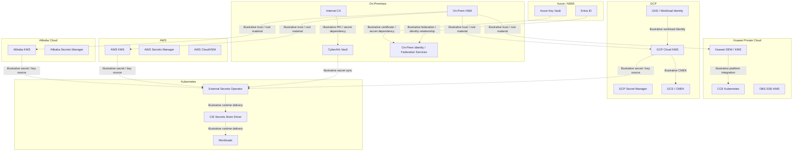
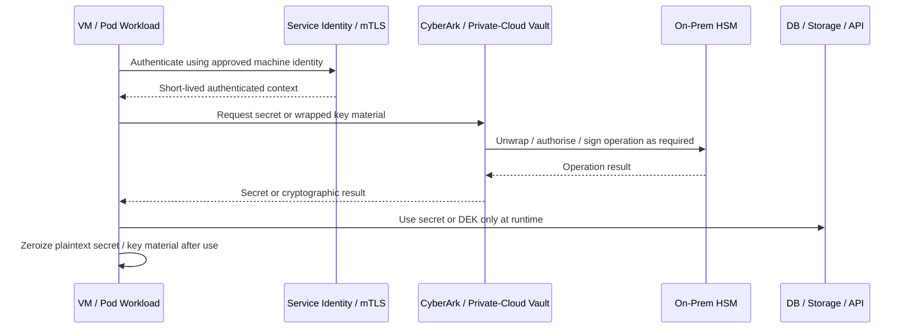
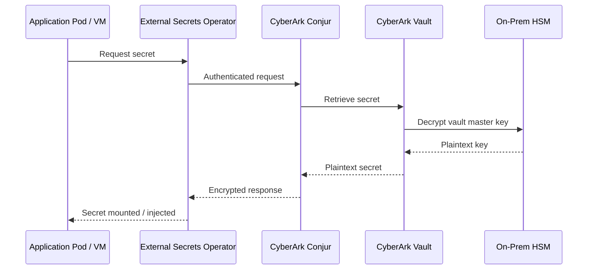
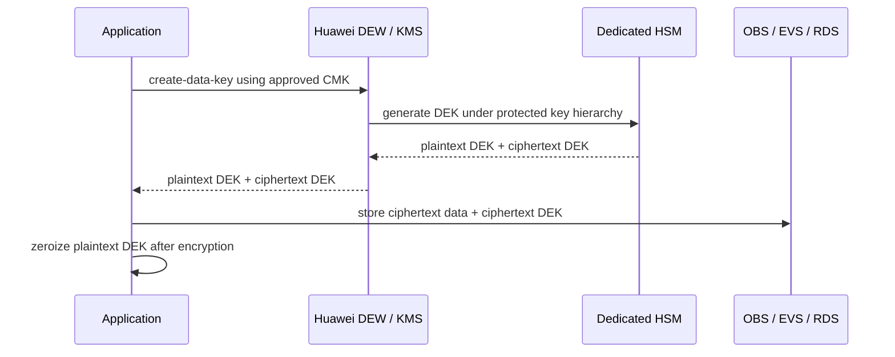
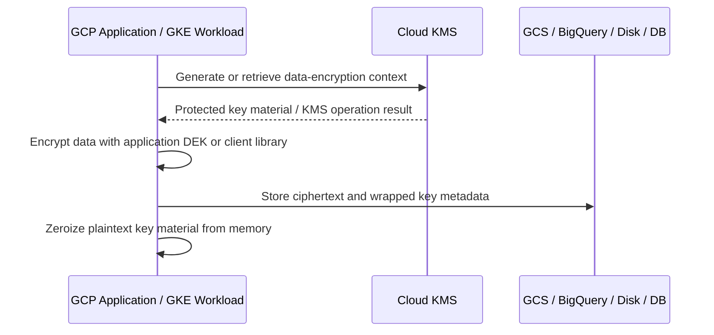

# Enterprise Cryptographic Management Guideline — v1.6 Redline Patch

**Patch File Purpose:** Apply the following replacements to `Enterprise-Cryptographic-Management-Guideline-v1_5.md` so Section 7, Appendix A, and Appendix F use consistent numbering, cross-references, and provider-specific requirement IDs.

---

## 1. Revision History — REPLACE TABLE WITH THE FOLLOWING

| Version | Date | Change Summary |
|---------|------|----------------|
| 1.0 | March 2026 | Initial draft baseline |
| 1.1 | March 2026 | Redline update to strengthen auditable language, add inventory management and review process, add cryptographic design and approval process, add traceable numbered requirements, expand checklists, and tighten dependency vulnerability management controls |
| 1.2 | March 2026 | Added China / NIST / European cross-standard algorithm comparison tables, use-case mappings, equivalent algorithm notes, recommended-now and do-not-use tables, and linked reference updates |
| 1.3 | March 2026 | Assumed GCP adoption for planning, expanded GCP encryption and key management examples, and corrected Section 7 architecture diagram to show illustrative relationships only with Entra linked to on-premises rather than AWS KMS |
| 1.4 | March 2026 | Consolidated algorithm guidance by merging Chinese equivalents, PQC choices, and do-not-use notes into Section 3.2; reduced overlap with Section 5.6 and made Section 3.2 the primary single-reference algorithm catalogue |
| 1.5 | March 2026 | Made Section 3.2 operational with Mandatory / Permitted by Exception / Forbidden columns, reduced residual overlap with Section 5.6, and added algorithm traceability requirements to Appendix F |
| 1.6 | March 2026 | Standardised Section 7 and Appendix A cloud/on-prem platform samples so AWS, Alibaba Cloud, Huawei private cloud, Azure, and on-prem/private cloud use the same control depth, numbering model, and implementation example pattern as GCP; updated internal cross-references and replaced Appendix A and Appendix F to eliminate duplicate numbering |

---

## 2. Table of Contents — REPLACE THE SECTION 7 ENTRY WITH THE FOLLOWING

- [7. Cryptographic Architecture — Technology Stack](#7-cryptographic-architecture--technology-stack)
  - [7.1 On-Premises HSM and Private Cloud Trust Services](#71-on-premises-hsm-and-private-cloud-trust-services)
    - [7.1.1 On-Prem / Private-Cloud Key Management Model](#711-on-prem--private-cloud-key-management-model)
    - [7.1.2 On-Prem / Private-Cloud Use Cases](#712-on-prem--private-cloud-use-cases)
    - [7.1.3 On-Prem / Private-Cloud Illustrative Runtime Secret and Key Pattern](#713-on-prem--private-cloud-illustrative-runtime-secret-and-key-pattern)
  - [7.2 CyberArk Vault & Conjur](#72-cyberark-vault--conjur)
  - [7.3 AWS KMS & Secrets Manager](#73-aws-kms--secrets-manager)
    - [7.3.1 AWS Key Management Model](#731-aws-key-management-model)
    - [7.3.2 AWS Use Cases](#732-aws-use-cases)
    - [7.3.3 AWS Illustrative Envelope Encryption Pattern](#733-aws-illustrative-envelope-encryption-pattern)
  - [7.4 Alibaba Cloud KMS](#74-alibaba-cloud-kms)
    - [7.4.1 Alibaba Cloud Key Management Model](#741-alibaba-cloud-key-management-model)
    - [7.4.2 Alibaba Cloud Use Cases](#742-alibaba-cloud-use-cases)
    - [7.4.3 Alibaba Cloud Illustrative Envelope Encryption Pattern](#743-alibaba-cloud-illustrative-envelope-encryption-pattern)
  - [7.5 Huawei Private Cloud — DEW & KMS](#75-huawei-private-cloud--dew--kms)
    - [7.5.1 Huawei Private-Cloud Key Management Model](#751-huawei-private-cloud-key-management-model)
    - [7.5.2 Huawei Private-Cloud Use Cases](#752-huawei-private-cloud-use-cases)
    - [7.5.3 Huawei Private-Cloud Illustrative Envelope Encryption Pattern](#753-huawei-private-cloud-illustrative-envelope-encryption-pattern)
  - [7.6 Azure Key Vault & Entra ID](#76-azure-key-vault--entra-id)
    - [7.6.1 Azure Key Management Model](#761-azure-key-management-model)
    - [7.6.2 Azure Use Cases](#762-azure-use-cases)
    - [7.6.3 Azure Illustrative Signing and Secret Retrieval Pattern](#763-azure-illustrative-signing-and-secret-retrieval-pattern)
  - [7.7 GCP Cloud KMS](#77-gcp-cloud-kms)
    - [7.7.1 GCP Key Management Model](#771-gcp-key-management-model)
    - [7.7.2 GCP Use Cases](#772-gcp-use-cases)
    - [7.7.3 GCP Illustrative Envelope Encryption Pattern](#773-gcp-illustrative-envelope-encryption-pattern)
    - [7.7.4 GCP Terraform Example Key Ring and CMEK](#774-gcp-terraform-example-key-ring-and-cmek)
    - [7.7.5 GCP Example Asymmetric Signing with Cloud KMS](#775-gcp-example-asymmetric-signing-with-cloud-kms)
    - [7.7.6 GKE and Secret Retrieval Example](#776-gke-and-secret-retrieval-example)

## 3. Table of Contents — REPLACE THE APPENDIX A AND APPENDIX F ENTRIES WITH THE FOLLOWING

- [13. Appendices](#13-appendices)
  - [Appendix A — Platform Integration Technical Reference](#appendix-a--platform-integration-technical-reference)
    - [A.1 AWS KMS and Secrets Manager Examples](#a1-aws-kms-and-secrets-manager-examples)
    - [A.2 Alibaba Cloud KMS Examples](#a2-alibaba-cloud-kms-examples)
    - [A.3 Huawei Private Cloud DEW and Dedicated HSM Examples](#a3-huawei-private-cloud-dew-and-dedicated-hsm-examples)
    - [A.4 On-Premises HSM and Private-Cloud Trust Services Examples](#a4-on-premises-hsm-and-private-cloud-trust-services-examples)
    - [A.5 CyberArk and Kubernetes Secret Delivery Examples](#a5-cyberark-and-kubernetes-secret-delivery-examples)
    - [A.6 Azure Key Vault and Entra ID Examples](#a6-azure-key-vault-and-entra-id-examples)
    - [A.7 GCP Cloud KMS and CMEK Examples](#a7-gcp-cloud-kms-and-cmek-examples)
  - [Appendix F — Requirement Traceability Matrix](#appendix-f--requirement-traceability-matrix)

---

## 4. Section 7 — REPLACE THE ENTIRE EXISTING SECTION 7 WITH THE FOLLOWING

## 7. Cryptographic Architecture — Technology Stack

The following architecture views are **illustrative only**. They show example trust, integration, and dependency patterns that may exist across the enterprise, but they do not assert that every depicted connection exists in the current environment.



### 7.1 On-Premises HSM and Private Cloud Trust Services

On-premises HSM and private-cloud cryptographic services SHALL be used where the organisation requires direct custody of root material, regulated signing keys, private-cloud storage encryption, or trust anchoring for hybrid and cross-cloud key strategies. Dual control, split knowledge, formally approved operator roles, and auditable administrative procedures are mandatory for all high-assurance cryptographic administration.

#### 7.1.1 On-Prem / Private-Cloud Key Management Model

| Requirement ID | Requirement | Example Implementation |
| :-- | :-- | :-- |
| CRYPTO-ONP-001 | Confidential or Restricted on-premises and private-cloud workloads SHALL use enterprise-controlled keys rather than unmanaged platform-default keys wherever explicit key selection is supported. | Private-cloud storage, databases, Kubernetes secrets encryption, and application-level encryption reference HSM-backed or enterprise KMS-managed key material. |
| CRYPTO-ONP-002 | Root keys, CA keys, signing keys, and application master keys SHALL be separated by environment, data classification, and trust boundary. | Separate HSM partitions, logical domains, or key hierarchies for `prod-restricted`, `prod-confidential`, and `nonprod`. |
| CRYPTO-ONP-003 | Workloads SHALL authenticate to vault or key services using approved machine identity, mTLS, federation, or equivalent short-lived controls rather than shared static credentials. | VM workloads use certificate-based service identity; Kubernetes workloads use ESO, CSI, or approved workload identity integration. |
| CRYPTO-ONP-004 | HSM, vault, CA, and private-cloud key-service audit logs SHALL be exported to the enterprise SIEM. | Generate, import, unwrap, sign, disable, restore, and admin login events are centrally monitored. |
| CRYPTO-ONP-005 | Every production key, certificate, and managed secret SHALL be linked to the enterprise inventory and approved design record. | HSM object label, vault path, CA identifier, and dependent service are mapped to Appendix B and Appendix C records. |
| CRYPTO-ONP-006 | HSM-backed non-exportable protection SHALL be mandatory for root CA keys, externally trusted signing keys, and other high-assurance Restricted use cases. | Offline root CA, code-signing key, and selected JWT signing keys remain non-exportable within approved HSM controls. |
| CRYPTO-ONP-007 | Secrets SHALL be retrieved at runtime from CyberArk, approved private-cloud vault services, or HSM-integrated services and SHALL NOT be embedded in code, images, or plaintext configuration. | No secrets in source repositories, VM templates, container images, or unsecured deployment variables. |
| CRYPTO-ONP-008 | Backup, recovery, revocation, destruction, and emergency disablement procedures SHALL be documented, approved, and tested at least annually. | HSM backup restore, CA recovery, and emergency key-disable runbooks are evidenced and retained for audit. |

#### 7.1.2 On-Prem / Private-Cloud Use Cases

| Use Case | Recommended Control | Key Management Pattern |
| :-- | :-- | :-- |
| Root CA and subordinate CA protection | On-prem HSM | Offline or tightly controlled ceremony-based custody |
| High-assurance application signing | Non-exportable HSM asymmetric key | Signing operation occurs in HSM; private key never leaves module |
| Kubernetes secret encryption at rest | Envelope encryption with approved KMS or HSM-integrated plugin | Cluster-level encryption key separated by environment |
| Database or storage encryption in private cloud | HSM-backed or enterprise KMS-managed KEK / CMK | Platform storage encryption plus optional application-layer AES-256-GCM |
| VM and application secrets retrieval | CyberArk or approved private-cloud vault | Runtime retrieval using machine identity and auditable access path |

#### 7.1.3 On-Prem / Private-Cloud Illustrative Runtime Secret and Key Pattern



### 7.2 CyberArk Vault & Conjur

CyberArk is the strategic vault for privileged secrets, application secrets, and selected cryptographic key-adjacent materials across both VM and Kubernetes environments.



### 7.3 AWS KMS & Secrets Manager

AWS KMS SHALL be the default AWS control plane for customer-managed encryption keys, envelope encryption, and asymmetric signing where supported. AWS Secrets Manager or approved enterprise vault services SHALL be used for runtime secret retrieval, and CloudHSM-backed custom key stores SHOULD be used for the most sensitive or specially regulated AWS use cases.

#### 7.3.1 AWS Key Management Model

| Requirement ID | Requirement | Example Implementation |
| :-- | :-- | :-- |
| CRYPTO-AWS-001 | AWS workloads handling Confidential or Restricted data SHALL use customer-managed keys rather than service-default encryption where the AWS service supports such control. | S3, EBS, RDS, selected EKS workloads, and application-layer encryption use AWS KMS CMKs. |
| CRYPTO-AWS-002 | Keys SHALL be separated by account, environment, region, and data classification as appropriate to the workload risk boundary. | Distinct keys or aliases for `prod-restricted`, `prod-confidential`, and `nonprod`; production and non-production keys are never shared. |
| CRYPTO-AWS-003 | Workloads SHALL use approved short-lived AWS identity or federation controls rather than embedded long-lived access keys. | Compute and container workloads retrieve secrets and invoke KMS without static credentials stored in code, AMIs, or images. |
| CRYPTO-AWS-004 | AWS KMS administrative and usage events SHALL be logged and exported to the enterprise monitoring platform. | CloudTrail captures `Encrypt`, `Decrypt`, `GenerateDataKey`, `CreateKey`, `DisableKey`, and policy-change events. |
| CRYPTO-AWS-005 | AWS key inventory records SHALL be linked to the enterprise inventory and design record. | KMS key ARN, alias, account owner, data classification, and dependent application are mapped to Appendix C. |
| CRYPTO-AWS-006 | CloudHSM-backed custom key stores or equivalent stronger custody controls SHALL be used where required by regulation, risk rating, or externally trusted signing. | High-value signing or high-assurance custody uses HSM-backed integration rather than general-purpose key custody alone. |
| CRYPTO-AWS-007 | Secrets SHALL be retrieved at runtime from AWS Secrets Manager or approved enterprise vault services. | Database credentials, API secrets, and token-signing dependencies are not stored in source code, images, or plaintext configuration. |
| CRYPTO-AWS-008 | Rotation, disablement, revocation, recovery, and re-encryption procedures SHALL be documented and tested. | Automatic rotation is enabled where supported; runbooks exist for disable, restore, and data re-encryption scenarios. |

#### 7.3.2 AWS Use Cases

| Use Case | Recommended AWS Control | Key Management Pattern |
| :-- | :-- | :-- |
| Object storage encryption | S3 SSE-KMS | Bucket encryption references approved AWS KMS CMK |
| Database encryption | RDS with KMS-backed encryption | Key segregated by environment and sensitivity |
| Application-layer encryption | Envelope encryption with AWS KMS | `GenerateDataKey` returns per-operation DEK; plaintext DEK is zeroized after use |
| Secrets management | AWS Secrets Manager | Runtime retrieval using approved identity path |
| Application or JWT signing | AWS KMS asymmetric signing | Sign without exporting the private key |

#### 7.3.3 AWS Illustrative Envelope Encryption Pattern

1. The application authenticates using approved AWS identity controls.
2. The application requests a DEK from AWS KMS using an approved CMK.
3. The application encrypts data locally using AES-256-GCM with the plaintext DEK.
4. The application stores ciphertext together with the wrapped DEK and required metadata.
5. The application zeroizes plaintext DEK material immediately after use.

### 7.4 Alibaba Cloud KMS

Alibaba Cloud KMS SHALL be the primary key-management service for envelope encryption, CMK lifecycle control, and service-integrated encryption across Alibaba workloads. Alibaba secrets capabilities or approved enterprise vault services SHALL be used for runtime secret retrieval and SHALL follow the same inventory, monitoring, and exception-governance requirements used elsewhere in this document.

#### 7.4.1 Alibaba Cloud Key Management Model

| Requirement ID | Requirement | Example Implementation |
| :-- | :-- | :-- |
| CRYPTO-ALI-001 | Confidential or Restricted Alibaba workloads SHALL use customer-managed or enterprise-selected encryption controls where the platform supports such control. | OSS, ECS-attached storage, RDS, and application encryption reference approved KMS-managed keys. |
| CRYPTO-ALI-002 | Keys SHALL be separated by environment, account boundary, and data classification. | Distinct CMKs for `prod-restricted`, `prod-confidential`, and `nonprod`. |
| CRYPTO-ALI-003 | Workloads SHALL use approved identity-based access rather than embedded static credentials. | Compute and Kubernetes workloads access KMS and secret services through approved runtime identity controls. |
| CRYPTO-ALI-004 | Administrative and usage events SHALL be logged and exported to enterprise monitoring. | Key creation, disablement, rotation, decrypt, and policy-administration events are forwarded to SIEM. |
| CRYPTO-ALI-005 | KMS keys and secret dependencies SHALL be linked to the enterprise inventory and design record. | CMK identifier, owning team, use case, dependency mapping, and exception record are retained. |
| CRYPTO-ALI-006 | Stronger custody controls SHALL be used for the highest-sensitivity use cases where platform capability or external HSM integration is required. | High-assurance signing or master-key protection uses an approved enhanced custody pattern. |
| CRYPTO-ALI-007 | Secrets SHALL be retrieved at runtime and SHALL NOT be embedded in code, images, or plaintext configuration. | Applications obtain credentials through approved managed secret or vault workflows. |
| CRYPTO-ALI-008 | Rotation, disablement, and recovery procedures SHALL be documented, approved, and tested. | Platform runbooks define revoke, rotate, and re-encrypt actions for each dependent service. |

#### 7.4.2 Alibaba Cloud Use Cases

| Use Case | Recommended Alibaba Control | Key Management Pattern |
| :-- | :-- | :-- |
| Object storage encryption | OSS SSE-KMS | Bucket or object encryption references approved CMK |
| Database encryption | RDS with KMS-backed encryption | Key split by environment and classification |
| Application-layer encryption | Envelope encryption with Alibaba KMS | Per-operation DEK generated, wrapped, and stored with ciphertext |
| Secrets management | Approved managed secret service or enterprise vault | Runtime retrieval through approved identity path |
| Container or service secrets | ACK-integrated runtime retrieval | Secrets delivered at runtime, not baked into images or manifests |

#### 7.4.3 Alibaba Cloud Illustrative Envelope Encryption Pattern

1. The application authenticates using approved platform identity controls.
2. The application requests a DEK from Alibaba Cloud KMS.
3. KMS returns a plaintext DEK for immediate use and a wrapped DEK for storage.
4. The application encrypts business data using AES-256-GCM.
5. The wrapped DEK is stored with ciphertext metadata and the plaintext DEK is zeroized.

### 7.5 Huawei Private Cloud — DEW & KMS

Huawei private-cloud workloads SHALL use DEW, KMS, and Dedicated HSM capabilities for enterprise-controlled encryption, key lifecycle governance, and private-cloud storage protection. Because this platform may operate in a more organisation-controlled boundary than public cloud, designs SHALL explicitly document custody boundaries, administrative roles, recovery processes, and integration with enterprise SIEM and inventory.

#### 7.5.1 Huawei Private-Cloud Key Management Model

| Requirement ID | Requirement | Example Implementation |
| :-- | :-- | :-- |
| CRYPTO-HPC-001 | Confidential or Restricted private-cloud workloads SHALL use enterprise-selected DEW / KMS keys rather than unmanaged platform-default cryptography where explicit control is available. | OBS, EVS, RDS, CCE secret protection, and application-level encryption use approved key references. |
| CRYPTO-HPC-002 | Keys SHALL be separated by region, environment, and data classification. | Separate keys for production Restricted, production Confidential, and non-production workloads. |
| CRYPTO-HPC-003 | Workloads SHALL use approved private-cloud identity, federation, or workload authentication instead of shared static credentials. | CCE and VM workloads access DEW through controlled service identity and approved runtime path. |
| CRYPTO-HPC-004 | DEW, Dedicated HSM, and private-cloud audit events SHALL be forwarded to enterprise monitoring. | Key generation, decrypt, disable, rotation, restore, and admin-access events are exported to SIEM. |
| CRYPTO-HPC-005 | Private-cloud key records SHALL be linked to enterprise inventory and design records. | DEW key ID, owner, application mapping, and exception reference are linked to Appendix B and Appendix C. |
| CRYPTO-HPC-006 | Dedicated HSM-backed protection SHALL be used for root material, high-value signing, and regulated Restricted data where required by business or regulatory drivers. | Dedicated HSM stores or protects master material for the highest-sensitivity use cases. |
| CRYPTO-HPC-007 | Secrets SHALL be retrieved at runtime from approved private-cloud or enterprise vault services. | No plaintext secret sprawl in VM templates, images, or Kubernetes manifests. |
| CRYPTO-HPC-008 | Disablement, rotation, backup, recovery, and emergency procedures SHALL be documented and tested. | Annual evidence for restore and emergency key-disable workflows is retained. |

#### 7.5.2 Huawei Private-Cloud Use Cases

| Use Case | Recommended Huawei Control | Key Management Pattern |
| :-- | :-- | :-- |
| Object storage encryption | OBS SSE-KMS | Approved DEW key referenced by storage policy |
| Volume or VM storage encryption | EVS / VM storage with DEW-managed key | Key separated by environment and sensitivity |
| Database encryption | RDS with DEW/KMS-backed control | Managed DB encryption tied to enterprise key inventory |
| CCE workload secrets | DEW-integrated or approved vault retrieval pattern | Runtime access through approved workload identity path |
| Application-layer encryption | Envelope encryption with DEW | Per-operation DEK created, wrapped, stored, and plaintext zeroized |

#### 7.5.3 Huawei Private-Cloud Illustrative Envelope Encryption Pattern



### 7.6 Azure Key Vault & Entra ID

Azure Key Vault SHALL be the default Azure control plane for keys, secrets, and certificates, while Entra ID SHALL govern approved identity-driven access patterns for Azure workloads. Azure implementations SHALL use non-exportable keys where supported, align certificate and signing use cases to enterprise policy, and avoid static credentials in workloads.

#### 7.6.1 Azure Key Management Model

| Requirement ID | Requirement | Example Implementation |
| :-- | :-- | :-- |
| CRYPTO-AZR-001 | Confidential or Restricted Azure workloads SHALL use customer-controlled encryption keys where the platform supports such control. | Azure storage, managed databases, AKS-related secret workflows, and application-layer encryption reference approved Key Vault keys. |
| CRYPTO-AZR-002 | Keys, certificates, and secrets SHALL be separated by environment, subscription boundary, and data classification. | Distinct vaults or key sets for `prod-restricted`, `prod-confidential`, and `nonprod`. |
| CRYPTO-AZR-003 | Workloads SHALL use Entra-governed managed identity, federation, or equivalent short-lived access rather than embedded secrets. | VM and AKS workloads retrieve keys or secrets at runtime through approved identity paths. |
| CRYPTO-AZR-004 | Key Vault administrative and usage logs SHALL be exported to enterprise monitoring. | Sign, unwrap, secret read, certificate update, key disable, and policy-change events are forwarded to SIEM. |
| CRYPTO-AZR-005 | Azure key, certificate, and secret records SHALL be linked to enterprise inventory and design records. | Vault URI, key name, certificate name, owner, and dependent application are mapped in inventory. |
| CRYPTO-AZR-006 | HSM-backed or higher-assurance key protection SHALL be used for externally trusted signing, root-like trust anchors, and the highest-sensitivity use cases. | High-value signing and certificate-authority-adjacent controls use stronger custody options where required. |
| CRYPTO-AZR-007 | Secrets and certificates SHALL be retrieved or renewed through approved runtime workflows rather than manual distribution or file export. | Applications and services consume current secrets at runtime; certificates rotate without uncontrolled private-key export. |
| CRYPTO-AZR-008 | Rotation, disablement, certificate renewal, and emergency response procedures SHALL be documented and tested. | Key rollover, certificate renewal, and incident disablement runbooks are retained as evidence. |

#### 7.6.2 Azure Use Cases

| Use Case | Recommended Azure Control | Key Management Pattern |
| :-- | :-- | :-- |
| Application secrets | Azure Key Vault secrets | Runtime retrieval via approved identity path |
| Certificate lifecycle | Azure Key Vault certificates | Renewal and distribution controlled centrally |
| Application signing / JWT signing | Non-exportable asymmetric key in Key Vault | Signing operation occurs without private-key export |
| Storage or database encryption | Service-integrated customer-controlled key reference | Key ownership retained in Key Vault |
| AKS secrets access | Approved identity-based retrieval pattern | Workload accesses secret at runtime rather than embedding it |

#### 7.6.3 Azure Illustrative Signing and Secret Retrieval Pattern

1. The workload authenticates using approved Entra-managed identity or federation.
2. The workload retrieves a secret or invokes a signing operation from Azure Key Vault.
3. Private signing keys remain non-exportable and are not distributed to application hosts.
4. Key usage, secret access, and administrative events are exported to central monitoring.
5. Rotated secrets and keys are consumed through runtime retrieval rather than manual redeployment of plaintext credentials.

### 7.7 GCP Cloud KMS

GCP is an in-scope platform for planning and implementation. GCP workloads SHALL use Cloud KMS and, where sensitivity requires it, Cloud HSM-backed key protection for regulated or high-value data.

#### 7.7.1 GCP Key Management Model

| Requirement ID | Requirement | Example Implementation |
| :-- | :-- | :-- |
| CRYPTO-GCP-001 | GCP workloads handling Confidential or Restricted data SHALL use CMEK rather than provider-default encryption where the service supports it. | BigQuery, GCS, Persistent Disk, and selected AI services use Cloud KMS keys. |
| CRYPTO-GCP-002 | Key rings and keys SHALL be separated by environment, project, and data classification. | Separate key rings for `prod-restricted`, `prod-confidential`, and `nonprod`. |
| CRYPTO-GCP-003 | Workloads SHALL use Workload Identity or equivalent short-lived identity federation rather than long-lived service account keys. | GKE Workload Identity is bound to service accounts that can call Cloud KMS or Secret Manager. |
| CRYPTO-GCP-004 | Cloud Audit Logs for KMS operations SHALL be exported to the enterprise monitoring platform. | `Encrypt`, `Decrypt`, `AsymmetricSign`, `CreateCryptoKeyVersion`, IAM policy change, and disable events are audited. |
| CRYPTO-GCP-005 | GCP key inventory records SHALL be linked to the enterprise inventory and design record. | Cloud KMS key resource ID is linked to Appendix C and Appendix B records. |
| CRYPTO-GCP-006 | Cloud HSM-backed or equivalent stronger protection SHALL be used for the most sensitive regulated data, root-like trust anchors, and high-assurance signing use cases. | Selected signing keys or highly sensitive master keys use stronger protection tiers where required. |
| CRYPTO-GCP-007 | Secrets SHALL be retrieved at runtime from Secret Manager or approved enterprise vault services and SHALL NOT be embedded in code, images, or static configuration. | Application credentials and secrets are accessed at runtime through Workload Identity. |
| CRYPTO-GCP-008 | Rotation, disablement, revocation, and recovery procedures SHALL be documented and tested. | Key version rotation, disablement, re-encryption, and emergency response runbooks are retained. |

#### 7.7.2 GCP Use Cases

| Use Case | Recommended GCP Control | Key Management Pattern |
| :-- | :-- | :-- |
| Object storage encryption | GCS with CMEK | Cloud KMS key referenced by bucket policy |
| VM disk encryption | Persistent Disk CMEK | Cloud KMS key scoped by environment and project |
| GKE application encryption | Envelope encryption with Cloud KMS or Secret Manager | Workload Identity retrieves keys or secrets at runtime |
| BigQuery sensitive datasets | CMEK-enabled datasets | Dataset-level encryption policy tied to Cloud KMS |
| Application signing / JWT signing | Cloud KMS asymmetric signing keys | Sign without exporting private key |
| Secrets management | Secret Manager with Cloud KMS-backed protection | Runtime retrieval via Workload Identity |

#### 7.7.3 GCP Illustrative Envelope Encryption Pattern



#### 7.7.4 GCP Terraform Example Key Ring and CMEK

```hcl
resource "google_kms_key_ring" "prod_restricted" {
  name     = "prod-restricted-ring"
  location = "asia-east2"
}

resource "google_kms_crypto_key" "gcs_cmek" {
  name            = "gcs-restricted-cmek"
  key_ring        = google_kms_key_ring.prod_restricted.id
  rotation_period = "7776000s"

  version_template {
    algorithm        = "GOOGLE_SYMMETRIC_ENCRYPTION"
    protection_level = "HSM"
  }
}

resource "google_storage_bucket" "restricted_bucket" {
  name     = "example-prod-restricted-bucket"
  location = "ASIA-EAST2"

  encryption {
    default_kms_key_name = google_kms_crypto_key.gcs_cmek.id
  }
}
```

#### 7.7.5 GCP Example Asymmetric Signing with Cloud KMS

```python
from google.cloud import kms

client = kms.KeyManagementServiceClient()
key_version_name = "projects/PROJECT/locations/asia-east2/keyRings/prod-restricted-ring/cryptoKeys/jwt-signing/cryptoKeyVersions/1"

digest = kms.Digest(sha384=b"digest-bytes")
response = client.asymmetric_sign(
    request={"name": key_version_name, "digest": digest}
)

signature = response.signature
```

#### 7.7.6 GKE and Secret Retrieval Example

```yaml
apiVersion: v1
kind: ServiceAccount
metadata:
  name: app-sa
  namespace: production
  annotations:
    iam.gke.io/gcp-service-account: app-sa@example-project.iam.gserviceaccount.com
---
apiVersion: apps/v1
kind: Deployment
metadata:
  name: api
  namespace: production
spec:
  template:
    spec:
      serviceAccountName: app-sa
      containers:
        - name: api
          image: asia-east2-docker.pkg.dev/example-project/prod/api:1.0.0
```

Use Workload Identity so the pod can retrieve secrets from Secret Manager or invoke Cloud KMS without embedding long-lived credentials.

---

## 5. Section 8 and Other Internal Cross-References — APPLY THE FOLLOWING TARGETED UPDATES

Replace any existing internal references that point to the former heading `7.1 On-Premises HSM` or anchor `#71-on-premises-hsm` with the updated heading `7.1 On-Premises HSM and Private Cloud Trust Services` and anchor `#71-on-premises-hsm-and-private-cloud-trust-services`.

Where a reference is intended to point to the new detailed on-premises control model rather than the overall Section 7 chapter, use `§7.1.1` and anchor `#711-on-prem--private-cloud-key-management-model`.

No other existing anchors in Sections 1–12 require renumbering because the new Section 7 structure preserves the top-level numbering pattern already used by the current document.

---

## 6. Appendix A — REPLACE THE ENTIRE EXISTING APPENDIX A WITH THE FOLLOWING

### Appendix A — Platform Integration Technical Reference

This appendix is fully replaced to remove duplicate numbering and make all platform examples parallel in structure.

#### A.1 AWS KMS and Secrets Manager Examples

##### A.1.1 AWS Terraform CMK Example

```hcl
resource "aws_kms_key" "restricted_data" {
  description             = "CMK for Restricted data"
  enable_key_rotation     = true
  deletion_window_in_days = 30
}

resource "aws_kms_alias" "restricted_data_alias" {
  name          = "alias/prod-restricted-data"
  target_key_id = aws_kms_key.restricted_data.key_id
}
```

##### A.1.2 AWS Envelope Encryption Pattern

```python
# Pseudocode example
plaintext_dek, ciphertext_dek = kms.generate_data_key(cmk_id)
ciphertext = aes_gcm_encrypt(plaintext_dek, plaintext)
store(ciphertext, ciphertext_dek)
zeroize(plaintext_dek)
```

##### A.1.3 AWS Runtime Secret Retrieval Pattern

```python
# Pseudocode example
secret = secrets_manager.get_secret_value(secret_id)
use_secret(secret)
zeroize(secret)
```

#### A.2 Alibaba Cloud KMS Examples

##### A.2.1 Alibaba KMS Envelope Encryption Pattern

```python
# Pseudocode example
plaintext_dek, ciphertext_dek = kms.generate_data_key(cmk_id)
ciphertext = aes_gcm_encrypt(plaintext_dek, plaintext)
store(ciphertext, ciphertext_dek)
zeroize(plaintext_dek)
```

##### A.2.2 Alibaba Object Storage Encryption Example

```text
Object storage policy SHALL reference an approved KMS-managed key for Restricted or Confidential data where the service supports customer-selected encryption controls.
```

##### A.2.3 Alibaba Runtime Secret Retrieval Pattern

```text
Applications SHALL retrieve secrets at runtime through approved managed secret or enterprise vault integration and SHALL NOT embed secrets in source code, images, or plaintext configuration.
```

#### A.3 Huawei Private Cloud DEW and Dedicated HSM Examples

##### A.3.1 Huawei DEW Envelope Encryption Pattern

```python
# Pseudocode example
plaintext_dek, ciphertext_dek = dew.create_data_key(cmk_id)
ciphertext = aes_gcm_encrypt(plaintext_dek, plaintext)
store(ciphertext, ciphertext_dek)
zeroize(plaintext_dek)
```

##### A.3.2 Huawei Dedicated HSM Custody Pattern

```text
Use Dedicated HSM for root material, high-value signing, or specially regulated Restricted data where stronger custody boundaries are required than standard software-backed controls.
```

##### A.3.3 Huawei Private-Cloud Runtime Secret Pattern

```text
CCE and VM workloads SHALL retrieve secrets through approved runtime identity and vault or KMS integration patterns rather than static secret distribution.
```

#### A.4 On-Premises HSM and Private-Cloud Trust Services Examples

##### A.4.1 HSM Signing Example

```python
# Pseudocode example
digest = sha384(data)
signature = hsm.sign(key_label="prod-code-signing", digest=digest)
```

##### A.4.2 Private-Cloud Database Encryption Pattern

```text
On-premises or private-cloud database encryption SHOULD use TDE or application-layer AES-256-GCM with an HSM-backed KEK / CMK aligned to the platform trust model.
```

##### A.4.3 VM Machine Identity Secret Retrieval Pattern

```text
VM workloads SHALL authenticate with approved machine identity or mTLS and retrieve required secrets only at runtime from CyberArk or approved private-cloud vault services.
```

#### A.5 CyberArk and Kubernetes Secret Delivery Examples

##### A.5.1 ESO / Conjur Delivery Example

```yaml
apiVersion: external-secrets.io/v1beta1
kind: ExternalSecret
metadata:
  name: app-secret
  namespace: production
spec:
  refreshInterval: 1h
  secretStoreRef:
    name: conjur-store
    kind: SecretStore
  target:
    name: app-secret
  data:
    - secretKey: password
      remoteRef:
        key: /production/app/db-password
```

##### A.5.2 Kubernetes Runtime Secret Delivery Note

```text
Secrets delivered to Kubernetes SHALL originate from an approved upstream vault or KMS-backed service and SHALL be rotated through the source system rather than by manual editing of cluster-local plaintext values.
```

#### A.6 Azure Key Vault and Entra ID Examples

##### A.6.1 Azure Key Example

```text
Store application signing or wrapping keys in Azure Key Vault using non-exportable key protection where supported and appropriate to the use case.
```

##### A.6.2 Azure Signing Pattern

```python
# Pseudocode example
digest = sha384(data)
signature = key_vault.sign(key_name="jwt-signing", algorithm="ES384", digest=digest)
```

##### A.6.3 Azure Runtime Secret Retrieval Pattern

```text
AKS and VM workloads SHALL use managed identity or approved federation to retrieve secrets at runtime from Azure Key Vault without embedding credentials in code or deployment artifacts.
```

#### A.7 GCP Cloud KMS and CMEK Examples

##### A.7.1 Bucket with CMEK

```hcl
resource "google_storage_bucket" "analytics" {
  name     = "example-analytics-prod"
  location = "ASIA-EAST2"

  encryption {
    default_kms_key_name = google_kms_crypto_key.analytics_cmek.id
  }
}
```

##### A.7.2 BigQuery Dataset with CMEK

```hcl
resource "google_bigquery_dataset" "restricted" {
  dataset_id = "restricted_dataset"
  location   = "asia-east2"

  default_encryption_configuration {
    kms_key_name = google_kms_crypto_key.analytics_cmek.id
  }
}
```

##### A.7.3 Secret Manager Access Pattern

```text
Store application secrets in Secret Manager and authorise access through Workload Identity-bound service accounts rather than distributing service account key files.
```

---

## 7. Appendix F — REPLACE THE ENTIRE EXISTING APPENDIX F WITH THE FOLLOWING

### Appendix F — Requirement Traceability Matrix

This appendix is fully replaced so provider-specific requirement IDs are complete, unique, and consistent with the updated Section 7 numbering.

| Requirement ID | Control Summary | Primary Section | Evidence Example |
| :-- | :-- | :-- | :-- |
| CRYPTO-GOV-001 | Design record required before production deployment | [§8.2](#82-cryptographic-function-design-template) | Approved Appendix B record |
| CRYPTO-GOV-006 | Security Architect approval required | [§8.2](#82-cryptographic-function-design-template) | Workflow approval / sign-off |
| CRYPTO-ALG-001 | Forbidden algorithms not permitted | [§3.3](#33-forbidden--deprecated-algorithm-list) | Config review, scan evidence |
| CRYPTO-ALG-010 | New systems must use mandatory algorithms unless an approved exception exists | [§3.2.2](#322-operational-requirements) | Approved design record / exception record |
| CRYPTO-ALG-011 | Exception-based algorithm use must be documented and linked to inventory | [§3.2.2](#322-operational-requirements) | Design record, exception approval, inventory link |
| CRYPTO-ALG-012 | Chinese algorithm use must include interoperability or regulatory justification | [§3.2.2](#322-operational-requirements) | Design rationale and approval evidence |
| CRYPTO-ALG-013 | Forbidden algorithms must not be used in production | [§3.2.2](#322-operational-requirements) | Config review, scan result, audit evidence |
| CRYPTO-ALG-014 | New asymmetric designs must document PQC transition or crypto-agility approach | [§3.2.2](#322-operational-requirements) | Design record and architecture review |
| CRYPTO-INV-001 | All production keys and secrets recorded in inventory | [§4.9](#49-inventory-management--review-process) | Inventory report |
| CRYPTO-INV-021 | Monthly rotation due-date review | [§4.9.3](#493-review-and-attestation-process) | Review ticket / report |
| CRYPTO-MON-001 | Key and cryptographic events logged and reviewed | [§9](#9-monitoring-detection--siem-integration) | Log forwarding evidence |
| CRYPTO-OSL-001 | Dependency discovery required | [§12.3.1](#1231-dependency-vulnerability-management-function) | SCA scan report |
| CRYPTO-OSL-010 | Dependency scanning at PR, build, and scheduled intervals | [§12.3.3](#1233-governance-requirements) | Pipeline config |
| CRYPTO-ONP-001 | On-premises and private-cloud workloads handling Confidential or Restricted data SHALL use enterprise-controlled keys where supported. | [§7.1.1](#711-on-prem--private-cloud-key-management-model) | HSM partition policy, KMS config, or design record |
| CRYPTO-ONP-002 | On-prem root, CA, signing, and application master keys SHALL be separated by environment, classification, and trust boundary. | [§7.1.1](#711-on-prem--private-cloud-key-management-model) | HSM partition map or key hierarchy evidence |
| CRYPTO-ONP-003 | On-prem and private-cloud workloads SHALL use approved machine identity, federation, or mTLS rather than static credentials for secret and key access. | [§7.1.1](#711-on-prem--private-cloud-key-management-model) | Identity policy, mTLS config, or workload auth evidence |
| CRYPTO-ONP-004 | HSM, vault, CA, and key-service audit events SHALL be exported to enterprise monitoring. | [§7.1.1](#711-on-prem--private-cloud-key-management-model) | SIEM forwarding evidence |
| CRYPTO-ONP-005 | On-prem production keys and secrets SHALL be linked to enterprise inventory and design records. | [§7.1.1](#711-on-prem--private-cloud-key-management-model) | Inventory linkage report |
| CRYPTO-ONP-006 | HSM-backed non-exportable protection SHALL be used for root CA, externally trusted signing, and high-assurance Restricted use cases. | [§7.1.1](#711-on-prem--private-cloud-key-management-model) | HSM custody evidence |
| CRYPTO-ONP-007 | On-prem and private-cloud secrets SHALL be retrieved at runtime from approved vault or HSM-integrated services. | [§7.1.1](#711-on-prem--private-cloud-key-management-model) | Runtime secret retrieval config |
| CRYPTO-ONP-008 | On-prem and private-cloud backup, recovery, revocation, and emergency disablement procedures SHALL be documented and tested. | [§7.1.1](#711-on-prem--private-cloud-key-management-model) | Test record or approved runbook |
| CRYPTO-AWS-001 | AWS Confidential or Restricted workloads SHALL use customer-managed keys where supported. | [§7.3.1](#731-aws-key-management-model) | KMS config or service encryption evidence |
| CRYPTO-AWS-002 | AWS keys SHALL be separated by account, environment, region, and classification as appropriate. | [§7.3.1](#731-aws-key-management-model) | Key inventory or tagging report |
| CRYPTO-AWS-003 | AWS workloads SHALL use approved short-lived identity or federation rather than embedded long-lived access keys. | [§7.3.1](#731-aws-key-management-model) | IAM role or workload identity evidence |
| CRYPTO-AWS-004 | AWS KMS administrative and usage events SHALL be exported to enterprise monitoring. | [§7.3.1](#731-aws-key-management-model) | CloudTrail / SIEM evidence |
| CRYPTO-AWS-005 | AWS key inventory records SHALL be linked to enterprise inventory and design records. | [§7.3.1](#731-aws-key-management-model) | Inventory linkage report |
| CRYPTO-AWS-006 | HSM-backed custody SHALL be used for AWS high-assurance or specially regulated use cases where required. | [§7.3.1](#731-aws-key-management-model) | CloudHSM / custom key store evidence |
| CRYPTO-AWS-007 | AWS secrets SHALL be retrieved at runtime from approved services. | [§7.3.1](#731-aws-key-management-model) | Secrets Manager or vault retrieval evidence |
| CRYPTO-AWS-008 | AWS rotation, disablement, recovery, and re-encryption procedures SHALL be documented and tested. | [§7.3.1](#731-aws-key-management-model) | Runbook or rotation test evidence |
| CRYPTO-ALI-001 | Alibaba Confidential or Restricted workloads SHALL use customer-managed or enterprise-selected encryption controls where supported. | [§7.4.1](#741-alibaba-cloud-key-management-model) | KMS config or service encryption evidence |
| CRYPTO-ALI-002 | Alibaba keys SHALL be separated by environment, account boundary, and classification. | [§7.4.1](#741-alibaba-cloud-key-management-model) | Key inventory or naming convention evidence |
| CRYPTO-ALI-003 | Alibaba workloads SHALL use approved runtime identity rather than embedded static credentials. | [§7.4.1](#741-alibaba-cloud-key-management-model) | Access policy or workload auth evidence |
| CRYPTO-ALI-004 | Alibaba key administrative and usage events SHALL be exported to enterprise monitoring. | [§7.4.1](#741-alibaba-cloud-key-management-model) | Action trail / SIEM evidence |
| CRYPTO-ALI-005 | Alibaba key and secret dependencies SHALL be linked to enterprise inventory and design records. | [§7.4.1](#741-alibaba-cloud-key-management-model) | Inventory linkage report |
| CRYPTO-ALI-006 | Stronger custody controls SHALL be used for the highest-sensitivity Alibaba use cases where required. | [§7.4.1](#741-alibaba-cloud-key-management-model) | Enhanced custody design approval |
| CRYPTO-ALI-007 | Alibaba secrets SHALL be retrieved at runtime from approved services. | [§7.4.1](#741-alibaba-cloud-key-management-model) | Secret retrieval configuration |
| CRYPTO-ALI-008 | Alibaba rotation, disablement, and recovery procedures SHALL be documented and tested. | [§7.4.1](#741-alibaba-cloud-key-management-model) | Runbook or test evidence |
| CRYPTO-HPC-001 | Huawei private-cloud Confidential or Restricted workloads SHALL use enterprise-selected DEW/KMS keys where supported. | [§7.5.1](#751-huawei-private-cloud-key-management-model) | DEW / KMS configuration evidence |
| CRYPTO-HPC-002 | Huawei private-cloud keys SHALL be separated by region, environment, and classification. | [§7.5.1](#751-huawei-private-cloud-key-management-model) | Key inventory or naming evidence |
| CRYPTO-HPC-003 | Huawei private-cloud workloads SHALL use approved service identity or federation rather than shared static credentials. | [§7.5.1](#751-huawei-private-cloud-key-management-model) | Workload authentication evidence |
| CRYPTO-HPC-004 | Huawei private-cloud administrative and usage events SHALL be exported to enterprise monitoring. | [§7.5.1](#751-huawei-private-cloud-key-management-model) | Audit forwarding evidence |
| CRYPTO-HPC-005 | Huawei private-cloud key records SHALL be linked to enterprise inventory and design records. | [§7.5.1](#751-huawei-private-cloud-key-management-model) | Inventory linkage report |
| CRYPTO-HPC-006 | Dedicated HSM-backed protection SHALL be used for high-assurance or regulated private-cloud use cases where required. | [§7.5.1](#751-huawei-private-cloud-key-management-model) | Dedicated HSM evidence |
| CRYPTO-HPC-007 | Huawei private-cloud secrets SHALL be retrieved at runtime from approved services. | [§7.5.1](#751-huawei-private-cloud-key-management-model) | Runtime retrieval config |
| CRYPTO-HPC-008 | Huawei private-cloud disablement, rotation, backup, and recovery procedures SHALL be documented and tested. | [§7.5.1](#751-huawei-private-cloud-key-management-model) | Runbook or test evidence |
| CRYPTO-AZR-001 | Azure Confidential or Restricted workloads SHALL use customer-controlled encryption keys where supported. | [§7.6.1](#761-azure-key-management-model) | Key Vault or service encryption evidence |
| CRYPTO-AZR-002 | Azure keys, certificates, and secrets SHALL be separated by environment, subscription boundary, and classification. | [§7.6.1](#761-azure-key-management-model) | Vault inventory or segregation evidence |
| CRYPTO-AZR-003 | Azure workloads SHALL use Entra-governed managed identity or federation rather than embedded secrets. | [§7.6.1](#761-azure-key-management-model) | Managed identity or federation config |
| CRYPTO-AZR-004 | Azure Key Vault administrative and usage events SHALL be exported to enterprise monitoring. | [§7.6.1](#761-azure-key-management-model) | Azure Monitor / SIEM evidence |
| CRYPTO-AZR-005 | Azure key, certificate, and secret records SHALL be linked to enterprise inventory and design records. | [§7.6.1](#761-azure-key-management-model) | Inventory linkage report |
| CRYPTO-AZR-006 | Azure higher-assurance or HSM-backed protection SHALL be used for high-value signing and similar sensitive use cases where required. | [§7.6.1](#761-azure-key-management-model) | HSM-backed or premium protection evidence |
| CRYPTO-AZR-007 | Azure secrets and certificates SHALL be retrieved or renewed through approved runtime workflows. | [§7.6.1](#761-azure-key-management-model) | Rotation / retrieval evidence |
| CRYPTO-AZR-008 | Azure rotation, disablement, and renewal procedures SHALL be documented and tested. | [§7.6.1](#761-azure-key-management-model) | Runbook or test evidence |
| CRYPTO-GCP-001 | GCP Confidential or Restricted workloads SHALL use CMEK where supported. | [§7.7.1](#771-gcp-key-management-model) | CMEK configuration evidence |
| CRYPTO-GCP-002 | GCP key rings and keys SHALL be separated by environment, project, and classification. | [§7.7.1](#771-gcp-key-management-model) | Key ring inventory evidence |
| CRYPTO-GCP-003 | GCP workloads SHALL use Workload Identity or equivalent short-lived federation rather than long-lived service account keys. | [§7.7.1](#771-gcp-key-management-model) | Workload Identity config |
| CRYPTO-GCP-004 | GCP KMS administrative and usage events SHALL be exported to enterprise monitoring. | [§7.7.1](#771-gcp-key-management-model) | Cloud Audit Logs / SIEM evidence |
| CRYPTO-GCP-005 | GCP key inventory records SHALL be linked to enterprise inventory and design records. | [§7.7.1](#771-gcp-key-management-model) | Inventory linkage report |
| CRYPTO-GCP-006 | Stronger GCP key protection SHALL be used for high-assurance or specially regulated use cases where required. | [§7.7.1](#771-gcp-key-management-model) | Cloud HSM or strong protection evidence |
| CRYPTO-GCP-007 | GCP secrets SHALL be retrieved at runtime from approved services. | [§7.7.1](#771-gcp-key-management-model) | Secret retrieval config |
| CRYPTO-GCP-008 | GCP rotation, disablement, and recovery procedures SHALL be documented and tested. | [§7.7.1](#771-gcp-key-management-model) | Runbook or test evidence |

---

## 8. Validation Notes

- Appendix A numbering is now fully sequential from A.1 through A.7, with no reused heading numbers.
- Appendix F is now fully replaced rather than appended, so requirement IDs remain unique and are not duplicated against the existing matrix.
- Internal anchors for Section 7.1, Appendix A, and Appendix F have been updated so links remain consistent with the revised headings.
- The previous Appendix A entries `A.4 CyberArk Conjur — External Secrets Operator Example`, `A.5 On-Prem HSM to AWS XKS Concept`, and `A.6 Azure Key Vault — Certificate Rotation Concept` are absorbed into the new Appendix A structure so numbering stays consistent.
