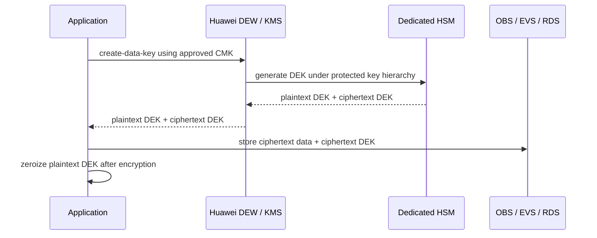
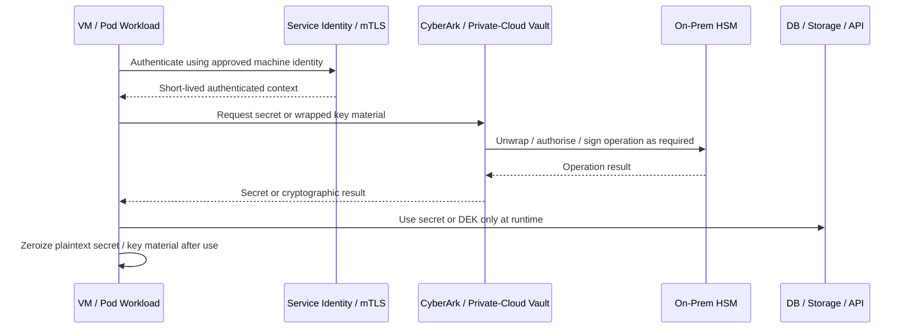
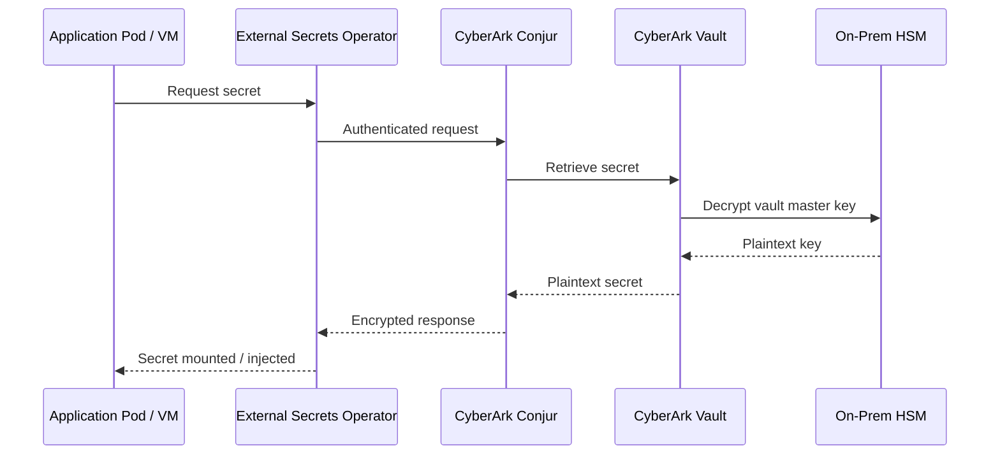
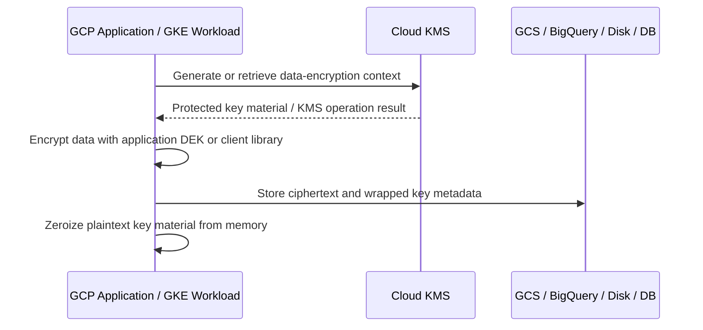

# Enterprise Cryptographic Management Guideline

**Classification:** Internal — Restricted  
**Version:** 2.0 (HYBRID DOMAIN DRAFT)  
**Date:** March 2026  
**Owner:** Information Security Architecture  
**Review Cycle:** Annual, or upon regulatory change, platform adoption, algorithm deprecation, or cryptographic compromise event  
**Status:** DRAFT — Hybrid Control-Domain Rewrite

---

## Revision History

| Version | Date | Change Summary |
|---------|------|----------------|
| 1.0 | March 2026 | Initial draft baseline |
| 1.1 | March 2026 | Added auditable language, inventory management, design approval process, and requirement traceability |
| 1.2 | March 2026 | Added China / NIST / Europe algorithm comparison and expanded reference mapping |
| 1.3 | March 2026 | Expanded GCP planning assumptions and cloud encryption examples |
| 1.4 | March 2026 | Consolidated algorithm guidance into a single primary operational catalogue |
| 1.5 | March 2026 | Added Mandatory / Permitted by Exception / Forbidden algorithm model and improved traceability |
| 1.6 | March 2026 | Standardised cloud and on-prem platform sections and replaced Appendix A and Appendix F |
| 2.0 | March 2026 | Rewritten into a hybrid model using cloud-style control domains on top of detailed cryptographic control statements and technical implementation guidance |

---

## Table of Contents

- [1. Document Overview](#1-document-overview)
  - [1.1 Purpose](#11-purpose)
  - [1.2 Scope](#12-scope)
  - [1.3 How to Use This Document](#13-how-to-use-this-document)
  - [1.4 Normative Language and Traceability](#14-normative-language-and-traceability)
- [2. Control Domain Model](#2-control-domain-model)
  - [2.1 Domain Structure](#21-domain-structure)
  - [2.2 Domain-to-Section Map](#22-domain-to-section-map)
- [3. GRC — Governance, Risk, and Compliance](#3-grc--governance-risk-and-compliance)
  - [3.1 Control Objective](#31-control-objective)
  - [3.2 Policy and Standards Hierarchy](#32-policy-and-standards-hierarchy)
  - [3.3 Design Approval and Exception Governance](#33-design-approval-and-exception-governance)
  - [3.4 Roles and Accountability](#34-roles-and-accountability)
  - [3.5 Evidence and Assurance](#35-evidence-and-assurance)
- [4. CEK — Cryptography, Encryption, and Key Management](#4-cek--cryptography-encryption-and-key-management)
  - [4.1 Control Objective](#41-control-objective)
  - [4.2 Cryptographic Taxonomy and Definitions](#42-cryptographic-taxonomy-and-definitions)
  - [4.3 Algorithm Selection Standard](#43-algorithm-selection-standard)
  - [4.4 Key Management Lifecycle](#44-key-management-lifecycle)
  - [4.5 Inventory and Attestation](#45-inventory-and-attestation)
  - [4.6 PQC and Crypto-Agility](#46-pqc-and-crypto-agility)
- [5. IAM — Identity and Access for Cryptographic Services](#5-iam--identity-and-access-for-cryptographic-services)
  - [5.1 Control Objective](#51-control-objective)
  - [5.2 Human Administrative Access](#52-human-administrative-access)
  - [5.3 Workload Identity and Federation](#53-workload-identity-and-federation)
  - [5.4 Runtime Secret Retrieval](#54-runtime-secret-retrieval)
  - [5.5 Separation of Duties](#55-separation-of-duties)
- [6. DSP — Data Security and Protection](#6-dsp--data-security-and-protection)
  - [6.1 Control Objective](#61-control-objective)
  - [6.2 Data at Rest](#62-data-at-rest)
  - [6.3 Data in Transit](#63-data-in-transit)
  - [6.4 Application-Level Protection](#64-application-level-protection)
  - [6.5 Tokens, Certificates, and Signing](#65-tokens-certificates-and-signing)
- [7. TVM — Technical Implementation and Platform Patterns](#7-tvm--technical-implementation-and-platform-patterns)
  - [7.1 Control Objective](#71-control-objective)
  - [7.2 On-Premises HSM and Private Cloud Trust Services](#72-on-premises-hsm-and-private-cloud-trust-services)
  - [7.3 CyberArk Vault and Conjur](#73-cyberark-vault-and-conjur)
  - [7.4 AWS KMS and Secrets Manager](#74-aws-kms-and-secrets-manager)
  - [7.5 Alibaba Cloud KMS](#75-alibaba-cloud-kms)
  - [7.6 Huawei Private Cloud DEW and KMS](#76-huawei-private-cloud-dew-and-kms)
  - [7.7 Azure Key Vault and Entra ID](#77-azure-key-vault-and-entra-id)
  - [7.8 GCP Cloud KMS and Secret Manager](#78-gcp-cloud-kms-and-secret-manager)
  - [7.9 Developer Implementation Requirements](#79-developer-implementation-requirements)
- [8. LOG — Logging, Monitoring, and Detection](#8-log--logging-monitoring-and-detection)
  - [8.1 Control Objective](#81-control-objective)
  - [8.2 Event Sources](#82-event-sources)
  - [8.3 Detection Rules](#83-detection-rules)
  - [8.4 Alerting and Evidence Retention](#84-alerting-and-evidence-retention)
- [9. IR — Incident Response and Recovery](#9-ir--incident-response-and-recovery)
  - [9.1 Control Objective](#91-control-objective)
  - [9.2 Compromise Indicators](#92-compromise-indicators)
  - [9.3 Emergency Containment](#93-emergency-containment)
  - [9.4 Recovery and Re-Establishment of Trust](#94-recovery-and-re-establishment-of-trust)
  - [9.5 Notification and Post-Incident Review](#95-notification-and-post-incident-review)
- [10. STA — Supply Chain and Third-Party Assurance](#10-sta--supply-chain-and-third-party-assurance)
  - [10.1 Control Objective](#101-control-objective)
  - [10.2 Third-Party Cryptography Review](#102-third-party-cryptography-review)
  - [10.3 External PKI and Trust Dependencies](#103-external-pki-and-trust-dependencies)
  - [10.4 Open Source Cryptographic Libraries](#104-open-source-cryptographic-libraries)
- [11. Appendices](#11-appendices)
  - [Appendix A — Platform Technical Reference](#appendix-a--platform-technical-reference)
  - [Appendix B — Cryptographic Design Record Template](#appendix-b--cryptographic-design-record-template)
  - [Appendix C — Key Inventory Template](#appendix-c--key-inventory-template)
  - [Appendix D — Exception and Compliance Checklist](#appendix-d--exception-and-compliance-checklist)
  - [Appendix E — Approved Algorithm Catalogue](#appendix-e--approved-algorithm-catalogue)
  - [Appendix F — Requirement Traceability Matrix](#appendix-f--requirement-traceability-matrix)
  - [Appendix G — Operational Checklists](#appendix-g--operational-checklists)
  - [Appendix H — Cross-Standard Algorithm Comparison](#appendix-h--cross-standard-algorithm-comparison)
- [12. References](#12-references)

---

## 1. Document Overview

### 1.1 Purpose

This guideline establishes the enterprise requirements for cryptography, encryption, key management, and cryptographic service consumption across cloud, private-cloud, on-premises, Kubernetes, virtual machine, and CI/CD environments.

This version uses a hybrid structure:
- **Control domains** provide governance and audit readability.
- **Detailed control statements** provide normative implementation requirements.
- **Technical implementation sections** provide provider- and workload-specific procedures and patterns.

This document supports three audiences:
- Governance and risk teams that need control objectives and assurance evidence.
- Architects and reviewers that need detailed requirements and approval criteria.
- Engineers and platform teams that need implementable technical patterns.

### 1.2 Scope

This guideline applies to all personnel — employees, contractors, and third parties — who design, deploy, operate, maintain, assess, or consume cryptographic capabilities on behalf of the organisation.

In-scope environments include:
- AWS.
- Alibaba Cloud.
- Azure and Microsoft 365 related cryptographic integrations.
- Huawei private cloud.
- GCP.
- On-premises HSM, internal CA, and vault services.
- Kubernetes and container platforms.
- Virtual machines and database platforms.
- CI/CD pipelines and software-signing workflows.

### 1.3 How to Use This Document

Read this document in layers:

1. Start with the **control domain** to understand the objective.
2. Read the **control statements** to identify mandatory requirements.
3. Use the **implementation and technical guidance** for platform delivery.
4. Record design decisions in the approved design template.
5. Link each production cryptographic asset to the inventory and evidence model.

### 1.4 Normative Language and Traceability

The following terms define control strength:
- **MUST / SHALL**: mandatory control requirement.
- **SHOULD**: expected control unless a documented exception is approved.
- **MAY**: optional implementation choice where consistent with approved design and standards.

All auditable requirements use identifiers in the format `CRYPTO-[DOMAIN]-[NUMBER]`. Existing requirement IDs from prior versions are preserved wherever possible to maintain audit continuity.

---

## 2. Control Domain Model

### 2.1 Domain Structure

This document uses the following hybrid control domains:

| Domain | Meaning | Primary Purpose |
| :-- | :-- | :-- |
| GRC | Governance, Risk, and Compliance | Policy, accountability, review, exceptions, traceability |
| CEK | Cryptography, Encryption, and Key Management | Algorithms, lifecycle, inventories, key custody, crypto-agility |
| IAM | Identity and Access for Cryptographic Services | Human and workload access to HSM, KMS, vault, PKI, and secrets services |
| DSP | Data Security and Protection | Data-at-rest, data-in-transit, application-layer encryption, certificates, tokens |
| TVM | Technical Implementation and Platform Patterns | Cloud, on-prem, private-cloud, Kubernetes, and developer implementation procedures |
| LOG | Logging, Monitoring, and Detection | Audit trails, SIEM integration, anomaly detection, evidence retention |
| IR | Incident Response and Recovery | Key compromise handling, emergency controls, trust restoration |
| STA | Supply Chain and Third-Party Assurance | Third-party trust, PKI dependencies, open source library governance |

### 2.2 Domain-to-Section Map

| Domain | Typical Control Question | Primary Sections |
| :-- | :-- | :-- |
| GRC | Who approves, owns, reviews, and evidences cryptographic decisions? | 3 |
| CEK | Which cryptography is approved and how are keys managed? | 4 |
| IAM | Who or what may access cryptographic services, and how? | 5 |
| DSP | Where must encryption or signing be applied? | 6 |
| TVM | How is the control implemented on each platform? | 7 |
| LOG | What must be logged and detected? | 8 |
| IR | What happens during compromise or failure? | 9 |
| STA | How are third-party dependencies governed? | 10 |

---

## 3. GRC — Governance, Risk, and Compliance

### 3.1 Control Objective

Ensure that enterprise cryptography is governed by approved policy, aligned to current standards, supported by named accountability, and evidenced for audit, regulatory, and risk-management purposes.

### 3.2 Policy and Standards Hierarchy

Cryptographic decisions SHALL be interpreted using the following hierarchy:
1. Applicable law and regulatory obligations.
2. Enterprise information security policy.
3. This cryptographic management guideline.
4. Approved technical standards and design patterns.
5. Provider-specific implementation guidance.

#### GRC Control Statements

- **CRYPTO-GOV-001** — All production cryptographic implementations SHALL follow this guideline and complete design documentation before deployment.
- **CRYPTO-GOV-002** — Each design SHALL identify the cryptographic purpose, data classification, algorithm choice, key custody model, and dependent systems.
- **CRYPTO-GOV-003** — The design SHALL identify any jurisdictional, regulatory, or interoperability driver, including any requirement for ShangMi, dual-stack operation, or provider-specific exception handling.
- **CRYPTO-GOV-004** — Conflicts between platform defaults and enterprise cryptographic requirements SHALL be resolved in favour of the stronger approved control unless a formal exception is granted.

### 3.3 Design Approval and Exception Governance

Every new production use of cryptography SHALL complete a formal design and approval process before deployment.

#### Required Design Elements

- Business purpose and protected asset.
- Cryptographic function type.
- Selected algorithm and approved parameter set.
- Key generation, storage, retrieval, rotation, revocation, and destruction model.
- Dependency on HSM, KMS, vault, PKI, or third-party providers.
- Logging, alerting, and incident-response dependencies.
- PQC or crypto-agility impact for asymmetric use cases.
- Evidence and inventory linkage.

#### GRC Control Statements

- **CRYPTO-GOV-005** — Any use of non-default, legacy, or exception-based cryptography SHALL be documented and routed through formal exception governance.
- **CRYPTO-GOV-006** — Security Architect approval SHALL be obtained before production deployment.
- **CRYPTO-GOV-007** — Exceptions SHALL include scope, rationale, expiry date, risk acceptance, and compensating controls.
- **CRYPTO-GOV-008** — Expired exceptions SHALL be treated as control failures unless renewed through formal approval.

### 3.4 Roles and Accountability

| Role | Core Responsibilities |
| :-- | :-- |
| Security Architect | Approves designs, standards alignment, exceptions, and major control changes |
| Crypto Officer | Oversees lifecycle governance, crypto-agility planning, and strategic risk |
| Key Custodian | Executes approved operational tasks for keys, certificates, vaults, or HSMs |
| System Owner | Maintains control implementation, inventory accuracy, and attestation |
| DevOps / Platform Team | Implements integration patterns, identity controls, and monitoring |
| Crypto Auditor | Tests evidence, control effectiveness, and inventory completeness |
| Incident Response Lead | Coordinates compromise triage, containment, and trust restoration |

### 3.5 Evidence and Assurance

Minimum governance evidence includes:
- Approved design record.
- Inventory linkage.
- Exception records, where applicable.
- Rotation or review evidence.
- Monitoring configuration.
- Audit forwarding evidence.
- Incident runbooks.
- Quarterly or periodic owner attestations.

---

## 4. CEK — Cryptography, Encryption, and Key Management

### 4.1 Control Objective

Ensure that approved cryptographic mechanisms are selected, operated, and retired using controlled, auditable, and interoperable practices across the full key lifecycle.

### 4.2 Cryptographic Taxonomy and Definitions

The following cryptographic function classes are governed by this document:
- Symmetric encryption.
- Key exchange.
- Public-key encryption and wrapping.
- Digital signatures.
- Code signing and release signing.
- Hashing and integrity.
- Message authentication.
- Password storage.
- Key derivation.
- TLS certificates and server authentication.
- SSH host and user authentication.
- Post-quantum transition planning.

Definitions such as cryptoperiod, CMK, DEK, KEK, envelope encryption, HSM, KMS, CA, CRL, OCSP, PQC, crypto-agility, and zeroization are authoritative within this document.

### 4.3 Algorithm Selection Standard

The enterprise operational algorithm catalogue is maintained in Appendix E and SHALL be treated as the authoritative reference for new implementations.

#### CEK Control Statements — Algorithm Governance

- **CRYPTO-ALG-001** — Forbidden algorithms and protocols SHALL NOT be used in production.
- **CRYPTO-ALG-010** — New systems SHALL use the mandatory algorithm baseline unless an approved exception exists.
- **CRYPTO-ALG-011** — Any algorithm used by exception SHALL be documented in the design record and linked to the inventory.
- **CRYPTO-ALG-012** — Any China-specific or ShangMi selection SHALL state the exact interoperability, customer, or regulatory driver.
- **CRYPTO-ALG-013** — Deprecated algorithms SHALL be migrated according to approved retirement timelines.
- **CRYPTO-ALG-014** — New asymmetric designs SHALL document their PQC transition path or crypto-agility approach.

#### Minimum Enterprise Baseline

| Function | Mandatory Baseline | Permitted by Exception | Forbidden |
| :-- | :-- | :-- | :-- |
| Bulk encryption | AES-256-GCM | ChaCha20-Poly1305 where justified | DES, 3DES, RC4, AES-ECB |
| Key exchange | ECDHE P-384 or X25519 | RSA-4096 legacy interoperability only | RSA key transport, static DH |
| Digital signatures | ECDSA P-384, Ed25519 where appropriate | RSA-PSS 4096 for compatibility | DSA, SHA-1 signatures |
| Hashing | SHA-256 minimum, SHA-384 preferred | SHA-512 or SHA-3 where justified | MD5, SHA-1 |
| MAC | HMAC-SHA256 or HMAC-SHA384 | HMAC-SHA512 | HMAC-MD5, HMAC-SHA1 |
| Password storage | Argon2id | PBKDF2-SHA256 in constrained contexts | Unsalted hashes, reversible storage |
| TLS | TLS 1.3 | TLS 1.2 by approved exception | SSL, TLS 1.0, TLS 1.1 |

### 4.4 Key Management Lifecycle

All production keys, certificates, and managed cryptographic secrets SHALL follow an approved lifecycle.

#### Lifecycle Stages

1. Planning and design.
2. Generation or issuance.
3. Registration and inventory linkage.
4. Activation and use.
5. Rotation and renewal.
6. Suspension or emergency disablement.
7. Revocation.
8. Archival where required.
9. Destruction and evidence retention.

#### CEK Control Statements — Lifecycle

- **CRYPTO-KM-001** — Production keys SHALL be generated from approved entropy sources.
- **CRYPTO-KM-002** — HSM-generated or HSM-protected keys SHALL be mandatory for root CA keys, externally trusted signing keys, and other high-assurance master keys.
- **CRYPTO-KM-003** — Plaintext CMKs SHALL NOT be exposed to applications.
- **CRYPTO-KM-004** — Envelope encryption SHALL be the default pattern for application data.
- **CRYPTO-KM-005** — Key transport SHALL use approved wrapping or HSM-/KMS-backed mechanisms.
- **CRYPTO-KM-006** — Cryptoperiods SHALL be defined by key type and enforced operationally.
- **CRYPTO-KM-007** — Automated rotation SHALL be preferred wherever platform support exists.
- **CRYPTO-KM-008** — Backup, recovery, revocation, and destruction procedures SHALL be documented, approved, and tested.

#### Standard Cryptoperiods

| Key Type | Standard Cryptoperiod |
| :-- | :-- |
| Session key | Single session |
| DEK | Up to 2 years |
| HMAC key | 1 year |
| TLS private key | 1 year |
| KMS CMK | 1–3 years depending on platform and risk |
| Root CA key | 10–25 years under offline or equivalent high-assurance protection |

### 4.5 Inventory and Attestation

The organisation SHALL maintain a single approved inventory for cryptographic assets and design records.

#### CEK Control Statements — Inventory

- **CRYPTO-INV-001** — All production keys, certificates, and managed secrets SHALL be recorded in the approved inventory system.
- **CRYPTO-INV-002** — Inventory records SHALL include asset type, algorithm, key length or curve, owner, data classification, custody model, and lifecycle state.
- **CRYPTO-INV-003** — Inventory records SHALL include the linked design record and any applicable exception reference.
- **CRYPTO-INV-004** — Inventory records SHALL capture external dependencies and consumers to support impact analysis.
- **CRYPTO-INV-005** — Inventory completeness SHALL be attested quarterly by the system owner.
- **CRYPTO-INV-006** — Independent inventory review SHALL occur at least quarterly.

#### Minimum Inventory Fields

- Unique asset identifier.
- Key, certificate, or secret type.
- Algorithm and parameter set.
- Protected system or application.
- Data classification.
- Custody location.
- Rotation due date.
- Expiry date.
- Lifecycle state.
- Design reference.
- Exception reference.
- PQC priority and migration status.

### 4.6 PQC and Crypto-Agility

The organisation SHALL prepare for post-quantum transition without disrupting current approved cryptography.

#### CEK Control Statements — PQC

- **CRYPTO-PQC-001** — New asymmetric designs SHALL avoid hard-coding algorithm assumptions into business logic.
- **CRYPTO-PQC-002** — Algorithm identifiers, certificate profiles, and key metadata SHALL be versioned to support migration.
- **CRYPTO-PQC-003** — Long-lived confidentiality use cases SHALL be prioritised for hybrid and PQC migration planning.
- **CRYPTO-PQC-004** — Inventory records SHALL identify high-priority PQC migration candidates.

#### Enterprise PQC Direction

| Use Case | Current | Transition | Target |
| :-- | :-- | :-- | :-- |
| Key establishment | ECDH P-384 | Hybrid classical + ML-KEM-768 | ML-KEM-768 |
| Signatures | ECDSA P-384 | Hybrid classical + ML-DSA-65 | ML-DSA-65 |
| Selected high-assurance signatures | Classical signature | Classical + SLH-DSA | SLH-DSA |
| Symmetric encryption | AES-256-GCM | No change required | AES-256-GCM |

---

## 5. IAM — Identity and Access for Cryptographic Services

### 5.1 Control Objective

Ensure that human and machine access to HSMs, KMS platforms, vaults, certificate services, and secrets systems is strongly authenticated, minimally privileged, auditable, and segregated by role and trust boundary.

### 5.2 Human Administrative Access

Administrative access to cryptographic systems SHALL be tightly controlled.

#### IAM Control Statements

- **CRYPTO-IAM-001** — Administrative access to HSM, KMS, vault, and CA platforms SHALL require approved enterprise identity controls and MFA.
- **CRYPTO-IAM-002** — Shared administrative accounts SHALL NOT be used unless technically unavoidable and formally approved with compensating controls.
- **CRYPTO-IAM-003** — High-assurance administration SHALL use dual control and, where required, split knowledge.
- **CRYPTO-IAM-004** — Administrative privileges SHALL be role-based and periodically reviewed.

### 5.3 Workload Identity and Federation

Applications and workloads SHALL use approved runtime identity rather than embedded static credentials.

#### IAM Control Statements

- **CRYPTO-IAM-010** — Workloads SHALL authenticate to cryptographic services using managed identity, workload identity, federation, mTLS, or equivalent short-lived machine identity.
- **CRYPTO-IAM-011** — Long-lived shared secrets used only to unlock access to a better identity model SHALL be retired wherever platform support exists.
- **CRYPTO-IAM-012** — Service account keys, access keys, or equivalent long-lived workload credentials SHALL NOT be embedded in code, images, or templates.

### 5.4 Runtime Secret Retrieval

Secrets SHALL be retrieved at runtime from approved services and SHALL remain under enterprise policy control.

#### IAM Control Statements

- **CRYPTO-IAM-020** — Secrets SHALL be retrieved only from approved vault or secret-management services.
- **CRYPTO-IAM-021** — Secrets SHALL NOT be embedded in source code, container images, VM templates, or plaintext deployment configuration.
- **CRYPTO-IAM-022** — Secret retrieval paths SHALL be logged and attributable to a workload identity.
- **CRYPTO-IAM-023** — Rotated secrets SHALL be consumed through runtime refresh or approved rollover procedure.

### 5.5 Separation of Duties

| Activity | System Owner | Key Custodian | Security Architect | Platform Team | Auditor |
| :-- | :--: | :--: | :--: | :--: | :--: |
| Design approval | C | I | A/R | C | I |
| Inventory creation | A/R | C | C | C | I |
| Rotation execution | C | A/R | I | R | I |
| Exception approval | C | I | A/R | C | I |
| Audit review | I | I | I | I | A/R |

Legend: A = Accountable, R = Responsible, C = Consulted, I = Informed

---

## 6. DSP — Data Security and Protection

### 6.1 Control Objective

Ensure that Confidential and Restricted data is protected by approved cryptography during storage, transmission, processing support flows, signing, and trust validation.

### 6.2 Data at Rest

All Confidential or Restricted data at rest SHALL use approved encryption controls with customer-controlled or enterprise-managed keys where the platform supports such control.

#### DSP Control Statements — Storage and Databases

- **CRYPTO-DSP-001** — Storage services SHALL use provider-integrated customer-managed encryption where available.
- **CRYPTO-DSP-002** — Platform-default encryption MAY be used only where customer-controlled encryption is not technically supported and risk is accepted.
- **CRYPTO-DSP-003** — Application-layer encryption SHALL be added where risk, regulatory need, or trust separation requires stronger protection.
- **CRYPTO-DSP-004** — Storage and database encryption dependencies SHALL be recorded in inventory.

### 6.3 Data in Transit

TLS 1.3 SHALL be the enterprise default for new services.

#### DSP Control Statements — TLS and mTLS

- **CRYPTO-DSP-010** — TLS 1.3 SHALL be used for new service endpoints unless documented interoperability constraints require otherwise.
- **CRYPTO-DSP-011** — TLS 1.2 MAY be used only by approved exception with restricted cipher suites.
- **CRYPTO-DSP-012** — Weak protocols and cipher suites SHALL be disabled.
- **CRYPTO-DSP-013** — Mutual TLS SHALL use certificates issued by an approved trust model and SHALL define renewal, revocation, and trust-store management procedures.

#### Approved TLS Baseline

```text
TLS_AES_256_GCM_SHA384
TLS_CHACHA20_POLY1305_SHA256
TLS_AES_128_GCM_SHA256
```

### 6.4 Application-Level Protection

Applications SHALL use approved patterns for encryption, key derivation, message integrity, and password storage.

#### DSP Control Statements — Application Controls

- **CRYPTO-DSP-020** — Applications SHALL use envelope encryption for protected business data where encryption occurs outside platform-native storage controls.
- **CRYPTO-DSP-021** — Passwords SHALL be stored using approved memory-hard password hashing.
- **CRYPTO-DSP-022** — Message integrity SHALL use approved hash or MAC functions.
- **CRYPTO-DSP-023** — Home-grown cryptographic constructions SHALL NOT be used in place of approved libraries or provider services.

### 6.5 Tokens, Certificates, and Signing

#### DSP Control Statements — Signing and Trust

- **CRYPTO-DSP-030** — JWT and token-signing keys SHALL be centrally managed and SHOULD be non-exportable wherever supported.
- **CRYPTO-DSP-031** — Container images promoted to production SHALL be signed.
- **CRYPTO-DSP-032** — Private signing keys SHALL NOT be stored on developer laptops or unmanaged build hosts.
- **CRYPTO-DSP-033** — Public certificates SHALL be sourced only from approved public CAs.
- **CRYPTO-DSP-034** — Internal PKI root and equivalent trust anchors SHALL use HSM-backed or equivalent high-assurance protection.

---

## 7. TVM — Technical Implementation and Platform Patterns

### 7.1 Control Objective

Provide platform-specific implementation procedures and technical domains for applying enterprise cryptographic requirements consistently across cloud, private-cloud, on-premises, container, and application environments.

### 7.2 On-Premises HSM and Private Cloud Trust Services

This domain covers enterprise-controlled custody for root material, internal PKI, high-assurance signing, private-cloud storage encryption, and trust anchoring for hybrid environments.

#### TVM Control Statements — On-Prem and Private Cloud

- **CRYPTO-ONP-001** — Confidential or Restricted on-premises and private-cloud workloads SHALL use enterprise-controlled keys where explicit key selection is supported.
- **CRYPTO-ONP-002** — Root keys, CA keys, signing keys, and application master keys SHALL be separated by environment, data classification, and trust boundary.
- **CRYPTO-ONP-003** — Workloads SHALL authenticate to vault or key services using approved machine identity, mTLS, federation, or equivalent short-lived controls.
- **CRYPTO-ONP-004** — HSM, vault, CA, and private-cloud key-service audit logs SHALL be exported to the enterprise SIEM.
- **CRYPTO-ONP-005** — Every production key, certificate, and managed secret SHALL be linked to the inventory and approved design record.
- **CRYPTO-ONP-006** — HSM-backed non-exportable protection SHALL be mandatory for root CA keys, externally trusted signing keys, and other high-assurance Restricted use cases.
- **CRYPTO-ONP-007** — Secrets SHALL be retrieved at runtime from CyberArk, approved private-cloud vault services, or HSM-integrated services.
- **CRYPTO-ONP-008** — Backup, recovery, revocation, destruction, and emergency disablement procedures SHALL be documented and tested.

#### Typical Use Cases

- Offline or tightly controlled root CA custody.
- HSM-backed code-signing and trust-anchor signing.
- Private-cloud storage KEK / CMK protection.
- Kubernetes secret encryption at rest with approved integrations.
- VM and application runtime secret retrieval.

### 7.3 CyberArk Vault and Conjur

CyberArk is the strategic vault for privileged secrets, application secrets, and selected key-adjacent materials across VM and Kubernetes environments.

#### TVM Control Statements — CyberArk

- **CRYPTO-CYA-001** — CyberArk SHALL be used for approved privileged and application secret use cases where enterprise vault custody is required.
- **CRYPTO-CYA-002** — CyberArk secret access SHALL be bound to approved identity and policy controls.
- **CRYPTO-CYA-003** — CyberArk audit trails SHALL be exported to the enterprise SIEM.
- **CRYPTO-CYA-004** — Kubernetes secret delivery via Conjur, ESO, or approved operators SHALL preserve the upstream secret source as the system of record.

### 7.4 AWS KMS and Secrets Manager

#### TVM Control Statements — AWS

- **CRYPTO-AWS-001** — AWS workloads handling Confidential or Restricted data SHALL use customer-managed keys where supported.
- **CRYPTO-AWS-002** — Keys SHALL be separated by account, environment, region, and classification.
- **CRYPTO-AWS-003** — Workloads SHALL use approved short-lived AWS identity or federation controls rather than embedded long-lived access keys.
- **CRYPTO-AWS-004** — AWS KMS administrative and usage events SHALL be logged and exported to the monitoring platform.
- **CRYPTO-AWS-005** — AWS key inventory records SHALL be linked to the enterprise inventory and design record.
- **CRYPTO-AWS-006** — CloudHSM-backed or equivalent stronger custody controls SHALL be used where required by risk or regulation.
- **CRYPTO-AWS-007** — Secrets SHALL be retrieved at runtime from AWS Secrets Manager or approved enterprise vault services.
- **CRYPTO-AWS-008** — Rotation, disablement, revocation, recovery, and re-encryption procedures SHALL be documented and tested.

#### Example Technical Patterns

- S3 SSE-KMS.
- RDS with KMS-backed encryption.
- EKS workloads using role-based identity.
- Envelope encryption with `GenerateDataKey`.
- KMS asymmetric signing for JWT or application signatures.

### 7.5 Alibaba Cloud KMS

#### TVM Control Statements — Alibaba Cloud

- **CRYPTO-ALI-001** — Confidential or Restricted Alibaba workloads SHALL use enterprise-selected encryption controls where the platform supports such control.
- **CRYPTO-ALI-002** — Keys SHALL be separated by environment, account boundary, and classification.
- **CRYPTO-ALI-003** — Workloads SHALL use approved identity-based access rather than embedded static credentials.
- **CRYPTO-ALI-004** — Administrative and usage events SHALL be logged and exported to enterprise monitoring.
- **CRYPTO-ALI-005** — KMS keys and secret dependencies SHALL be linked to the enterprise inventory and design record.
- **CRYPTO-ALI-006** — Stronger custody controls SHALL be used for highest-sensitivity use cases where required.
- **CRYPTO-ALI-007** — Secrets SHALL be retrieved at runtime and SHALL NOT be embedded in code, images, or plaintext configuration.
- **CRYPTO-ALI-008** — Rotation, disablement, and recovery procedures SHALL be documented, approved, and tested.

#### Example Technical Patterns

- OSS SSE-KMS.
- RDS encryption with KMS-backed control.
- ACK runtime secret delivery.
- Envelope encryption for application data.

### 7.6 Huawei Private Cloud DEW and KMS

#### TVM Control Statements — Huawei Private Cloud

- **CRYPTO-HPC-001** — Confidential or Restricted private-cloud workloads SHALL use approved DEW / KMS keys where explicit control is available.
- **CRYPTO-HPC-002** — Keys SHALL be separated by region, environment, and classification.
- **CRYPTO-HPC-003** — Workloads SHALL use approved private-cloud identity, federation, or workload authentication rather than shared static credentials.
- **CRYPTO-HPC-004** — DEW, Dedicated HSM, and private-cloud audit events SHALL be forwarded to enterprise monitoring.
- **CRYPTO-HPC-005** — Private-cloud key records SHALL be linked to enterprise inventory and design records.
- **CRYPTO-HPC-006** — Dedicated HSM-backed protection SHALL be used for root material, high-value signing, and regulated Restricted data where required.
- **CRYPTO-HPC-007** — Secrets SHALL be retrieved at runtime from approved private-cloud or enterprise vault services.
- **CRYPTO-HPC-008** — Disablement, rotation, backup, recovery, and emergency procedures SHALL be documented and tested.

### 7.7 Azure Key Vault and Entra ID

#### TVM Control Statements — Azure

- **CRYPTO-AZR-001** — Confidential or Restricted Azure workloads SHALL use customer-controlled encryption keys where supported.
- **CRYPTO-AZR-002** — Keys, certificates, and secrets SHALL be separated by environment, subscription, and classification.
- **CRYPTO-AZR-003** — Workloads SHALL use Entra-governed managed identity, federation, or equivalent short-lived access rather than embedded secrets.
- **CRYPTO-AZR-004** — Key Vault administrative and usage logs SHALL be exported to enterprise monitoring.
- **CRYPTO-AZR-005** — Azure key, certificate, and secret records SHALL be linked to enterprise inventory and design records.
- **CRYPTO-AZR-006** — HSM-backed or higher-assurance key protection SHALL be used for externally trusted signing and highest-sensitivity use cases.
- **CRYPTO-AZR-007** — Secrets and certificates SHALL be retrieved or renewed through approved runtime workflows rather than manual distribution or file export.
- **CRYPTO-AZR-008** — Rotation, disablement, certificate renewal, and emergency response procedures SHALL be documented and tested.

### 7.8 GCP Cloud KMS and Secret Manager

#### TVM Control Statements — GCP

- **CRYPTO-GCP-001** — GCP workloads handling Confidential or Restricted data SHALL use CMEK rather than provider-default encryption where supported.
- **CRYPTO-GCP-002** — Key rings and keys SHALL be separated by environment, project, and classification.
- **CRYPTO-GCP-003** — Workloads SHALL use Workload Identity or equivalent short-lived identity federation rather than long-lived service account keys.
- **CRYPTO-GCP-004** — Cloud Audit Logs for KMS operations SHALL be exported to the enterprise monitoring platform.
- **CRYPTO-GCP-005** — GCP key inventory records SHALL be linked to the enterprise inventory and design record.
- **CRYPTO-GCP-006** — Cloud HSM-backed or equivalent stronger protection SHALL be used for high-assurance or regulated use cases where required.
- **CRYPTO-GCP-007** — Secrets SHALL be retrieved at runtime from Secret Manager or approved enterprise vault services.
- **CRYPTO-GCP-008** — Rotation, disablement, revocation, and recovery procedures SHALL be documented and tested.

### 7.9 Developer Implementation Requirements

Developers SHALL use this document as follows:
1. Identify the cryptographic function type.
2. Select the approved baseline from Appendix E.
3. Select the platform pattern from Appendix A.
4. Complete the design record in Appendix B.
5. Create or update the inventory record in Appendix C.
6. Confirm logging and incident requirements before production release.

#### TVM Control Statements — Developer Delivery

- **CRYPTO-DEV-001** — All new implementations SHALL complete a cryptographic design record before production deployment.
- **CRYPTO-DEV-002** — Approved libraries and provider services SHALL be used instead of ad hoc implementations.
- **CRYPTO-DEV-003** — Secrets SHALL be retrieved only at runtime from approved services.
- **CRYPTO-DEV-004** — Container images promoted to production SHALL be signed and, where supported, signature verification SHALL be enforced.

---

## 8. LOG — Logging, Monitoring, and Detection

### 8.1 Control Objective

Ensure that cryptographic control-plane events, secret-access activity, certificate lifecycle events, and high-risk administrative operations are centrally logged, reviewed, and monitored for misuse, failure, and compromise.

### 8.2 Event Sources

Relevant log sources include:
- Cloud-native audit logs from KMS, vault, IAM, and secret services.
- HSM, CA, and private-cloud audit trails.
- Kubernetes secret-delivery events.
- Certificate issuance, renewal, and revocation events.
- CI/CD signing events and build-pipeline evidence.
- Identity and policy change logs affecting cryptographic services.

### 8.3 Detection Rules

#### LOG Control Statements

- **CRYPTO-MON-001** — Cryptographic control-plane and key-usage events SHALL be logged and reviewed.
- **CRYPTO-MON-002** — Unusual secret-access patterns SHALL generate alerts.
- **CRYPTO-MON-003** — Deprecated or forbidden cryptographic configurations SHALL be detectable by telemetry, configuration scanning, or audit review.
- **CRYPTO-MON-004** — Certificate expiry, failed renewal, and unexpected trust-store changes SHALL be monitored.
- **CRYPTO-MON-005** — High-risk signing activity SHALL be monitored for abnormal volume, timing, or execution source.

#### Recommended Alerts

- Key disablement for a production workload.
- Broadened decryption permissions.
- Secret access from an unexpected workload identity.
- HSM or CA administrative access outside approved windows.
- Emergency certificate revocation or replacement.
- Detection of forbidden algorithm use in deployed configuration.

### 8.4 Alerting and Evidence Retention

Monitoring evidence SHALL be retained according to enterprise retention policy and SHALL be available for incident investigation, audit, and attestation.

---

## 9. IR — Incident Response and Recovery

### 9.1 Control Objective

Ensure that suspected or confirmed compromise of keys, certificates, secrets, trust anchors, or cryptographic service configurations is rapidly contained, investigated, remediated, and followed by validated recovery.

### 9.2 Compromise Indicators

Examples include:
- Unexplained sign or decrypt operations.
- Unexpected secret-retrieval volume.
- Private-key exposure in repositories, tickets, or logs.
- Unauthorised administrative changes.
- Suspicious certificate issuance.
- Loss of custody evidence for HSM-protected material.

### 9.3 Emergency Containment

#### IR Control Statements

- **CRYPTO-IR-001** — Suspected compromise SHALL trigger immediate triage and scope identification.
- **CRYPTO-IR-002** — Affected keys, certificates, secrets, or trust relationships SHALL be disabled, revoked, or restricted as appropriate to business impact.
- **CRYPTO-IR-003** — All affected applications, signatures, ciphertext dependencies, and third-party integrations SHALL be assessed.
- **CRYPTO-IR-004** — Logs, approvals, and operational evidence SHALL be preserved for investigation.

### 9.4 Recovery and Re-Establishment of Trust

- **CRYPTO-IR-010** — Replacement keys or certificates SHALL be issued under approved controls.
- **CRYPTO-IR-011** — Re-encryption SHALL be performed where compromise risk affects protected data.
- **CRYPTO-IR-012** — Inventory, design records, and monitoring configurations SHALL be updated after recovery.
- **CRYPTO-IR-013** — Recovery SHALL include explicit validation that trust has been re-established and old material is no longer in use.

### 9.5 Notification and Post-Incident Review

Material incidents SHALL involve Legal, Compliance, and the appropriate notification workflow where law, contract, or regulator expectations require reporting.

---

## 10. STA — Supply Chain and Third-Party Assurance

### 10.1 Control Objective

Ensure that third-party products, external PKI dependencies, SaaS integrations, and open source cryptographic libraries do not weaken enterprise cryptographic control requirements.

### 10.2 Third-Party Cryptography Review

Before adopting a third-party service or product, the following SHALL be assessed:
- What cryptographic functions are performed.
- Whether keys are customer-controlled, provider-controlled, or shared-responsibility.
- Whether keys are exportable or non-exportable.
- What algorithms, key sizes, and certificate models are used.
- How logging, rotation, and revocation are handled.
- What jurisdictional or interoperability constraints apply.

#### STA Control Statements

- **CRYPTO-STA-001** — Third-party cryptographic dependencies SHALL undergo documented review before production use.
- **CRYPTO-STA-002** — The organisation SHALL identify whether the third party or the enterprise controls key material.
- **CRYPTO-STA-003** — Third-party cryptographic risks SHALL be recorded in the design review and inventory dependency model.

### 10.3 External PKI and Trust Dependencies

- **CRYPTO-STA-010** — Public certificates SHALL be sourced only from approved public CAs.
- **CRYPTO-STA-011** — Wildcard certificates SHOULD be minimised and explicitly approved.
- **CRYPTO-STA-012** — External trust dependencies SHALL feed monitoring, renewal, revocation, and inventory processes.

### 10.4 Open Source Cryptographic Libraries

#### STA Control Statements — Library Governance

- **CRYPTO-OSL-001** — Approved libraries SHALL be tracked with dependency vulnerability scanning.
- **CRYPTO-OSL-002** — Teams SHALL use approved cryptographic libraries rather than home-grown implementations.
- **CRYPTO-OSL-003** — Cryptographic library versions SHALL be pinned or otherwise controlled.
- **CRYPTO-OSL-004** — Unsupported or high-risk cryptographic libraries SHALL be removed or formally excepted.
- **CRYPTO-OSL-010** — Dependency scanning SHALL occur at pull request, build, and scheduled intervals.
- **CRYPTO-OSL-011** — High-severity vulnerabilities in cryptographic dependencies SHALL block production promotion unless formally excepted.
- **CRYPTO-OSL-012** — Teams SHALL maintain a remediation process for dependency advisories affecting cryptographic libraries.
- **CRYPTO-OSL-013** — Signing, secret retrieval, and other security-sensitive build steps SHALL run only in approved CI/CD contexts.

---

## 11. Appendices

### Appendix A — Platform Technical Reference

This appendix provides platform-specific implementation examples using a parallel structure across public cloud, private cloud, on-premises, and Kubernetes-connected environments.

#### A.1 AWS KMS and Secrets Manager Examples

##### A.1.1 Typical AWS Use Cases

| Use Case | Recommended AWS Control | Key Management Pattern |
| :-- | :-- | :-- |
| Object storage encryption | S3 SSE-KMS | Bucket encryption references approved AWS KMS CMK |
| Database encryption | RDS with KMS-backed encryption | Key segregated by environment and sensitivity |
| Application-layer encryption | Envelope encryption with AWS KMS | `GenerateDataKey` returns per-operation DEK; plaintext DEK is zeroized after use |
| Secrets management | AWS Secrets Manager | Runtime retrieval using approved identity path |
| Application signing / JWT signing | AWS KMS asymmetric signing | Sign without exporting the private key |

##### A.1.2 AWS Illustrative Envelope Encryption Pattern

1. The application authenticates using approved AWS identity controls.
2. The application requests a DEK from AWS KMS using an approved CMK.
3. The application encrypts data locally using AES-256-GCM with the plaintext DEK.
4. The application stores ciphertext together with the wrapped DEK and required metadata.
5. The application zeroizes plaintext DEK material immediately after use.

##### A.1.3 AWS Example — KMS Policy Control Points

- Restrict `kms:Decrypt` to approved workload roles only.
- Separate production and non-production keys by account and alias.
- Deny broad wildcard principals in KMS key policy.
- Export CloudTrail logs for `Encrypt`, `Decrypt`, `GenerateDataKey`, `DisableKey`, and policy changes.

##### A.1.4 AWS Example — Secrets Retrieval Pattern

```yaml
apiVersion: external-secrets.io/v1beta1
kind: ExternalSecret
metadata:
  name: app-db-secret
  namespace: production
spec:
  refreshInterval: 1h
  secretStoreRef:
    name: aws-secrets
    kind: SecretStore
  target:
    name: app-db-secret
  data:
    - secretKey: password
      remoteRef:
        key: /prod/app/database
        property: password
```

---

#### A.2 Alibaba Cloud KMS Examples

##### A.2.1 Typical Alibaba Cloud Use Cases

| Use Case | Recommended Alibaba Control | Key Management Pattern |
| :-- | :-- | :-- |
| Object storage encryption | OSS SSE-KMS | Bucket or object encryption references approved CMK |
| Database encryption | RDS with KMS-backed encryption | Key split by environment and classification |
| Application-layer encryption | Envelope encryption with Alibaba Cloud KMS | Per-operation DEK generated, wrapped, and stored with ciphertext |
| Secrets management | Approved managed secret service or enterprise vault | Runtime retrieval through approved identity path |
| Container or service secrets | ACK-integrated runtime retrieval | Secrets delivered at runtime, not baked into images or manifests |

##### A.2.2 Alibaba Cloud Illustrative Envelope Encryption Pattern

1. The application authenticates using approved platform identity controls.
2. The application requests a DEK from Alibaba Cloud KMS.
3. KMS returns a plaintext DEK for immediate use and a wrapped DEK for storage.
4. The application encrypts business data using AES-256-GCM.
5. The wrapped DEK is stored with ciphertext metadata and the plaintext DEK is zeroized.

##### A.2.3 Alibaba Cloud Operational Notes

- Separate keys by environment and account boundary.
- Log key creation, disablement, rotation, decrypt, and policy administration events.
- Store secret dependencies in the enterprise inventory.
- Use enhanced custody patterns for high-assurance signing or highest-sensitivity workloads.

---

#### A.3 Huawei Private Cloud DEW and Dedicated HSM Examples

##### A.3.1 Typical Huawei Private Cloud Use Cases

| Use Case | Recommended Huawei Control | Key Management Pattern |
| :-- | :-- | :-- |
| Object storage encryption | OBS SSE-KMS | Approved DEW key referenced by storage policy |
| Volume or VM storage encryption | EVS / VM storage with DEW-managed key | Key separated by environment and sensitivity |
| Database encryption | RDS with DEW/KMS-backed control | Managed DB encryption tied to enterprise key inventory |
| CCE workload secrets | DEW-integrated or approved vault retrieval pattern | Runtime access through approved workload identity path |
| Application-layer encryption | Envelope encryption with DEW | Per-operation DEK created, wrapped, stored, and plaintext zeroized |

##### A.3.2 Huawei Private Cloud Illustrative Envelope Encryption Pattern



##### A.3.3 Huawei Private Cloud Control Notes

- Dedicated HSM protection is mandatory where root material, high-value signing, or regulated Restricted data requires stronger custody.
- Private-cloud custody boundaries, admin roles, and emergency recovery procedures must be explicitly documented.
- Audit events must be forwarded to the enterprise SIEM.

---

#### A.4 On-Premises HSM and Private-Cloud Trust Services Examples

##### A.4.1 Typical On-Premises Use Cases

| Use Case | Recommended Control | Key Management Pattern |
| :-- | :-- | :-- |
| Root CA and subordinate CA protection | On-prem HSM | Offline or tightly controlled ceremony-based custody |
| High-assurance application signing | Non-exportable HSM asymmetric key | Signing occurs in HSM; private key never leaves module |
| Kubernetes secret encryption at rest | Envelope encryption with approved KMS or HSM-integrated plugin | Cluster-level encryption key separated by environment |
| Database or storage encryption in private cloud | HSM-backed or enterprise KMS-managed KEK / CMK | Platform storage encryption plus optional application-layer AES-256-GCM |
| VM and application secrets retrieval | CyberArk or approved private-cloud vault | Runtime retrieval using machine identity and auditable access path |

##### A.4.2 Illustrative Runtime Secret and Key Pattern



##### A.4.3 On-Premises Operational Notes

- Root keys, CA keys, and signing keys must be separated by trust boundary and classification.
- Dual control and split knowledge apply to high-assurance administrative functions.
- HSM backup, restore, destruction, and emergency key-disable procedures must be tested annually.

---

#### A.5 CyberArk and Kubernetes Secret Delivery Examples

##### A.5.1 CyberArk Illustrative Flow



##### A.5.2 Approved Delivery Patterns

- ESO retrieving secrets from CyberArk while CyberArk remains the source of record.
- CSI-based runtime mount from approved secret providers.
- Short-lived machine identity bound to pod or VM workload.
- Secret rotation through upstream update and controlled sync, not through hard-coded redeployments.

##### A.5.3 Forbidden Delivery Patterns

- Base64 Kubernetes Secret as the primary long-term system of record for sensitive production secrets.
- Hard-coded secrets in Helm charts, values files, or CI variables without approved protection.
- Manual sharing of production secrets by email, chat, or spreadsheet.

---

#### A.6 Azure Key Vault and Entra ID Examples

##### A.6.1 Typical Azure Use Cases

| Use Case | Recommended Azure Control | Key Management Pattern |
| :-- | :-- | :-- |
| Application secrets | Azure Key Vault secrets | Runtime retrieval via approved identity path |
| Certificate lifecycle | Azure Key Vault certificates | Renewal and distribution controlled centrally |
| Application signing / JWT signing | Non-exportable asymmetric key in Key Vault | Signing occurs without private-key export |
| Storage or database encryption | Service-integrated customer-controlled key reference | Key ownership retained in Key Vault |
| AKS secrets access | Approved identity-based retrieval pattern | Workload accesses secret at runtime rather than embedding it |

##### A.6.2 Azure Signing and Secret Retrieval Pattern

1. The workload authenticates using approved Entra-managed identity or federation.
2. The workload retrieves a secret or invokes a signing operation from Azure Key Vault.
3. Private signing keys remain non-exportable and are not distributed to application hosts.
4. Key usage, secret access, and administrative events are exported to central monitoring.
5. Rotated secrets and keys are consumed through runtime retrieval rather than manual redeployment of plaintext credentials.

##### A.6.3 Azure Operational Notes

- Separate vaults or equivalent logical boundaries by environment and classification.
- Export Key Vault administrative and usage logs to SIEM.
- Use stronger protection tiers where externally trusted signing or highest-sensitivity use cases require it.

---

#### A.7 GCP Cloud KMS and CMEK Examples

##### A.7.1 Typical GCP Use Cases

| Use Case | Recommended GCP Control | Key Management Pattern |
| :-- | :-- | :-- |
| Object storage encryption | GCS with CMEK | Cloud KMS key referenced by bucket policy |
| VM disk encryption | Persistent Disk CMEK | Cloud KMS key scoped by environment and project |
| GKE application encryption | Envelope encryption with Cloud KMS or Secret Manager | Workload Identity retrieves keys or secrets at runtime |
| BigQuery sensitive datasets | CMEK-enabled datasets | Dataset-level encryption policy tied to Cloud KMS |
| Application signing / JWT signing | Cloud KMS asymmetric signing keys | Sign without exporting private key |
| Secrets management | Secret Manager with Cloud KMS-backed protection | Runtime retrieval via Workload Identity |

##### A.7.2 GCP Illustrative Envelope Encryption Pattern



##### A.7.3 GCP Terraform Example Key Ring and CMEK

```hcl
resource "google_kms_key_ring" "prod_restricted" {
  name     = "prod-restricted-ring"
  location = "asia-east2"
}

resource "google_kms_crypto_key" "gcs_cmek" {
  name            = "gcs-restricted-cmek"
  key_ring        = google_kms_key_ring.prod_restricted.id
  rotation_period = "7776000s"

  version_template {
    algorithm        = "GOOGLE_SYMMETRIC_ENCRYPTION"
    protection_level = "HSM"
  }
}

resource "google_storage_bucket" "restricted_bucket" {
  name     = "example-prod-restricted-bucket"
  location = "ASIA-EAST2"

  encryption {
    default_kms_key_name = google_kms_crypto_key.gcs_cmek.id
  }
}
```

##### A.7.4 GCP Example Asymmetric Signing with Cloud KMS

```python
from google.cloud import kms

client = kms.KeyManagementServiceClient()
key_version_name = "projects/PROJECT/locations/asia-east2/keyRings/prod-restricted-ring/cryptoKeys/jwt-signing/cryptoKeyVersions/1"

digest = kms.Digest(sha384=b"digest-bytes")
response = client.asymmetric_sign(
    request={"name": key_version_name, "digest": digest}
)

signature = response.signature
```

##### A.7.5 GKE and Secret Retrieval Example

```yaml
apiVersion: v1
kind: ServiceAccount
metadata:
  name: app-sa
  namespace: production
  annotations:
    iam.gke.io/gcp-service-account: app-sa@example-project.iam.gserviceaccount.com
---
apiVersion: apps/v1
kind: Deployment
metadata:
  name: api
  namespace: production
spec:
  template:
    spec:
      serviceAccountName: app-sa
      containers:
        - name: api
          image: asia-east2-docker.pkg.dev/example-project/prod/api:1.0.0
```

---

### Appendix B — Cryptographic Design Record Template

Use this appendix for every new production implementation or any material change to an existing cryptographic implementation.

#### B.1 Header Information

| Field | Required Content |
| :-- | :-- |
| Design Record ID | Unique identifier |
| System / Application Name | Name of workload or service |
| Business Owner | Named accountable owner |
| Technical Owner | Named delivery owner |
| Security Architect | Reviewer / approver |
| Date Raised | Submission date |
| Target Deployment Date | Planned production date |
| Environment | Production / non-production / shared service |
| Data Classification | Public / Internal / Confidential / Restricted |

#### B.2 Business and Security Context

1. What business problem requires cryptography?
2. What data, message, transaction, or identity is being protected?
3. What security objective applies: confidentiality, integrity, authenticity, non-repudiation, or multiple?
4. What is the data classification?
5. Does the solution involve regulated data, personal data, customer trust material, or externally trusted signatures?

#### B.3 Cryptographic Function Selection

| Field | Required Content |
| :-- | :-- |
| Function Type | Encryption, signature, HMAC, hash, KDF, PKI, secret management, etc. |
| Approved Algorithm | Selected algorithm from Appendix E |
| Parameters | Key size, curve, hash, mode, padding, KDF settings |
| Why Selected | Reason for selection |
| Mandatory or Exception | State whether baseline or exception |
| Forbidden Alternatives Avoided | State which disallowed or weaker alternatives were rejected |

#### B.4 Key and Secret Management Model

| Field | Required Content |
| :-- | :-- |
| Key Type | CMK, DEK, signing key, HMAC key, certificate key, secret |
| Generation Method | HSM, KMS, software under approved service, CA issuance |
| Storage Location | HSM, KMS, vault, provider service |
| Exportability | Exportable / non-exportable |
| Runtime Retrieval Method | Managed identity, workload identity, mTLS, federation, etc. |
| Rotation Frequency | Defined rotation or renewal period |
| Revocation / Disablement Method | Emergency path |
| Backup / Recovery Method | Approved recovery model |
| Destruction Method | Zeroization, HSM destroy, vault purge, etc. |

#### B.5 Platform and Dependency Analysis

- Which platform or provider is used?
- Which HSM, KMS, PKI, vault, ESO, CSI, or library dependencies exist?
- Are third parties or external trust anchors involved?
- Are there any China-specific, jurisdictional, or interoperability constraints?
- Is dual-stack or parallel trust required?

#### B.6 Monitoring and Incident Design

| Field | Required Content |
| :-- | :-- |
| Logs Generated | KMS events, vault events, CA events, signing events |
| SIEM Integration | Source and forwarding path |
| Alerts Required | Key disablement, unusual decrypt/sign, secret access anomaly, expiry, etc. |
| Incident Trigger Conditions | Compromise indicators relevant to the design |
| Recovery Dependencies | Re-encryption, reissue, rollover, trust-store update, etc. |

#### B.7 PQC and Crypto-Agility Assessment

- Does the design use asymmetric cryptography?
- What is the expected data or signature lifetime?
- Is the use case a high-priority PQC migration candidate?
- How are algorithm identifiers versioned?
- Can the system support hybrid or future algorithm replacement without business-logic rewrite?

#### B.8 Approvals

| Role | Name | Decision | Date |
| :-- | :-- | :-- | :-- |
| System Owner |  | Approve / Reject |  |
| Security Architect |  | Approve / Reject |  |
| Crypto Officer |  | Approve / Reject / N/A |  |
| Exception Approver |  | Approve / Reject / N/A |  |

---

### Appendix C — Key Inventory Template

#### C.1 Minimum Inventory Schema

| Field | Description |
| :-- | :-- |
| Asset ID | Unique identifier |
| Asset Type | CMK, DEK, certificate, secret, signing key, HMAC key, etc. |
| Algorithm | AES-256-GCM, ECDSA P-384, Ed25519, etc. |
| Key Size / Curve | Parameter set |
| Purpose | Encryption, signing, secret retrieval, PKI, etc. |
| System / Application | Protected workload |
| Environment | Production / non-production |
| Data Classification | Public / Internal / Confidential / Restricted |
| Owner | Named accountable owner |
| Custody Location | HSM, KMS, vault, CA, third-party |
| Exportability | Exportable / non-exportable |
| Lifecycle State | Planned, active, suspended, revoked, archived, destroyed |
| Create Date | Creation or issuance date |
| Activation Date | Production activation date |
| Rotation Due Date | Scheduled rotation date |
| Expiry Date | Expiry or cryptoperiod end |
| Last Attestation Date | Most recent owner attestation |
| Design Record Reference | Appendix B linkage |
| Exception Reference | Appendix D linkage if applicable |
| PQC Priority | High / medium / low |
| Dependencies | Systems, consumers, third parties |

#### C.2 Example Inventory Record

| Field | Example |
| :-- | :-- |
| Asset ID | KEY-PROD-API-001 |
| Asset Type | JWT signing key |
| Algorithm | ECDSA P-384 |
| Key Size / Curve | secp384r1 |
| Purpose | Token signing |
| System / Application | Customer API |
| Environment | Production |
| Data Classification | Confidential |
| Owner | API Platform Team |
| Custody Location | AWS KMS asymmetric key |
| Exportability | Non-exportable |
| Lifecycle State | Active |
| Create Date | 2026-03-10 |
| Activation Date | 2026-03-15 |
| Rotation Due Date | 2027-03-15 |
| Expiry Date | N/A |
| Last Attestation Date | 2026-03-31 |
| Design Record Reference | DR-API-2026-014 |
| Exception Reference | None |
| PQC Priority | Medium |
| Dependencies | API gateway, JWKS endpoint, consumer apps |

#### C.3 Review and Attestation Frequencies

| Review Activity | Frequency | Responsible Role | Evidence |
| :-- | :-- | :-- | :-- |
| New asset onboarding review | Before production deployment | System Owner + Security Architect | Approved design + inventory entry |
| Rotation due-date review | Monthly | Key Custodian | Rotation report |
| Inventory completeness attestation | Quarterly | System Owner | Signed attestation |
| Independent inventory review | Quarterly | Crypto Auditor | Audit report |
| Algorithm and deprecation review | Semi-annual | Security Architect | Review note |
| PQC migration status review | Semi-annual | Crypto Officer | Migration dashboard |

---

### Appendix D — Exception and Compliance Checklist

#### D.1 Exception Request Template

| Field | Required Content |
| :-- | :-- |
| Exception ID | Unique identifier |
| Related Requirement ID | Control being excepted |
| Scope | Systems / environments / data involved |
| Rationale | Why baseline cannot be met |
| Risk Description | Specific cryptographic or operational risk |
| Compensating Controls | Controls reducing exposure |
| Approval Owner | Named approver |
| Start Date | Approval start |
| Expiry Date | Approval end |
| Review Trigger | Events requiring reassessment |
| Remediation Plan | Path to return to baseline |

#### D.2 Mandatory Exception Criteria

- The exception must identify the exact requirement being excepted.
- The exception must define a bounded scope.
- The exception must define an expiry date.
- The exception must document risk acceptance.
- The exception must include compensating controls.
- The exception must be linked to the design record and inventory.

#### D.3 Compliance Checklist — New Implementation

- [ ] A design record has been completed.
- [ ] Approved algorithm baseline has been selected from Appendix E.
- [ ] No forbidden algorithm or protocol is used.
- [ ] Key storage and runtime retrieval use approved HSM, KMS, vault, or secret-management controls.
- [ ] Monitoring and SIEM integration are defined.
- [ ] Incident-response dependencies are defined.
- [ ] Inventory record has been created.
- [ ] Any exception has been formally approved.

#### D.4 Compliance Checklist — Operational Review

- [ ] All active keys, certificates, and secrets remain in inventory.
- [ ] Rotation due dates are current.
- [ ] Expiry and renewal processes are operating.
- [ ] Secret retrieval still uses approved identity-based patterns.
- [ ] Logging is present and forwarded to SIEM.
- [ ] No expired exceptions remain in place.
- [ ] No forbidden algorithms are detected in deployed configuration.

---

### Appendix E — Approved Algorithm Catalogue

This appendix is the authoritative operational algorithm reference for new implementations, reviews, and audits.

#### E.1 Operational Algorithm Decision Table

| Function Type / Use Case | Mandatory | Permitted by Exception | Chinese Equivalent / Option | PQC / Crypto-Agility Note | Forbidden |
| :-- | :-- | :-- | :-- | :-- | :-- |
| Symmetric encryption — bulk data at rest / in transit | AES-256-GCM; AEAD mandatory | ChaCha20-Poly1305 where justified | SM4-GCM or SM4-CCM where required | Keep algorithm metadata abstracted | DES, 3DES, RC4, AES-ECB, unauthenticated CBC |
| Key exchange for TLS / mTLS / secure sessions | ECDHE over P-384 or X25519 | RSA-4096 legacy interoperability only | SM2 key exchange where required | Support hybrid migration with ML-KEM-768 | RSA key transport, static DH, weak curves |
| Public-key encryption / small-payload wrapping | Envelope encryption with KMS-managed DEKs and KEKs | RSA-4096 OAEP only for legacy interoperability | SM2 public-key encryption where required | Prefer KEM-style architecture | RSA PKCS#1 v1.5 encryption, RSA < 2048 |
| Digital signatures — apps, JWT, certificates | ECDSA P-384 preferred; Ed25519 where supported | RSA-PSS 4096 for legacy compatibility | SM2 + SM3 where required | Plan for ML-DSA-65 | DSA, SHA-1 signatures, RSA PKCS#1 v1.5 signatures |
| Code signing / release signing | ECDSA P-384 or Ed25519 with non-exportable keys | RSA-PSS 4096 only where verifier compatibility requires it | SM2 signing where required | Prioritise hybrid planning for long-lived artefacts | Private signing keys on laptops, exported CI keys, SHA-1-signed releases |
| Hashing / integrity | SHA-256 minimum; SHA-384 preferred | SHA-512 or SHA-3 where justified | SM3 where required | Record algorithm identifiers | MD5 and SHA-1 |
| Message authentication | HMAC-SHA256 or HMAC-SHA384 | HMAC-SHA512 where justified | HMAC-SM3 where required | Keep MAC selection configurable | HMAC-MD5 and HMAC-SHA1 |
| Password storage | Argon2id | PBKDF2-SHA256 in constrained contexts | No separate baseline defined | Review parameters periodically | Unsalted hashes, reversible encryption, MD5, SHA-1-based storage |
| Key derivation | HKDF-SHA256; HKDF-SHA384 for higher assurance | PBKDF2 only where specifically required | SM3-based KDF where explicitly required | Abstract behind approved libraries | Ad hoc or home-grown derivation |
| TLS certificates and server auth | ECDSA P-384 certificates preferred; TLS 1.3 baseline | RSA-4096 certificates and TLS 1.2 only by approved exception | SM2 certificates with SM3 in ShangMi TLS | Keep PKI agile | SHA-1-signed certs, RSA < 2048, SSLv3, TLS 1.0, TLS 1.1 |
| SSH host / user authentication | Ed25519 host keys; ECDSA P-384 acceptable | RSA-4096 only for legacy clients | No mainstream ShangMi SSH profile in scope | Track PQC SSH maturity | DSA, small RSA keys, weak MACs |
| Long-term PQC planning baseline | Use approved classical algorithms now with crypto-agility | Classical-only operation temporarily where documented | No separate Chinese commercial PQC baseline adopted | ML-KEM-768, ML-DSA-65, SLH-DSA for selected cases | Classical-only long-term assumptions with no migration plan |

#### E.2 Operational Requirements

- **CRYPTO-ALG-010** — New systems SHALL use the Mandatory column unless an approved exception exists.
- **CRYPTO-ALG-011** — Any selection from Permitted by Exception SHALL be documented in the design record, approved through exception governance, and linked to inventory.
- **CRYPTO-ALG-012** — If a Chinese equivalent or option is used, the design SHALL state the exact interoperability or regulatory driver.
- **CRYPTO-ALG-013** — Any item listed in Forbidden SHALL NOT be used in production.
- **CRYPTO-ALG-014** — New asymmetric designs SHALL document PQC transition or crypto-agility at design time.

#### E.3 Forbidden and Deprecated Algorithm List

| Algorithm / Protocol | Status | Action |
| :-- | :-- | :-- |
| MD5 | Forbidden | Replace immediately |
| SHA-1 for signatures | Forbidden | Replace immediately |
| SSL 2.0 / 3.0 | Forbidden | Disable immediately |
| TLS 1.0 / 1.1 | Forbidden | Disable immediately |
| RC4 | Forbidden | Remove immediately |
| DES / 3DES | Forbidden | Replace immediately |
| RSA < 2048 | Forbidden | Regenerate |
| AES-ECB | Forbidden | Replace with AEAD |
| HMAC-SHA1 | Deprecated | Sunset by policy timeline |
| RSA-2048 | Deprecated for new standard use | Retire according to roadmap |
| ECDSA P-256 | Deprecated for new standard use | Prefer P-384 |
| AES-128 in high-security contexts | Deprecated for new high-security use | Prefer AES-256 |

---

### Appendix F — Requirement Traceability Matrix

#### F.1 Consolidated Matrix

| Requirement ID | Domain | Control Summary | Primary Section | Evidence Example | Control Owner |
| :-- | :-- | :-- | :-- | :-- | :-- |
| CRYPTO-GOV-001 | GRC | Design record required before production deployment | 3.2 / 3.3 | Approved Appendix B record | Security Architect |
| CRYPTO-GOV-006 | GRC | Security Architect approval required | 3.3 | Workflow approval | Security Architect |
| CRYPTO-GOV-007 | GRC | Exceptions must include scope, rationale, expiry, and compensating controls | 3.3 | Approved exception record | Security Architect |
| CRYPTO-ALG-001 | CEK | Forbidden algorithms and protocols not permitted | 4.3 / Appendix E | Config review, scan evidence | Security Architect |
| CRYPTO-ALG-010 | CEK | New systems must use mandatory algorithms unless approved exception exists | 4.3 / Appendix E | Design record or exception | Security Architect |
| CRYPTO-ALG-011 | CEK | Exception-based algorithm use must be documented and linked to inventory | 4.3 / Appendix E | Design, exception, inventory link | System Owner |
| CRYPTO-ALG-012 | CEK | Chinese algorithm use must include explicit interoperability or regulatory justification | 4.3 / Appendix E | Design rationale | Security Architect |
| CRYPTO-ALG-013 | CEK | Forbidden algorithms must not be used in production | 4.3 / Appendix E | Scan and audit evidence | Security Architect |
| CRYPTO-ALG-014 | CEK | New asymmetric designs must document PQC transition or crypto-agility | 4.6 / Appendix E | Design review record | Crypto Officer |
| CRYPTO-KM-002 | CEK | HSM-backed protection required for root CA, external signing, and high-assurance master keys | 4.4 | HSM or provider strong-custody evidence | Key Custodian |
| CRYPTO-KM-004 | CEK | Envelope encryption is the default pattern for application data | 4.4 | Architecture design | System Owner |
| CRYPTO-INV-001 | CEK | All production keys and secrets recorded in inventory | 4.5 / Appendix C | Inventory report | System Owner |
| CRYPTO-INV-005 | CEK | Inventory completeness attested quarterly | 4.5 / Appendix C | Signed attestation | System Owner |
| CRYPTO-PQC-001 | CEK | New asymmetric designs must avoid hard-coded algorithm assumptions | 4.6 | Architecture review | Security Architect |
| CRYPTO-IAM-001 | IAM | Administrative access requires approved identity and MFA | 5.2 | Access control evidence | Platform Team |
| CRYPTO-IAM-010 | IAM | Workloads use managed identity, federation, mTLS, or equivalent | 5.3 | Runtime auth config | Platform Team |
| CRYPTO-IAM-020 | IAM | Secrets retrieved only from approved services | 5.4 | Secret retrieval config | Platform Team |
| CRYPTO-DSP-001 | DSP | Storage uses customer-managed or enterprise-controlled encryption where supported | 6.2 | Platform encryption evidence | System Owner |
| CRYPTO-DSP-010 | DSP | TLS 1.3 required for new endpoints unless approved exception exists | 6.3 | TLS config review | Platform Team |
| CRYPTO-DSP-030 | DSP | JWT and token-signing keys centrally managed and preferably non-exportable | 6.5 | KMS / HSM evidence | System Owner |
| CRYPTO-DSP-031 | DSP | Production container images must be signed | 6.5 | Signing logs and pipeline policy | DevOps Team |
| CRYPTO-ONP-001 | TVM | On-prem/private-cloud workloads use enterprise-controlled keys where supported | 7.2 | HSM / KMS config | Platform Team |
| CRYPTO-ONP-006 | TVM | HSM-backed non-exportable protection for high-assurance use cases | 7.2 | HSM evidence | Key Custodian |
| CRYPTO-CYA-001 | TVM | CyberArk used for approved enterprise vault use cases | 7.3 | Vault policy and config | Platform Team |
| CRYPTO-AWS-001 | TVM | AWS Confidential or Restricted workloads use customer-managed keys where supported | 7.4 | KMS config evidence | Platform Team |
| CRYPTO-AWS-007 | TVM | AWS secrets retrieved at runtime from approved services | 7.4 | Secrets Manager config | Platform Team |
| CRYPTO-ALI-001 | TVM | Alibaba workloads use enterprise-selected encryption controls where supported | 7.5 | KMS evidence | Platform Team |
| CRYPTO-HPC-006 | TVM | Huawei Dedicated HSM protection used where high assurance or regulated use requires it | 7.6 | Dedicated HSM evidence | Platform Team |
| CRYPTO-AZR-003 | TVM | Azure workloads use Entra-managed identity or federation | 7.7 | Managed identity config | Platform Team |
| CRYPTO-GCP-003 | TVM | GCP workloads use Workload Identity or equivalent federation | 7.8 | Workload Identity config | Platform Team |
| CRYPTO-DEV-001 | TVM | All new implementations complete cryptographic design record | 7.9 | Approved design template | System Owner |
| CRYPTO-MON-001 | LOG | Cryptographic events logged and reviewed | 8.3 | SIEM forwarding evidence | Security Operations |
| CRYPTO-MON-004 | LOG | Certificate expiry and failed renewal monitored | 8.3 | Alert rules | Security Operations |
| CRYPTO-IR-001 | IR | Suspected compromise triggers triage and scope identification | 9.3 | Incident record | Incident Response Lead |
| CRYPTO-IR-010 | IR | Recovery includes replacement keys or certificates under approved controls | 9.4 | Recovery evidence | Incident Response Lead |
| CRYPTO-STA-001 | STA | Third-party cryptographic dependencies reviewed before production use | 10.2 | Review record | Security Architect |
| CRYPTO-OSL-001 | STA | Approved libraries tracked with dependency scanning | 10.4 | SCA report | DevOps Team |
| CRYPTO-OSL-010 | STA | Dependency scanning occurs at PR, build, and scheduled intervals | 10.4 | Pipeline config | DevOps Team |
| CRYPTO-OSL-011 | STA | High-severity vulnerabilities block promotion unless excepted | 10.4 | Build gate evidence | DevOps Team |

---

### Appendix G — Operational Checklists

#### G.1 New Cryptographic Implementation Checklist

- [ ] Business purpose is documented.
- [ ] Cryptographic function type is identified.
- [ ] Approved algorithm selected from Appendix E.
- [ ] No forbidden algorithm or protocol is used.
- [ ] Key generation and custody model are approved.
- [ ] Runtime secret retrieval path uses approved identity-based method.
- [ ] Monitoring and SIEM forwarding are defined.
- [ ] Incident-response path is defined.
- [ ] Design record is approved.
- [ ] Inventory record is created.

#### G.2 Rotation Readiness Checklist

- [ ] Rotation due date is current.
- [ ] Dependent systems are identified.
- [ ] Rollover or overlap window is defined.
- [ ] Re-encryption impact is assessed.
- [ ] Rollback plan exists.
- [ ] Monitoring will detect failure or unexpected usage.
- [ ] Evidence of completion will be retained.

#### G.3 Certificate Renewal Checklist

- [ ] Certificate owner is known.
- [ ] Renewal window begins before expiry threshold.
- [ ] Private key custody remains compliant.
- [ ] Trust-store update path is known.
- [ ] Revocation or replacement path exists if issuance fails.
- [ ] Monitoring alerts cover expiry and failed renewal.

#### G.4 Inventory Review Checklist

- [ ] All active assets are present in inventory.
- [ ] Algorithms and key sizes match deployed reality.
- [ ] Lifecycle states are current.
- [ ] Rotation and expiry dates are current.
- [ ] Design record and exception links are present.
- [ ] PQC priority status is current.

#### G.5 Key Compromise Checklist

- [ ] Scope affected key, certificate, secret, or trust dependency.
- [ ] Disable, revoke, or restrict use immediately as appropriate.
- [ ] Preserve logs and evidence.
- [ ] Assess impact to encrypted data, signatures, tokens, and third parties.
- [ ] Reissue or replace affected material.
- [ ] Re-encrypt data where required.
- [ ] Update inventory, design records, and monitoring.
- [ ] Complete post-incident review.

#### G.6 Provider Migration Checklist

- [ ] Data classification and trust requirements are confirmed.
- [ ] Equivalent key custody controls exist on target platform.
- [ ] Identity and secret retrieval patterns are approved.
- [ ] Logging and monitoring parity is achieved.
- [ ] Inventory references are updated.
- [ ] Rotation and recovery procedures are tested after migration.

---

### Appendix H — Cross-Standard Algorithm Comparison

#### H.1 Enterprise / NIST / China / Europe Crosswalk

| Use Case | Enterprise Baseline | NIST-Aligned Direction | China / ShangMi Option | Europe / General Guidance Note |
| :-- | :-- | :-- | :-- | :-- |
| Bulk encryption | AES-256-GCM | AES-GCM widely aligned | SM4-GCM / SM4-CCM where required | AEAD preferred |
| Key exchange | ECDHE P-384 or X25519 | ECDH now, ML-KEM for transition planning | SM2 key exchange where required | Strong curves and modern TLS profiles preferred |
| Digital signatures | ECDSA P-384, Ed25519 where supported | ECDSA now, ML-DSA transition planning | SM2 + SM3 where required | Strong signature schemes and larger key strengths preferred |
| Hashing | SHA-256 minimum, SHA-384 preferred | SHA-2 / SHA-3 family | SM3 where required | SHA-2 family widely accepted |
| Message authentication | HMAC-SHA256 / SHA384 | HMAC-SHA2 family | HMAC-SM3 where required | Strong MACs preferred |
| Password storage | Argon2id | Memory-hard password hashing best practice | No separate enterprise baseline | Strong adaptive password storage required |
| TLS server auth | ECDSA P-384 certificates, TLS 1.3 | Strong modern PKI and TLS | SM2 certificates for ShangMi TLS | Modern TLS and strong certificate profiles preferred |
| PQC planning | Crypto-agile now; hybrid migration later | ML-KEM / ML-DSA / SLH-DSA direction | No separate enterprise China PQC baseline adopted | Crypto-agility and transition planning important |

#### H.2 Use Notes

- ShangMi options are used only where customer, regulatory, or interoperability requirements explicitly require them.
- The enterprise baseline defaults to globally interoperable algorithms unless there is an approved reason to do otherwise.
- PQC planning applies primarily to asymmetric use cases and long-lived confidentiality or signature assurance.

---

## 12. References

| Ref ID | Source | Link |
| :-- | :-- | :-- |
| R1 | Office of the Government Chief Information Officer / Digital Policy Office — Code of Practice for ICT Services and Systems Security Management, v1.0 | [https://www.ogcio.gov.hk/en/our_work/business/tech_promotion/cyber_security/reference_materials/files/CoP_Guidelines.pdf](https://www.ogcio.gov.hk/en/our_work/business/tech_promotion/cyber_security/reference_materials/files/CoP_Guidelines.pdf) |
| R2 | Hong Kong e-Legislation — Protection of Critical Infrastructures (Computer Systems) Ordinance (Cap. 653) | [https://www.elegislation.gov.hk/](https://www.elegislation.gov.hk/) |
| R3 | Office of the Privacy Commissioner for Personal Data — Guidance on Data Security Measures for ICT | [https://www.pcpd.org.hk/english/resources_centre/publications/files/guidance_data_security_e.pdf](https://www.pcpd.org.hk/english/resources_centre/publications/files/guidance_data_security_e.pdf) |
| R4 | NIST SP 800-57 Part 1 Rev. 5 — Recommendation for Key Management | [https://csrc.nist.gov/pubs/sp/800/57/pt1/r5/final](https://csrc.nist.gov/pubs/sp/800/57/pt1/r5/final) |
| R5 | NIST SP 800-57 Part 1 Rev. 6 Initial Public Draft | [https://csrc.nist.gov/pubs/sp/800/57/pt1/r6/ipd](https://csrc.nist.gov/pubs/sp/800/57/pt1/r6/ipd) |
| R6 | NIST SP 800-175B Rev. 1 — Guideline for Using Cryptographic Standards | [https://csrc.nist.gov/pubs/sp/800/175/b/r1/final](https://csrc.nist.gov/pubs/sp/800/175/b/r1/final) |
| R7 | FIPS 203 — Module-Lattice-Based Key-Encapsulation Mechanism Standard | [https://csrc.nist.gov/pubs/fips/203/final](https://csrc.nist.gov/pubs/fips/203/final) |
| R8 | FIPS 204 — Module-Lattice-Based Digital Signature Standard | [https://csrc.nist.gov/pubs/fips/204/final](https://csrc.nist.gov/pubs/fips/204/final) |
| R9 | FIPS 205 — Stateless Hash-Based Digital Signature Standard | [https://csrc.nist.gov/pubs/fips/205/final](https://csrc.nist.gov/pubs/fips/205/final) |
| R10 | NIST SP 800-88 Rev. 1 — Guidelines for Media Sanitization | [https://csrc.nist.gov/pubs/sp/800/88/r1/final](https://csrc.nist.gov/pubs/sp/800/88/r1/final) |
| R11 | ISO/IEC 27001:2022 — Information security management systems | [https://www.iso.org/standard/27001](https://www.iso.org/standard/27001) |
| R12 | ISO/IEC 19790 — Security requirements for cryptographic modules | [https://www.iso.org/standard/52906.html](https://www.iso.org/standard/52906.html) |
| R13 | BSI TR-02102 — Cryptographic Mechanisms: Recommendations and Key Lengths | [https://www.bsi.bund.de/EN/Themen/Oeffentliche-Verwaltung/Mindeststandards/Architektur/BSI-TR-02102/bsitr-02102_node.html](https://www.bsi.bund.de/EN/Themen/Oeffentliche-Verwaltung/Mindeststandards/Architektur/BSI-TR-02102/bsitr-02102_node.html) |
| R14 | OWASP Cryptographic Storage Cheat Sheet | [https://cheatsheetseries.owasp.org/cheatsheets/Cryptographic_Storage_Cheat_Sheet.html](https://cheatsheetseries.owasp.org/cheatsheets/Cryptographic_Storage_Cheat_Sheet.html) |
| R15 | AWS Key Management Service Documentation | [https://docs.aws.amazon.com/kms/](https://docs.aws.amazon.com/kms/) |
| R16 | AWS Secrets Manager Documentation | [https://docs.aws.amazon.com/secretsmanager/](https://docs.aws.amazon.com/secretsmanager/) |
| R17 | Alibaba Cloud KMS Documentation | [https://www.alibabacloud.com/help/en/kms/](https://www.alibabacloud.com/help/en/kms/) |
| R18 | Huawei Cloud Data Encryption Workshop (DEW) Documentation | [https://support.huaweicloud.com/intl/en-us/dew/](https://support.huaweicloud.com/intl/en-us/dew/) |
| R19 | Microsoft Azure Key Vault Documentation | [https://learn.microsoft.com/azure/key-vault/](https://learn.microsoft.com/azure/key-vault/) |
| R20 | Microsoft Entra ID Documentation | [https://learn.microsoft.com/entra/](https://learn.microsoft.com/entra/) |
| R21 | Google Cloud KMS Documentation | [https://cloud.google.com/kms/docs](https://cloud.google.com/kms/docs) |
| R22 | Google Secret Manager Documentation | [https://cloud.google.com/secret-manager/docs](https://cloud.google.com/secret-manager/docs) |
| R23 | Google Kubernetes Engine Workload Identity | [https://cloud.google.com/kubernetes-engine/docs/how-to/workload-identity](https://cloud.google.com/kubernetes-engine/docs/how-to/workload-identity) |
| R24 | Google Cloud HSM Documentation | [https://cloud.google.com/kms/docs/hsm](https://cloud.google.com/kms/docs/hsm) |
| R25 | RFC 8998 — ShangMi Cipher Suites for TLS 1.3 | [https://www.rfc-editor.org/rfc/rfc8998](https://www.rfc-editor.org/rfc/rfc8998) |
| R26 | People’s Republic of China — Cryptography Law | [http://www.npc.gov.cn/](http://www.npc.gov.cn/) |
| R27 | CyberArk Documentation | [https://docs.cyberark.com/](https://docs.cyberark.com/) |
| R28 | External Secrets Operator Documentation | [https://external-secrets.io/latest/](https://external-secrets.io/latest/) |
