# Enterprise Cryptographic Management Guideline

**Classification:** Internal — Restricted  
**Version:** 2.5 (FULL MERGED MARKDOWN)  
**Date:** March 2026  
**Owner:** Information Security Architecture  
**Review Cycle:** Annual, or upon regulatory change, platform adoption, algorithm deprecation, or cryptographic compromise event  
**Status:** DRAFT — Full merged markdown with Cap. 653, SFC, NIST CSF 2.0, CSA CCM, and detailed control overlays, CSA CCM Crosswalk, and Cap. 653 Tiering Overlay

---

## Revision History

| Version | Date | Change Summary |
|---------|------|----------------|
| 1.0 | March 2026 | Initial draft baseline |
| 1.1 | March 2026 | Added auditable language, inventory management, design approval process, and requirement traceability |
| 1.2 | March 2026 | Added China / NIST / Europe algorithm comparison and expanded reference mapping |
| 1.3 | March 2026 | Expanded GCP planning assumptions and cloud encryption examples |
| 1.4 | March 2026 | Consolidated algorithm guidance into a single primary operational catalogue |
| 1.5 | March 2026 | Added Mandatory / Permitted by Exception / Forbidden algorithm model and improved traceability |
| 1.6 | March 2026 | Standardised cloud and on-prem platform sections and added parallel provider patterns, diagrams, and appendix structure |
| 2.0 | March 2026 | Rewritten into a hybrid model using cloud-style control domains on top of detailed cryptographic control statements and technical implementation guidance |
| 2.1 | March 2026 | Restored v1.6 operational detail and diagrams, preserved high-level clustering, and added NIST CSF 2.0 and NIST SP 800-53 clustering guidance |
| 2.2 | March 2026 | Added CSA Cloud Controls Matrix as a reference framework, cross-referenced CSA control domains, and clarified SaaS / PaaS / IaaS shared-responsibility applicability |
| 2.3 | March 2026 | Added Hong Kong Cap. 653 as Tier 0 legal authority, extracted critical-infrastructure obligations for a financial services operator, and introduced all-systems / critical-systems / CCS tiering |
| 2.4 | March 2026 | Added explicit Cap. 653 and SFC high-level policy requirements, restructured policy-to-control traceability, and expanded high-level to lower-level mappings using NIST CSF 2.0, CSA CCM, NIST, and OWASP |
| 2.5 | March 2026 | Consolidated all prior updates into the full merged markdown document and packaged downloadable artifacts |

---

## Table of Contents

- [1. Document Overview](#1-document-overview)
  - [1.1 Purpose](#11-purpose)
  - [1.2 Scope](#12-scope)
  - [1.3 Design Principles](#13-design-principles)
  - [1.4 Maintenance and Review Cycle](#14-maintenance-and-review-cycle)
  - [1.5 Normative Language and Traceability](#15-normative-language-and-traceability)
- [2. Control Clustering Model](#2-control-clustering-model)
  - [2.1 Hybrid Domain Structure](#21-hybrid-domain-structure)
  - [2.2 NIST CSF 2.0 Clustering](#22-nist-csf-20-clustering)
  - [2.3 NIST SP 800-53 Clustering](#23-nist-sp-800-53-clustering)
  - [2.4 CSA CCM Clustering](#24-csa-ccm-clustering)
  - [2.5 Shared Responsibility by Service Model](#25-shared-responsibility-by-service-model)
  - [2.6 Domain-to-Requirement Logic](#26-domain-to-requirement-logic)
- [3. Governance and Standards Alignment](#3-governance-and-standards-alignment)
  - [3.1 Governing Hierarchy](#31-governing-hierarchy)
  - [3.2 Tier 0 and Tier 1 Policy Structure](#32-tier-0-and-tier-1-policy-structure)
  - [3.3 Cap. 653 High-Level Policy Requirements](#33-cap-653-high-level-policy-requirements)
  - [3.4 SFC High-Level Policy Requirements](#34-sfc-high-level-policy-requirements)
  - [3.5 Enterprise System Tiering Model](#35-enterprise-system-tiering-model)
  - [3.6 High-Level to Lower-Level Mapping](#36-high-level-to-lower-level-mapping)
  - [3.7 Compliance Calendar](#37-compliance-calendar)
- [4. GRC — Governance, Risk, and Compliance](#4-grc--governance-risk-and-compliance)
- [5. CEK — Cryptography, Encryption, and Key Management](#5-cek--cryptography-encryption-and-key-management)
- [6. IAM — Identity and Access for Cryptographic Services](#6-iam--identity-and-access-for-cryptographic-services)
- [7. DSP — Data Security and Protection](#7-dsp--data-security-and-protection)
- [8. TVM — Technical Implementation and Platform Patterns](#8-tvm--technical-implementation-and-platform-patterns)
  - [8.1 Enterprise Architecture View](#81-enterprise-architecture-view)
  - [8.2 On-Premises HSM and Private Cloud Trust Services](#82-on-premises-hsm-and-private-cloud-trust-services)
  - [8.3 CyberArk Vault and Conjur](#83-cyberark-vault-and-conjur)
  - [8.4 AWS KMS and Secrets Manager](#84-aws-kms-and-secrets-manager)
  - [8.5 Alibaba Cloud KMS](#85-alibaba-cloud-kms)
  - [8.6 Huawei Private Cloud DEW and KMS](#86-huawei-private-cloud-dew-and-kms)
  - [8.7 Azure Key Vault and Entra ID](#87-azure-key-vault-and-entra-id)
  - [8.8 GCP Cloud KMS and Secret Manager](#88-gcp-cloud-kms-and-secret-manager)
- [9. Developer and Delivery Patterns](#9-developer-and-delivery-patterns)
  - [9.1 Implementation Decision Flow](#91-implementation-decision-flow)
  - [9.2 Design Record Process](#92-design-record-process)
  - [9.3 Secrets Management Patterns](#93-secrets-management-patterns)
  - [9.4 TLS and mTLS Patterns](#94-tls-and-mtls-patterns)
  - [9.5 JWT and Signing Patterns](#95-jwt-and-signing-patterns)
  - [9.6 Database and Storage Patterns](#96-database-and-storage-patterns)
  - [9.7 Container Image Signing](#97-container-image-signing)
- [10. LOG — Logging, Monitoring, and Detection](#10-log--logging-monitoring-and-detection)
- [11. IR — Incident Response and Recovery](#11-ir--incident-response-and-recovery)
- [12. STA — Supply Chain and Third-Party Assurance](#12-sta--supply-chain-and-third-party-assurance)
- [13. PQC and Crypto-Agility Programme](#13-pqc-and-crypto-agility-programme)
- [14. Appendices](#14-appendices)
  - [Appendix J — CSA CCM Crosswalk](#appendix-j--csa-ccm-crosswalk)
  - [Appendix K — SaaS PaaS IaaS Shared-Responsibility Overlay](#appendix-k--saas-paas-iaas-shared-responsibility-overlay)
  - [Appendix M — Policy to Control Traceability Matrix](#appendix-m--policy-to-control-traceability-matrix)
- [15. References](#15-references)

---

## 1. Document Overview

### 1.1 Purpose

This guideline establishes the enterprise requirements for cryptography, encryption, key management, certificate management, secret management, signing, and cryptographic service consumption across cloud, private-cloud, on-premises, Kubernetes, virtual machine, and CI/CD environments.

This version uses a **hybrid** structure:
- High-level clustered control domains for executive review, audit, and operating-model clarity.
- Detailed technical and lifecycle requirements for architects and implementers.
- Platform-specific operational patterns and diagrams for delivery teams.
- Crosswalks to NIST CSF 2.0 and NIST SP 800-53 to improve control clustering, policy explanation, and traceability.

### 1.2 Scope

This guideline applies to all employees, contractors, service providers, and third parties who design, build, operate, assess, review, or depend on cryptographic capabilities on behalf of the organisation.

In-scope platforms and environments include:
- AWS KMS, Secrets Manager, CloudHSM, S3 SSE-KMS, RDS, EBS, EC2, EKS.
- Alibaba Cloud KMS, OSS, ECS, ACK, RDS, and approved secrets capabilities.
- Azure Key Vault, Entra ID, AKS, Microsoft 365-related cryptographic integrations.
- Huawei private cloud DEW, KMS, Dedicated HSM, OBS, EVS, CCE, ECS, and RDS.
- GCP Cloud KMS, Cloud HSM, Secret Manager, GCS CMEK, BigQuery CMEK, Persistent Disk CMEK, and GKE Workload Identity.
- On-premises HSMs, internal CA platforms, CyberArk Vault, Conjur, Kubernetes secret-delivery components, and CI/CD signing systems.

### 1.3 Design Principles

This document is based on the following operating principles:
- Centralise key custody wherever possible.
- Prefer non-exportable keys for high-value signing and trust-anchor use cases.
- Use envelope encryption by default for application-managed protected data.
- Retrieve secrets at runtime through approved identity-based paths.
- Preserve algorithm agility and explicit migration paths for asymmetric cryptography.
- Separate governance clustering from implementation detail without losing either.

### 1.4 Maintenance and Review Cycle

This document SHALL be reviewed annually and also upon adoption of a new cloud platform or KMS service, publication of material algorithm deprecations or new standards, any cryptographic compromise event, or material changes to quantum threat timelines.

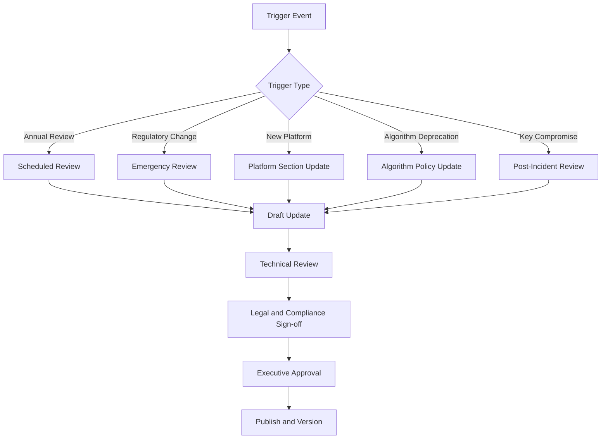

### 1.5 Normative Language and Traceability

The following terms define control strength:
- **MUST / SHALL**: mandatory control requirement.
- **SHOULD**: expected control unless a documented exception is approved.
- **MAY**: optional implementation choice where consistent with approved design and standards.

All auditable requirements use identifiers in the format `CRYPTO-[DOMAIN]-[NUMBER]`. Requirement IDs are consolidated in Appendix F to support audit, evidence collection, regulatory review, and design traceability.

---

## 2. Control Clustering Model

### 2.1 Hybrid Domain Structure

This document clusters controls into the following domains.

| Domain | Meaning | Primary Purpose |
| :-- | :-- | :-- |
| GRC | Governance, Risk, and Compliance | Policy, accountability, review, exceptions, traceability |
| CEK | Cryptography, Encryption, and Key Management | Algorithms, lifecycle, inventories, key custody, crypto-agility |
| IAM | Identity and Access for Cryptographic Services | Human and workload access to KMS, HSM, vault, PKI, and secrets services |
| DSP | Data Security and Protection | Data-at-rest, data-in-transit, application-layer protection, signing, certificates |
| TVM | Technical Implementation and Platform Patterns | Cloud, on-premises, private-cloud, Kubernetes, and workload implementation patterns |
| LOG | Logging, Monitoring, and Detection | Logging, SIEM, anomaly detection, operational evidence |
| IR | Incident Response and Recovery | Key compromise response, emergency controls, restoration of trust |
| STA | Supply Chain and Third-Party Assurance | Vendor, PKI, SaaS, library, and trust-dependency governance |

### 2.2 NIST CSF 2.0 Clustering

NIST CSF 2.0 provides six high-level cybersecurity functions: **Govern, Identify, Protect, Detect, Respond, and Recover**. This guideline uses those functions as an explanatory overlay rather than a replacement for the domain model.

| This Guideline Domain | Primary NIST CSF 2.0 Function | Secondary NIST CSF 2.0 Function | Why It Fits |
| :-- | :-- | :-- | :-- |
| GRC | Govern | Identify | Sets policy, accountability, oversight, risk, and exception handling |
| CEK | Protect | Identify | Defines what cryptography is approved and which assets exist |
| IAM | Protect | Govern | Controls who may administer or consume cryptographic services |
| DSP | Protect | Identify | Applies encryption, signing, and certificate protections to information flows |
| TVM | Protect | Govern | Turns policy into platform controls and repeatable implementation patterns |
| LOG | Detect | Protect | Monitors cryptographic activity and control-plane misuse |
| IR | Respond | Recover | Contains compromise and restores trusted cryptographic state |
| STA | Govern | Identify / Protect | Governs suppliers, third-party trust, and library risk |

#### Practical CSF Use

Use the NIST CSF view when the audience is asking:
- Are we governed correctly?
- Have we identified cryptographic assets and dependencies?
- Are we protecting data and keys correctly?
- Can we detect misuse?
- Can we respond to compromise?
- Can we recover trust?

### 2.3 NIST SP 800-53 Clustering

NIST SP 800-53 offers a more granular control-family model that helps explain *where* detailed requirements sit. For cryptographic management, the most useful families are the following.

| This Guideline Domain | Most Relevant NIST SP 800-53 Families | How They Help Explain Requirements |
| :-- | :-- | :-- |
| GRC | PL, PM, RA, CA | Planning, program management, risk assessment, assessment and authorization |
| CEK | SC, MP, CM | Cryptographic protection, media/key protection, configuration control for approved algorithms |
| IAM | AC, IA, PS | Access control, identification and authentication, privileged role control |
| DSP | SC, SI | Information-in-transit and at-rest protection, integrity, secure protocols |
| TVM | SC, CM, SA | Platform configuration, secure services acquisition, integration patterns |
| LOG | AU, SI | Audit logging, event review, integrity and anomaly handling |
| IR | IR, CP | Incident handling, contingency and recovery planning |
| STA | SR, SA, CA | Supply-chain risk, service acquisition, third-party assessment |

#### Working Interpretation

For this document:
- Use **NIST CSF 2.0** to explain the *cluster* and lifecycle stage of the control.
- Use **NIST SP 800-53** to explain the *control family logic* and detailed assurance expectation.
- Keep this enterprise domain model as the primary organising structure for the operational guideline.

### 2.4 CSA CCM Clustering

CSA Cloud Controls Matrix (CCM) is now adopted in this guideline as an additional cloud-focused clustering and shared-responsibility reference. It is particularly useful where the audience is assessing SaaS, PaaS, IaaS, customer-managed encryption, provider-managed encryption, logging boundaries, and customer-versus-provider obligations.

The current hybrid domain model in this guideline already mirrors several CCM domains closely, especially GRC, CEK, IAM, DSP, LOG, STA, and TVM. CSA CCM also adds cloud-native clarity for infrastructure, portability, auditability, and shared control ownership across the cloud supply chain.

| This Guideline Domain | Closest CSA CCM Domain(s) | Use in This Guideline |
| :-- | :-- | :-- |
| GRC | GRC | Governance, policy, risk, exceptions, and compliance accountability |
| CEK | CEK | Encryption, key management, key lifecycle, and customer key management capability |
| IAM | IAM | Human and workload access to cloud and enterprise cryptographic services |
| DSP | DSP | Data classification, encryption coverage, privacy, retention, and information lifecycle |
| TVM | IVS, CCC, TVM | Provider and workload implementation patterns, secure baseline configuration, and cloud platform hardening |
| LOG | LOG | Auditability, event collection, monitoring, and evidence generation |
| IR | SEF, BCR | Incident handling, forensics, continuity, and recovery of trusted cryptographic state |
| STA | STA, A&A, IPY | Vendor assurance, transparency, portability, and external assessment support |

### 2.5 Shared Responsibility by Service Model

CSA CCM is especially helpful because it explicitly supports cloud supply-chain role clarity and shared responsibility. This matters for future use of this guideline across SaaS, PaaS, and IaaS, where some controls are owned by the provider, some by the customer, and many are shared.

| Control Area | SaaS | PaaS | IaaS |
| :-- | :-- | :-- | :-- |
| Provider infrastructure encryption capability | Mostly provider-owned | Provider-owned | Shared; provider supplies platform capability, customer configures use |
| Customer-managed keys / BYOK / HYOK use | Limited to provider feature set | Often supported for managed services | Frequently supported and strongly relevant |
| Guest OS and middleware hardening | Usually provider-owned | Shared or provider-led | Mostly customer-owned |
| Application secret handling | Shared | Shared | Customer-owned for workloads, with provider services available |
| Data classification and encryption policy | Customer-owned | Customer-owned | Customer-owned |
| KMS / vault service configuration | Shared | Shared | Customer-owned within provider capabilities |
| Logging review and alerting | Shared | Shared | Customer-owned for workload telemetry, shared for control plane |
| Incident response for cloud cryptography | Shared | Shared | Shared, with wider customer scope in IaaS |

#### Service-Model Guidance

- For **SaaS**, this guideline should focus on what the customer can verify, configure, demand contractually, and monitor, such as key options, tenant isolation, logging visibility, certificate choices, and export / portability controls.
- For **PaaS**, this guideline should emphasise secure consumption of provider cryptographic features, workload identities, customer-managed key options, and application-layer secret and signing controls.
- For **IaaS**, this guideline should apply most fully, because customers usually control operating systems, workload configuration, application identity, runtime secret delivery, and many encryption decisions.

### 2.6 Domain-to-Requirement Logic

This hybrid approach keeps the top-level structure readable for governance and audit while preserving the detailed patterns engineers need. Adding CSA CCM makes the model more cloud-operational without removing the NIST overlays already used in the document.

| Question | Best View |
| :-- | :-- |
| Who owns and approves cryptographic decisions? | GRC / CSF Govern / 800-53 PL-PM-RA / CSA GRC |
| Which algorithms and key lifecycles are acceptable? | CEK / CSF Protect / 800-53 SC / CSA CEK |
| Who can access KMS, HSM, vault, and secrets? | IAM / CSF Protect / 800-53 AC-IA / CSA IAM |
| Where must data be encrypted or signed? | DSP / CSF Protect / 800-53 SC-SI / CSA DSP |
| How do we implement this on each platform? | TVM / CSF Protect / 800-53 SC-CM-SA / CSA IVS-CCC-TVM |
| What must be logged and alerted? | LOG / CSF Detect / 800-53 AU-SI / CSA LOG |
| What happens after compromise? | IR / CSF Respond-Recover / 800-53 IR-CP / CSA SEF-BCR |
| How do we govern vendors and libraries? | STA / CSF Govern / 800-53 SR-SA / CSA STA-A&A-IPY |

---

## 3. Governance and Standards Alignment

### 3.1 Governing Hierarchy

The organisation is treated as a financial-services critical infrastructure provider and is specifically regulated by the Securities and Futures Commission (SFC). High-level policy requirements therefore start with Hong Kong legal and sector-regulatory obligations, and detailed control requirements then flow down through internal governance, cloud control alignment, and implementation standards.

| Layer | Source / Framework | Role in This Guideline |
| :-- | :-- | :-- |
| Tier 0 | Hong Kong Cap. 653 Protection of Critical Infrastructures (Computer Systems) Ordinance | Top legal driver for critical-infrastructure computer-system security obligations |
| Tier 0.5 | SFC sector-regulatory cybersecurity expectations for internet trading and licensed corporations | Sector-specific policy expectations for exchange and market-facing systems |
| Tier 1 | Enterprise cyber policy and this cryptographic management guideline | High-level policy requirements applicable across all systems, with stricter tiering for Critical Systems and CCS |
| Tier 2 | NIST CSF 2.0 | Primary internal cyber governance and control framework |
| Tier 2 | CSA Cloud Controls Matrix (CCM) | Cloud control and shared-responsibility alignment framework |
| Tier 3 | NIST SP 800-53, NIST SP 800-57, NIST SP 800-175B, FIPS 203/204/205 | Detailed control families, key lifecycle, standards use, and PQC direction |
| Tier 3 | OWASP guidance and secure engineering patterns | Detailed implementation guidance for application, secrets, and storage controls |
| Tier 4 | Provider and platform standards | Technology-specific implementation detail |

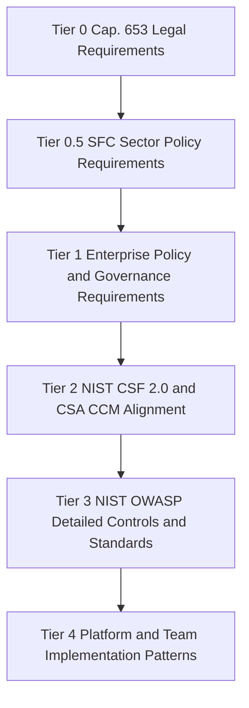

### 3.2 Tier 0 and Tier 1 Policy Structure

This document now separates **high-level policy / governance requirements** from **lower-level control and implementation requirements**.

- High-level policy requirements define what the organisation must achieve to satisfy Cap. 653, SFC expectations, enterprise governance, and regulated-exchange operating needs.
- Lower-level control requirements define how specific teams, technologies, and platforms implement those policy outcomes.
- Traceability is maintained from policy requirement to governance framework, control family, platform implementation pattern, evidence, and owner.

### 3.3 Cap. 653 High-Level Policy Requirements

Cap. 653 came into operation on 1 January 2026 and imposes statutory obligations on designated critical infrastructure operators to adopt appropriate measures to protect their computer systems, minimise the risk of essential services being disrupted or compromised due to cyberattacks, and maintain normal functioning of Hong Kong society. [page:1]

The official summary groups those obligations into three categories: Category 1 organisational obligations, Category 2 preventive obligations, and Category 3 incident reporting and response obligations. [page:1]

For cryptography and security policy, this guideline translates Cap. 653 into the following enterprise high-level requirements.

| Policy ID | High-Level Policy Requirement | Legal / Regulatory Driver |
| :-- | :-- | :-- |
| POLICY-CI-001 | All systems SHALL implement enterprise-approved security controls, and systems supporting regulated critical services SHALL implement enhanced controls proportionate to their criticality. | Cap. 653 requirement to adopt appropriate measures to protect computer systems [page:1] |
| POLICY-CI-002 | The organisation SHALL identify Critical Systems and Critical Computer Systems (CCS), including systems that protect, enable, recover, or materially support regulated exchange, market, and financial-service functions. | Cap. 653 obligations concerning critical computer systems and material changes [page:1] |
| POLICY-CI-003 | The organisation SHALL maintain a documented computer-system security management capability, including clear governance for cryptography, secrets, key management, certificates, and trust services. | Cap. 653 Category 1 security management unit requirement [page:1] |
| POLICY-CI-004 | The organisation SHALL maintain and implement a computer-system security management plan that includes cryptographic governance, key custody, identity, logging, incident response, and recovery requirements. | Cap. 653 Category 2 management plan requirement [page:1] |
| POLICY-CI-005 | Critical Systems and CCS SHALL be subject to periodic risk assessment, audit, drill, incident reporting, and emergency planning, with cryptographic dependencies included in scope. | Cap. 653 Category 2 and Category 3 obligations for risk assessment, audit, drills, emergency response plan, and incident notification [page:1] |
| POLICY-CI-006 | Material changes affecting CCS scope, cryptographic trust boundaries, key-management architecture, or major identity and connectivity dependencies SHALL be governed, assessed, and escalated. | Cap. 653 material change notification obligation [page:1] |
| POLICY-CI-007 | Cryptographic controls SHALL support resilience and recoverability of critical services, including backup, restoration, key recovery, certificate continuity, and trust re-establishment. | Cap. 653 emergency response and service continuity intent [page:1] |

#### Cap. 653 Cryptography Policy Interpretation

Cap. 653 does not prescribe individual algorithms in the statutory summary, but it requires appropriate measures, management plans, assessments, audits, drills, and incident readiness for critical computer systems. [page:1] For this enterprise guideline, that means cryptography becomes an explicit policy-controlled mechanism for confidentiality, integrity, authentication, non-repudiation, secure administration, secure connectivity, and trusted recovery in regulated critical environments.

### 3.4 SFC High-Level Policy Requirements

The SFC cybersecurity FAQ states that its guidance is intended to provide further guidance and practical examples for implementing the Guidelines for Reducing and Mitigating Hacking Risks Associated with Internet Trading. [page:2] The SFC FAQ also confirms that two-factor authentication is a principle-based requirement for authentication, and it states that dual passwords do not satisfy the 2FA requirement because they represent only one factor. [page:2]

Search results summarising the SFC internet-trading guidance state that intermediaries engaged in internet trading are required to use a strong data-encryption algorithm to encrypt sensitive information, such as login credentials and trade data during transmission between internal networks and client devices, and to protect client login passwords stored in internet trading systems. [web:100][web:102] They also describe the SFC framework as imposing baseline requirements to enhance cybersecurity resilience and reduce and mitigate hacking risks for internet trading. [web:100][web:104]

For a regulated exchange with both internet and private extranet access, this guideline treats the SFC position as creating the following high-level policy requirements.

| Policy ID | High-Level Policy Requirement | Regulatory Driver |
| :-- | :-- | :-- |
| POLICY-SFC-001 | Internet-facing and extranet-accessible trading, client, broker, member, and administrative channels SHALL use strong encryption for sensitive information in transit. | SFC internet-trading data-encryption requirement for sensitive information and trade data in transmission [web:100][web:102] |
| POLICY-SFC-002 | Client and user authentication for regulated internet-trading access SHALL use 2FA or stronger approved multi-factor controls; dual-password models alone SHALL NOT be treated as compliant. | SFC 2FA requirement and FAQ clarification [page:2] |
| POLICY-SFC-003 | Passwords and equivalent authentication secrets stored by regulated internet-trading systems SHALL be protected using strong cryptographic protection and enterprise-approved password-storage controls. | SFC summary requirement to protect stored client login passwords [web:100][web:102] |
| POLICY-SFC-004 | Regulated trading services SHALL implement monitoring and surveillance mechanisms to detect unauthorised access, anomalous login patterns, and suspicious account activity. | SFC FAQ examples for detecting unauthorised access [page:2] |
| POLICY-SFC-005 | Regulated trading services SHALL notify clients or counterparties of relevant security-significant account activity using approved risk-based notification controls. | SFC FAQ on prompt login notifications [page:2] |
| POLICY-SFC-006 | Systems supporting regulated exchange access over internet or private extranet SHALL preserve integrity, security, availability, and auditability of transaction, session, and identity data. | SFC cybersecurity baseline intent for internet trading resilience [web:100][web:104] |

#### Extranet Interpretation

Although the SFC materials cited here are framed around internet trading, the same policy intent should be applied conservatively to private extranet channels that support broker, participant, member, market, or administrative access to regulated exchange services, because those channels still carry sensitive identity, order, trade, and operational data. [web:100][page:2]

### 3.5 Enterprise System Tiering Model

This guideline applies to **all systems**, but requirements become stricter as a system moves closer to critical infrastructure and regulated exchange services.

| Tier | System Class | Applicability |
| :-- | :-- | :-- |
| Baseline | All systems | Mandatory minimum controls for cryptography, secrets, certificates, logging, secure administration, and approved algorithms |
| Enhanced | Critical Systems | Stronger segmentation, identity control, logging, recovery testing, and stricter key-custody and change governance |
| Highest | CCS and equivalent crown-jewel services | Formal Cap. 653 governance evidence, stronger signing and key protection, stricter monitoring, audit readiness, incident drills, and regulator-ready traceability |

#### Typical Exchange Examples

| Example System | Suggested Tier |
| :-- | :-- |
| Internal business application with no regulated trading dependency | Baseline |
| Internet trading portal or broker member extranet gateway | Critical System or CCS, depending on service criticality |
| Core exchange order-routing, matching, market data signing, KMS, HSM, token signing, or identity control plane | CCS / Highest |
| Backup, DR, privileged access vault, security gateway, or certificate authority protecting the exchange trust boundary | CCS / Highest |

### 3.6 High-Level to Lower-Level Mapping

The tables below show how high-level policy requirements map to internal governance frameworks and lower-level control references.

#### Policy to Governance Mapping

| High-Level Policy Area | NIST CSF 2.0 | CSA CCM | Typical Lower-Level References |
| :-- | :-- | :-- | :-- |
| Critical-infrastructure governance and accountability | Govern | GRC | NIST SP 800-53 PL, PM, RA, CA |
| Cryptography and key management | Protect | CEK | NIST SP 800-57, NIST SP 800-175B, FIPS 203/204/205 |
| Identity and privileged access for cryptographic services | Protect | IAM | NIST SP 800-53 AC, IA; OWASP authentication guidance |
| Data protection for internet and extranet channels | Protect | DSP | NIST SP 800-53 SC, SI; OWASP transport and storage guidance |
| Cloud implementation and shared responsibility | Govern / Protect | IVS, CCC, TVM, CEK | CSA CCM + provider control patterns |
| Monitoring, incident reporting, and recovery | Detect / Respond / Recover | LOG, SEF, BCR | NIST SP 800-53 AU, SI, IR, CP |
| Supply chain and third-party service assurance | Govern / Identify | STA, A&A, IPY | NIST SP 800-53 SR, SA; third-party security review requirements |

#### Policy to Detailed Control Mapping

| High-Level Policy Requirement | Primary Domain | Example Lower-Level Control Areas |
| :-- | :-- | :-- |
| POLICY-CI-001 Enterprise-wide protection with stricter critical-system controls | GRC / TVM | Asset tiering, secure baselines, stronger controls for critical services |
| POLICY-CI-003 Security management capability | GRC | Roles, approval process, inventory attestation, exception management |
| POLICY-CI-004 Management plan includes cryptography | GRC / CEK / IAM / LOG / IR | Key lifecycle, secret retrieval, logging, incident playbooks, recovery runbooks |
| POLICY-CI-005 Risk assessment, audit, drill, incident scope | GRC / LOG / IR | Annual risk reviews, biennial audits, drill evidence, compromise procedures |
| POLICY-SFC-001 Strong encryption in transit | DSP / CEK / TVM | TLS baseline, mTLS, secure extranet, cipher suite policy, certificate management |
| POLICY-SFC-002 2FA / MFA for regulated access | IAM | Strong authentication, phishing-resistant MFA where feasible, privileged access control |
| POLICY-SFC-003 Protected stored passwords | DSP / CEK | Argon2id, salted password storage, secret handling, credential lifecycle |
| POLICY-SFC-004 Monitoring of unauthorised access | LOG / IAM | Anomalous login detection, session monitoring, credential abuse detection |
| POLICY-SFC-005 Prompt notification | IR / LOG / TVM | User notification workflows, event triggers, evidence retention |
| POLICY-SFC-006 Integrity, availability, auditability | DSP / LOG / IR / TVM | Signing, logging, DR, certificate continuity, recovery testing |

#### China and International Standards Position

The organisation uses international cryptographic standards as the primary baseline and uses Chinese cryptographic standards where possible or where interoperability, jurisdictional, customer, or ecosystem requirements justify them. Lower-level controls therefore support both international and China-compatible options through the approved algorithm catalogue, including AES / ECDSA / Ed25519 / SHA-2 / ML-KEM direction on the international side and SM2 / SM3 / SM4 options where justified for China-facing interoperability.

### 3.7 Compliance Calendar

| Date / Trigger | Milestone | Action Required |
| :-- | :-- | :-- |
| Continuous | Maintain high-level policy traceability | Keep Cap. 653, SFC, NIST CSF, CSA CCM, and lower-level controls mapped in Appendix M |
| Annually | Critical-system and CCS risk assessment | Review critical-service cryptographic dependencies and design decisions |
| Every 2 years | Critical-system / CCS audit cycle | Perform independent audit for designated or equivalent regulated environments |
| On material change | Reassess policy and control mapping | Review internet/extranet connectivity, trust boundaries, KMS, HSM, and major identity changes |
| On incident | Execute reporting and recovery | Follow regulator-facing incident process, recovery testing, and evidence preservation |


## 4. GRC — Governance, Risk, and Compliance

### 4.1 Control Objective

Ensure enterprise cryptography is governed by approved policy, aligned to current standards, supported by named accountability, and evidenced for audit, regulatory, and risk-management purposes.

### 4.2 Policy and Approval Model

Cryptographic decisions SHALL be interpreted using the following hierarchy:
1. Applicable law and contractual obligation.
2. Enterprise information security policy.
3. This cryptographic management guideline.
4. Approved technical standards and architecture patterns.
5. Platform-specific implementation guidance.

#### Policy Traceability Principle

Every lower-level control in this document SHOULD be traceable upward to at least one high-level policy driver, whether Cap. 653, SFC, enterprise policy, or regulated exchange operational need. Each design, exception, and implementation pattern for Critical Systems or CCS SHOULD record the relevant policy IDs from Section 3 so teams can demonstrate governance alignment and implementation sufficiency.

#### GRC Control Statements

- **CRYPTO-GOV-001** — All production cryptographic implementations SHALL complete approved design documentation before deployment.
- **CRYPTO-GOV-002** — Each design SHALL identify purpose, data classification, algorithm choice, key custody model, and dependent systems.
- **CRYPTO-GOV-003** — Designs SHALL state any jurisdictional, interoperability, or customer driver, including ShangMi or dual-stack requirements.
- **CRYPTO-GOV-004** — Conflicts between provider defaults and enterprise requirements SHALL be resolved in favour of the stronger approved control unless formally excepted.
- **CRYPTO-GOV-005** — Non-default, legacy, or exception-based cryptography SHALL be documented and routed through exception governance.
- **CRYPTO-GOV-006** — Security Architect approval SHALL be obtained before production deployment.
- **CRYPTO-GOV-007** — Exceptions SHALL include scope, rationale, expiry date, risk acceptance, and compensating controls.
- **CRYPTO-GOV-008** — Expired exceptions SHALL be treated as control failures unless renewed through formal approval.

### 4.3 Roles and Accountability

| Role | Core Responsibilities |
| :-- | :-- |
| Security Architect | Approves designs, standards alignment, exceptions, and major control changes |
| Crypto Officer | Oversees lifecycle governance, crypto-agility planning, and strategic risk |
| Key Custodian | Executes approved operational tasks for keys, certificates, vaults, or HSMs |
| System Owner | Maintains implementation, inventory accuracy, and attestations |
| DevOps / Platform Team | Implements integration patterns, identity controls, logging, and automation |
| Crypto Auditor | Tests evidence, effectiveness, and inventory completeness |
| Incident Response Lead | Coordinates compromise triage, containment, and trust restoration |

### 4.4 Evidence and Assurance

Minimum governance evidence includes:
- Approved design record.
- Inventory linkage.
- Exception records, where applicable.
- Rotation and review evidence.
- Monitoring configuration.
- Audit forwarding evidence.
- Incident runbooks.
- Quarterly or periodic attestations.

---

## 5. CEK — Cryptography, Encryption, and Key Management

### 5.1 Control Objective

Ensure approved cryptographic mechanisms are selected, operated, and retired using controlled, auditable, and interoperable practices across the full key lifecycle.

### 5.2 Cryptographic Taxonomy

The following cryptographic function classes are governed by this document:
- Symmetric encryption.
- Key exchange.
- Public-key encryption and key wrapping.
- Digital signatures.
- Code signing and release signing.
- Hashing and integrity.
- Message authentication.
- Password storage.
- Key derivation.
- TLS certificates and server authentication.
- SSH host and user authentication.
- PQC transition planning.

### 5.3 Approved Algorithm Selection Standard

This section and Appendix E together form the operational algorithm catalogue. New implementations SHALL use the following baseline unless an approved exception exists.

| Function Type / Use Case | Mandatory | Permitted by Exception | Chinese Equivalent / Option | PQC / Crypto-Agility Note | Forbidden |
| :-- | :-- | :-- | :-- | :-- | :-- |
| Symmetric encryption — bulk data at rest / in transit | AES-256-GCM; AEAD mandatory | ChaCha20-Poly1305 where justified | SM4-GCM or SM4-CCM where required | Keep algorithm metadata abstracted | DES, 3DES, RC4, AES-ECB, unauthenticated CBC |
| Key exchange for TLS / mTLS / secure sessions | ECDHE over P-384 or X25519 | RSA-4096 legacy interoperability only | SM2 key exchange where required | Support hybrid migration with ML-KEM-768 | RSA key transport, static DH, weak curves |
| Public-key encryption / small-payload wrapping | Envelope encryption with KMS-managed DEKs and KEKs | RSA-4096 OAEP only for legacy interoperability | SM2 public-key encryption where required | Prefer KEM-style architecture | RSA PKCS#1 v1.5 encryption, RSA < 2048 |
| Digital signatures — apps, JWT, certificates | ECDSA P-384 preferred; Ed25519 where supported | RSA-PSS 4096 for legacy compatibility | SM2 + SM3 where required | Plan for ML-DSA-65 | DSA, SHA-1 signatures, RSA PKCS#1 v1.5 signatures |
| Code signing / release signing | ECDSA P-384 or Ed25519 with non-exportable keys | RSA-PSS 4096 only where verifier compatibility requires it | SM2 signing where required | Prioritise hybrid planning for long-lived artefacts | Private signing keys on laptops, exported CI keys, SHA-1-signed releases |
| Hashing / integrity | SHA-256 minimum; SHA-384 preferred | SHA-512 or SHA-3 where justified | SM3 where required | Record algorithm identifiers | MD5 and SHA-1 |
| Message authentication | HMAC-SHA256 or HMAC-SHA384 | HMAC-SHA512 where justified | HMAC-SM3 where required | Keep MAC selection configurable | HMAC-MD5 and HMAC-SHA1 |
| Password storage | Argon2id | PBKDF2-SHA256 in constrained contexts | No separate baseline defined | Review parameters periodically | Unsalted hashes, reversible encryption, MD5, SHA-1-based storage |
| Key derivation | HKDF-SHA256; HKDF-SHA384 for higher assurance | PBKDF2 only where specifically required | SM3-based KDF where explicitly required | Abstract behind approved libraries | Ad hoc or home-grown derivation |
| TLS certificates and server auth | ECDSA P-384 certificates preferred; TLS 1.3 baseline | RSA-4096 certificates and TLS 1.2 only by approved exception | SM2 certificates with SM3 in ShangMi TLS | Keep PKI agile | SHA-1-signed certs, RSA < 2048, SSLv3, TLS 1.0, TLS 1.1 |
| SSH host / user authentication | Ed25519 host keys; ECDSA P-384 acceptable | RSA-4096 only for legacy clients | No mainstream ShangMi SSH profile in scope | Track PQC SSH maturity | DSA, small RSA keys, weak MACs |
| Long-term PQC planning baseline | Use approved classical algorithms now with crypto-agility | Classical-only operation temporarily where documented | No separate Chinese commercial PQC baseline adopted | ML-KEM-768, ML-DSA-65, SLH-DSA for selected cases | Classical-only long-term assumptions with no migration plan |

#### CEK Control Statements — Algorithm Governance

- **CRYPTO-ALG-001** — Forbidden algorithms and protocols SHALL NOT be used in production.
- **CRYPTO-ALG-010** — New systems SHALL use the mandatory baseline unless an approved exception exists.
- **CRYPTO-ALG-011** — Any algorithm used by exception SHALL be documented in the design record and linked to the inventory.
- **CRYPTO-ALG-012** — Any China-specific or ShangMi selection SHALL state the exact interoperability, customer, or regulatory driver.
- **CRYPTO-ALG-013** — Deprecated algorithms SHALL be migrated according to approved retirement timelines.
- **CRYPTO-ALG-014** — New asymmetric designs SHALL document their PQC transition path or crypto-agility approach.

### 5.4 Key Lifecycle Requirements

All production keys, certificates, and managed cryptographic secrets SHALL follow an approved lifecycle.

#### Lifecycle Stages

1. Planning and design.
2. Generation or issuance.
3. Registration and inventory linkage.
4. Activation and use.
5. Rotation and renewal.
6. Suspension or emergency disablement.
7. Revocation.
8. Archival where required.
9. Destruction and evidence retention.

#### CEK Control Statements — Lifecycle

- **CRYPTO-KM-001** — Production keys SHALL be generated from approved entropy sources.
- **CRYPTO-KM-002** — HSM-generated or HSM-protected keys SHALL be mandatory for root CA keys, externally trusted signing keys, and other high-assurance master keys.
- **CRYPTO-KM-003** — Plaintext CMKs SHALL NOT be exposed to applications.
- **CRYPTO-KM-004** — Envelope encryption SHALL be the default pattern for application data.
- **CRYPTO-KM-005** — Key transport SHALL use approved wrapping or HSM-/KMS-backed mechanisms.
- **CRYPTO-KM-006** — Cryptoperiods SHALL be defined by key type and enforced operationally.
- **CRYPTO-KM-007** — Automated rotation SHALL be preferred wherever platform support exists.
- **CRYPTO-KM-008** — Backup, recovery, revocation, and destruction procedures SHALL be documented, approved, and tested.

#### Standard Cryptoperiods

| Key Type | Standard Cryptoperiod |
| :-- | :-- |
| Session key | Single session |
| DEK | Up to 2 years |
| HMAC key | 1 year |
| TLS private key | 1 year |
| KMS CMK | 1–3 years depending on platform and risk |
| Root CA key | 10–25 years under offline or equivalent high-assurance protection |

### 5.5 Inventory and Attestation

- **CRYPTO-INV-001** — All production keys, certificates, and managed secrets SHALL be recorded in the approved inventory system.
- **CRYPTO-INV-002** — Inventory records SHALL include asset type, algorithm, key length or curve, owner, data classification, custody model, and lifecycle state.
- **CRYPTO-INV-003** — Inventory records SHALL include the linked design record and any applicable exception reference.
- **CRYPTO-INV-004** — Inventory records SHALL capture external dependencies and consumers to support impact analysis.
- **CRYPTO-INV-005** — Inventory completeness SHALL be attested quarterly by the system owner.
- **CRYPTO-INV-006** — Independent inventory review SHALL occur at least quarterly.

---

## 6. IAM — Identity and Access for Cryptographic Services

### 6.1 Control Objective

Ensure that human and machine access to HSMs, KMS platforms, vaults, certificate services, and secrets systems is strongly authenticated, minimally privileged, auditable, and segregated by role and trust boundary.

### 6.2 Human Administrative Access

- **CRYPTO-IAM-001** — Administrative access to HSM, KMS, vault, and CA platforms SHALL require approved enterprise identity controls and MFA.
- **CRYPTO-IAM-002** — Shared administrative accounts SHALL NOT be used unless technically unavoidable and formally approved with compensating controls.
- **CRYPTO-IAM-003** — High-assurance administration SHALL use dual control and, where required, split knowledge.
- **CRYPTO-IAM-004** — Administrative privileges SHALL be role-based and periodically reviewed.

### 6.3 Workload Identity and Federation

- **CRYPTO-IAM-010** — Workloads SHALL authenticate to cryptographic services using managed identity, workload identity, federation, mTLS, or equivalent short-lived machine identity.
- **CRYPTO-IAM-011** — Long-lived shared secrets used only to unlock access to a better identity model SHALL be retired wherever platform support exists.
- **CRYPTO-IAM-012** — Service account keys, access keys, or equivalent long-lived workload credentials SHALL NOT be embedded in code, images, or templates.

### 6.4 Runtime Secret Retrieval

- **CRYPTO-IAM-020** — Secrets SHALL be retrieved only from approved vault or secret-management services.
- **CRYPTO-IAM-021** — Secrets SHALL NOT be embedded in source code, container images, VM templates, or plaintext deployment configuration.
- **CRYPTO-IAM-022** — Secret retrieval paths SHALL be logged and attributable to a workload identity.
- **CRYPTO-IAM-023** — Rotated secrets SHALL be consumed through runtime refresh or approved rollover procedure.

### 6.5 Separation of Duties

| Activity | System Owner | Key Custodian | Security Architect | Platform Team | Auditor |
| :-- | :--: | :--: | :--: | :--: | :--: |
| Design approval | C | I | A/R | C | I |
| Inventory creation | A/R | C | C | C | I |
| Rotation execution | C | A/R | I | R | I |
| Exception approval | C | I | A/R | C | I |
| Audit review | I | I | I | I | A/R |

Legend: A = Accountable, R = Responsible, C = Consulted, I = Informed

---

## 7. DSP — Data Security and Protection

### 7.1 Control Objective

Ensure that Confidential and Restricted data is protected by approved cryptography during storage, transmission, processing support flows, signing, and trust validation.

### 7.2 Data at Rest

- **CRYPTO-DSP-001** — Storage services SHALL use provider-integrated customer-managed encryption where available.
- **CRYPTO-DSP-002** — Platform-default encryption MAY be used only where customer-controlled encryption is not technically supported and risk is accepted.
- **CRYPTO-DSP-003** — Application-layer encryption SHALL be added where risk, regulatory need, or trust separation requires stronger protection.
- **CRYPTO-DSP-004** — Storage and database encryption dependencies SHALL be recorded in inventory.

### 7.3 Data in Transit

TLS 1.3 SHALL be the enterprise default for new services.

- **CRYPTO-DSP-010** — TLS 1.3 SHALL be used for new service endpoints unless documented interoperability constraints require otherwise.
- **CRYPTO-DSP-011** — TLS 1.2 MAY be used only by approved exception with restricted cipher suites.
- **CRYPTO-DSP-012** — Weak protocols and cipher suites SHALL be disabled.
- **CRYPTO-DSP-013** — Mutual TLS SHALL use certificates issued by an approved trust model and SHALL define renewal, revocation, and trust-store management procedures.

#### Approved TLS Baseline

```text
TLS_AES_256_GCM_SHA384
TLS_CHACHA20_POLY1305_SHA256
TLS_AES_128_GCM_SHA256
```

### 7.4 Application-Level Protection

- **CRYPTO-DSP-020** — Applications SHALL use envelope encryption for protected business data where encryption occurs outside platform-native storage controls.
- **CRYPTO-DSP-021** — Passwords SHALL be stored using approved memory-hard password hashing.
- **CRYPTO-DSP-022** — Message integrity SHALL use approved hash or MAC functions.
- **CRYPTO-DSP-023** — Home-grown cryptographic constructions SHALL NOT be used in place of approved libraries or provider services.

### 7.5 Tokens, Certificates, and Signing

- **CRYPTO-DSP-030** — JWT and token-signing keys SHALL be centrally managed and SHOULD be non-exportable wherever supported.
- **CRYPTO-DSP-031** — Container images promoted to production SHALL be signed.
- **CRYPTO-DSP-032** — Private signing keys SHALL NOT be stored on developer laptops or unmanaged build hosts.
- **CRYPTO-DSP-033** — Public certificates SHALL be sourced only from approved public CAs.
- **CRYPTO-DSP-034** — Internal PKI root and equivalent trust anchors SHALL use HSM-backed or equivalent high-assurance protection.

---

## 8. TVM — Technical Implementation and Platform Patterns

### 8.1 Enterprise Architecture View

The following architecture view is illustrative only. It shows example trust, integration, and dependency patterns that may exist across the enterprise, but it does not assert that every depicted connection exists in the current environment.

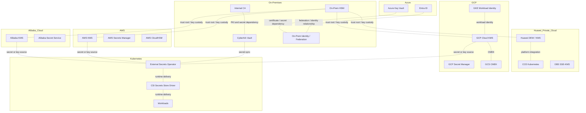

### 8.2 On-Premises HSM and Private Cloud Trust Services

On-premises HSM and private-cloud cryptographic services SHALL be used where the organisation requires direct custody of root material, regulated signing keys, private-cloud storage encryption, or trust anchoring for hybrid and cross-cloud key strategies. Dual control, split knowledge, formally approved operator roles, and auditable administrative procedures are mandatory for all high-assurance cryptographic administration.

#### TVM Control Statements — On-Prem and Private Cloud

| Requirement ID | Requirement | Example Implementation |
| :-- | :-- | :-- |
| CRYPTO-ONP-001 | Confidential or Restricted on-premises and private-cloud workloads SHALL use enterprise-controlled keys rather than unmanaged platform-default keys wherever explicit key selection is supported. | Private-cloud storage, databases, Kubernetes secret encryption, and application-level encryption reference HSM-backed or enterprise KMS-managed material. |
| CRYPTO-ONP-002 | Root keys, CA keys, signing keys, and application master keys SHALL be separated by environment, data classification, and trust boundary. | Separate HSM partitions, logical domains, or key hierarchies for prod-restricted, prod-confidential, and nonprod. |
| CRYPTO-ONP-003 | Workloads SHALL authenticate to vault or key services using approved machine identity, mTLS, federation, or equivalent short-lived controls rather than shared static credentials. | VM workloads use certificate-based service identity; Kubernetes workloads use ESO, CSI, or approved workload identity integration. |
| CRYPTO-ONP-004 | HSM, vault, CA, and private-cloud key-service audit logs SHALL be exported to the enterprise SIEM. | Generate, import, unwrap, sign, disable, restore, and admin-login events are centrally monitored. |
| CRYPTO-ONP-005 | Every production key, certificate, and managed secret SHALL be linked to the enterprise inventory and approved design record. | HSM label, vault path, CA identifier, and dependent service are mapped to Appendix B and Appendix C records. |
| CRYPTO-ONP-006 | HSM-backed non-exportable protection SHALL be mandatory for root CA keys, externally trusted signing keys, and other high-assurance Restricted use cases. | Offline root CA, code-signing key, and selected JWT signing keys remain non-exportable within approved HSM controls. |
| CRYPTO-ONP-007 | Secrets SHALL be retrieved at runtime from CyberArk, approved private-cloud vault services, or HSM-integrated services. | No secrets in source repositories, VM templates, container images, or unsecured deployment variables. |
| CRYPTO-ONP-008 | Backup, recovery, revocation, destruction, and emergency disablement procedures SHALL be documented, approved, and tested at least annually. | HSM backup/restore, CA recovery, and emergency key-disable runbooks are evidenced and retained for audit. |

#### Typical On-Premises Use Cases

| Use Case | Recommended Control | Key Management Pattern |
| :-- | :-- | :-- |
| Root CA and subordinate CA protection | On-prem HSM | Offline or tightly controlled ceremony-based custody |
| High-assurance application signing | Non-exportable HSM asymmetric key | Signing occurs in HSM; private key never leaves module |
| Kubernetes secret encryption at rest | Envelope encryption with approved KMS or HSM-integrated plugin | Cluster-level encryption key separated by environment |
| Database or storage encryption in private cloud | HSM-backed or enterprise KMS-managed KEK / CMK | Platform storage encryption plus optional application-layer AES-256-GCM |
| VM and application secrets retrieval | CyberArk or approved private-cloud vault | Runtime retrieval using machine identity and auditable access path |

#### Illustrative Runtime Secret and Key Pattern

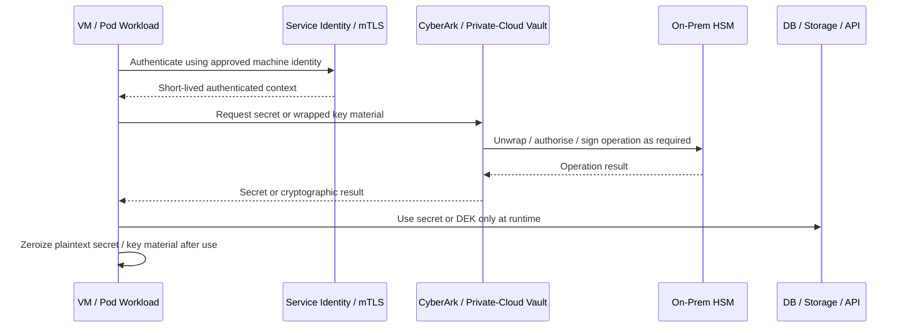

### 8.3 CyberArk Vault and Conjur

CyberArk is the strategic vault for privileged secrets, application secrets, and selected cryptographic key-adjacent materials across both VM and Kubernetes environments.

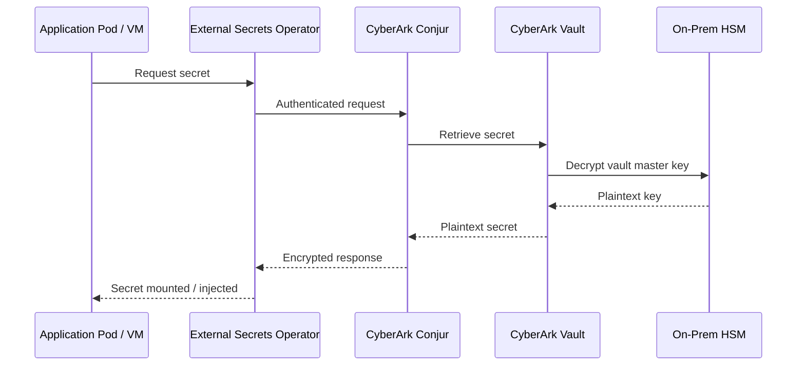

#### CyberArk Control Statements

- **CRYPTO-CYA-001** — CyberArk SHALL be used for approved privileged and application secret use cases where enterprise vault custody is required.
- **CRYPTO-CYA-002** — CyberArk secret access SHALL be bound to approved identity and policy controls.
- **CRYPTO-CYA-003** — CyberArk audit trails SHALL be exported to the enterprise SIEM.
- **CRYPTO-CYA-004** — Kubernetes secret delivery via Conjur, ESO, or approved operators SHALL preserve the upstream secret source as the system of record.

### 8.4 AWS KMS and Secrets Manager

AWS KMS SHALL be the default AWS control plane for customer-managed encryption keys, envelope encryption, and asymmetric signing where supported. AWS Secrets Manager or approved enterprise vault services SHALL be used for runtime secret retrieval, and CloudHSM-backed custom key stores SHOULD be used for the most sensitive or specially regulated AWS use cases.

| Requirement ID | Requirement | Example Implementation |
| :-- | :-- | :-- |
| CRYPTO-AWS-001 | AWS workloads handling Confidential or Restricted data SHALL use customer-managed keys rather than service-default encryption where the AWS service supports such control. | S3, EBS, RDS, selected EKS workloads, and application-layer encryption use AWS KMS CMKs. |
| CRYPTO-AWS-002 | Keys SHALL be separated by account, environment, region, and data classification. | Distinct keys or aliases for prod-restricted, prod-confidential, and nonprod; production and non-production keys are never shared. |
| CRYPTO-AWS-003 | Workloads SHALL use approved short-lived AWS identity or federation controls rather than embedded long-lived access keys. | Compute and container workloads retrieve secrets and invoke KMS without static credentials stored in code, AMIs, or images. |
| CRYPTO-AWS-004 | AWS KMS administrative and usage events SHALL be logged and exported to the monitoring platform. | CloudTrail captures Encrypt, Decrypt, GenerateDataKey, CreateKey, DisableKey, and policy-change events. |
| CRYPTO-AWS-005 | AWS key inventory records SHALL be linked to the enterprise inventory and design record. | KMS key ARN, alias, account owner, data classification, and dependent application are mapped to Appendix C. |
| CRYPTO-AWS-006 | CloudHSM-backed custom key stores or equivalent stronger custody controls SHALL be used where required by regulation, risk rating, or externally trusted signing. | High-value signing or high-assurance custody uses HSM-backed integration rather than general-purpose key custody alone. |
| CRYPTO-AWS-007 | Secrets SHALL be retrieved at runtime from AWS Secrets Manager or approved enterprise vault services. | Database credentials, API secrets, and token-signing dependencies are not stored in source code, images, or plaintext configuration. |
| CRYPTO-AWS-008 | Rotation, disablement, revocation, recovery, and re-encryption procedures SHALL be documented and tested. | Automatic rotation is enabled where supported; runbooks exist for disable, restore, and data re-encryption scenarios. |

#### AWS Use Cases

| Use Case | Recommended AWS Control | Key Management Pattern |
| :-- | :-- | :-- |
| Object storage encryption | S3 SSE-KMS | Bucket encryption references approved AWS KMS CMK |
| Database encryption | RDS with KMS-backed encryption | Key segregated by environment and sensitivity |
| Application-layer encryption | Envelope encryption with AWS KMS | `GenerateDataKey` returns per-operation DEK; plaintext DEK is zeroized after use |
| Secrets management | AWS Secrets Manager | Runtime retrieval using approved identity path |
| Application signing / JWT signing | AWS KMS asymmetric signing | Sign without exporting the private key |

#### AWS Illustrative Envelope Encryption Pattern

1. The application authenticates using approved AWS identity controls.
2. The application requests a DEK from AWS KMS using an approved CMK.
3. The application encrypts data locally using AES-256-GCM with the plaintext DEK.
4. The application stores ciphertext together with the wrapped DEK and required metadata.
5. The application zeroizes plaintext DEK material immediately after use.

```python
# Pseudocode example
plaintext_dek, ciphertext_dek = kms.generate_data_key(cmk_id)
ciphertext = aes_gcm_encrypt(plaintext_dek, plaintext)
store(ciphertext, ciphertext_dek)
zeroize(plaintext_dek)
```

### 8.5 Alibaba Cloud KMS

Alibaba Cloud KMS SHALL be the primary key-management service for envelope encryption, CMK lifecycle control, and service-integrated encryption across Alibaba workloads. Alibaba-managed secrets capabilities or approved enterprise vault services SHALL be used for runtime secret retrieval and SHALL follow the same inventory, monitoring, and exception-governance requirements used elsewhere in this document.

| Requirement ID | Requirement | Example Implementation |
| :-- | :-- | :-- |
| CRYPTO-ALI-001 | Confidential or Restricted Alibaba workloads SHALL use customer-managed or enterprise-selected encryption controls where the platform supports such control. | OSS, ECS-attached storage, RDS, and application encryption reference approved KMS-managed keys. |
| CRYPTO-ALI-002 | Keys SHALL be separated by environment, account boundary, and data classification. | Distinct CMKs for prod-restricted, prod-confidential, and nonprod. |
| CRYPTO-ALI-003 | Workloads SHALL use approved identity-based access rather than embedded static credentials. | Compute and Kubernetes workloads access KMS and secret services through approved runtime identity controls. |
| CRYPTO-ALI-004 | Administrative and usage events SHALL be logged and exported to enterprise monitoring. | Key creation, disablement, rotation, decrypt, and policy-administration events are forwarded to SIEM. |
| CRYPTO-ALI-005 | KMS keys and secret dependencies SHALL be linked to the enterprise inventory and design record. | CMK identifier, owning team, use case, dependency mapping, and exception record are retained. |
| CRYPTO-ALI-006 | Stronger custody controls SHALL be used for the highest-sensitivity use cases where platform capability or external HSM integration is required. | High-assurance signing or master-key protection uses an approved enhanced custody pattern. |
| CRYPTO-ALI-007 | Secrets SHALL be retrieved at runtime and SHALL NOT be embedded in code, images, or plaintext configuration. | Applications obtain credentials through approved managed secret or vault workflows. |
| CRYPTO-ALI-008 | Rotation, disablement, and recovery procedures SHALL be documented, approved, and tested. | Platform runbooks define revoke, rotate, and re-encrypt actions for each dependent service. |

#### Alibaba Cloud Use Cases

| Use Case | Recommended Alibaba Control | Key Management Pattern |
| :-- | :-- | :-- |
| Object storage encryption | OSS SSE-KMS | Bucket or object encryption references approved CMK |
| Database encryption | RDS with KMS-backed encryption | Key split by environment and classification |
| Application-layer encryption | Envelope encryption with Alibaba Cloud KMS | Per-operation DEK generated, wrapped, and stored with ciphertext |
| Secrets management | Approved managed secret service or enterprise vault | Runtime retrieval through approved identity path |
| Container or service secrets | ACK-integrated runtime retrieval | Secrets delivered at runtime, not baked into images or manifests |

#### Alibaba Cloud Illustrative Envelope Encryption Pattern

1. The application authenticates using approved platform identity controls.
2. The application requests a DEK from Alibaba Cloud KMS.
3. KMS returns a plaintext DEK for immediate use and a wrapped DEK for storage.
4. The application encrypts business data using AES-256-GCM.
5. The wrapped DEK is stored with ciphertext metadata and the plaintext DEK is zeroized.

```python
# Pseudocode example
plaintext_dek, ciphertext_dek = kms.generate_data_key(cmk_id)
ciphertext = aes_gcm_encrypt(plaintext_dek, plaintext)
store(ciphertext, ciphertext_dek)
zeroize(plaintext_dek)
```

### 8.6 Huawei Private Cloud DEW and KMS

Huawei private-cloud workloads SHALL use DEW, KMS, and Dedicated HSM capabilities for enterprise-controlled encryption, key lifecycle governance, and private-cloud storage protection. Because this platform may operate in a more organisation-controlled boundary than public cloud, designs SHALL explicitly document custody boundaries, administrative roles, recovery processes, and integration with enterprise SIEM and inventory.

| Requirement ID | Requirement | Example Implementation |
| :-- | :-- | :-- |
| CRYPTO-HPC-001 | Confidential or Restricted private-cloud workloads SHALL use enterprise-selected DEW/KMS keys rather than unmanaged platform-default cryptography where explicit control is available. | OBS, EVS, RDS, CCE secret protection, and application-level encryption use approved key references. |
| CRYPTO-HPC-002 | Keys SHALL be separated by region, environment, and data classification. | Separate keys for production Restricted, production Confidential, and non-production workloads. |
| CRYPTO-HPC-003 | Workloads SHALL use approved private-cloud identity, federation, or workload authentication instead of shared static credentials. | CCE and VM workloads access DEW through controlled service identity and approved runtime path. |
| CRYPTO-HPC-004 | DEW, Dedicated HSM, and private-cloud audit events SHALL be forwarded to enterprise monitoring. | Key generation, decrypt, disable, rotation, restore, and admin-access events are exported to SIEM. |
| CRYPTO-HPC-005 | Private-cloud key records SHALL be linked to enterprise inventory and design records. | DEW key ID, owner, application mapping, and exception reference are linked to Appendix B and Appendix C. |
| CRYPTO-HPC-006 | Dedicated HSM-backed protection SHALL be used for root material, high-value signing, and regulated Restricted data where required. | Dedicated HSM stores or protects master material for the highest-sensitivity use cases. |
| CRYPTO-HPC-007 | Secrets SHALL be retrieved at runtime from approved private-cloud or enterprise vault services. | No plaintext secret sprawl in VM templates, images, or Kubernetes manifests. |
| CRYPTO-HPC-008 | Disablement, rotation, backup, recovery, and emergency procedures SHALL be documented and tested. | Annual evidence for restore and emergency key-disable workflows is retained. |

#### Huawei Private Cloud Use Cases

| Use Case | Recommended Huawei Control | Key Management Pattern |
| :-- | :-- | :-- |
| Object storage encryption | OBS SSE-KMS | Approved DEW key referenced by storage policy |
| Volume or VM storage encryption | EVS / VM storage with DEW-managed key | Key separated by environment and sensitivity |
| Database encryption | RDS with DEW/KMS-backed control | Managed DB encryption tied to enterprise key inventory |
| CCE workload secrets | DEW-integrated or approved vault retrieval pattern | Runtime access through approved workload identity path |
| Application-layer encryption | Envelope encryption with DEW | Per-operation DEK created, wrapped, stored, and plaintext zeroized |

#### Huawei Private Cloud Illustrative Envelope Encryption Pattern

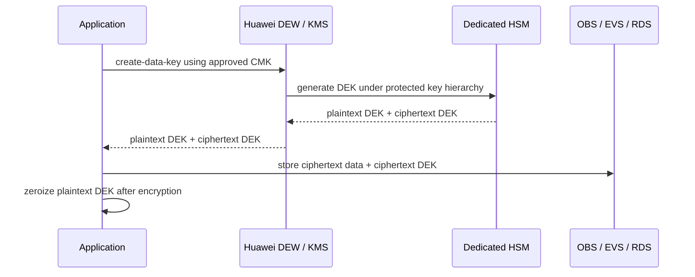

### 8.7 Azure Key Vault and Entra ID

Azure Key Vault SHALL be the default Azure control plane for keys, secrets, and certificates, while Entra ID SHALL govern approved identity-driven access patterns for Azure workloads. Azure implementations SHALL use non-exportable keys where supported, align certificate and signing use cases to enterprise policy, and avoid static credentials in workloads.

| Requirement ID | Requirement | Example Implementation |
| :-- | :-- | :-- |
| CRYPTO-AZR-001 | Confidential or Restricted Azure workloads SHALL use customer-controlled encryption keys where the platform supports such control. | Azure storage, managed databases, AKS-related secret workflows, and application-layer encryption reference approved Key Vault keys. |
| CRYPTO-AZR-002 | Keys, certificates, and secrets SHALL be separated by environment, subscription boundary, and data classification. | Distinct vaults or key sets for prod-restricted, prod-confidential, and nonprod. |
| CRYPTO-AZR-003 | Workloads SHALL use Entra-governed managed identity, federation, or equivalent short-lived access rather than embedded secrets. | VM and AKS workloads retrieve keys or secrets at runtime through approved identity paths. |
| CRYPTO-AZR-004 | Key Vault administrative and usage logs SHALL be exported to enterprise monitoring. | Sign, unwrap, secret read, certificate update, key disable, and policy-change events are forwarded to SIEM. |
| CRYPTO-AZR-005 | Azure key, certificate, and secret records SHALL be linked to enterprise inventory and design records. | Vault URI, key name, certificate name, owner, and dependent application are mapped in inventory. |
| CRYPTO-AZR-006 | HSM-backed or higher-assurance key protection SHALL be used for externally trusted signing, root-like trust anchors, and the highest-sensitivity use cases. | High-value signing and certificate-authority-adjacent controls use stronger custody options where required. |
| CRYPTO-AZR-007 | Secrets and certificates SHALL be retrieved or renewed through approved runtime workflows rather than manual distribution or file export. | Applications and services consume current secrets at runtime; certificates rotate without uncontrolled private-key export. |
| CRYPTO-AZR-008 | Rotation, disablement, certificate renewal, and emergency response procedures SHALL be documented and tested. | Key rollover, certificate renewal, and incident disablement runbooks are retained as evidence. |

#### Azure Use Cases

| Use Case | Recommended Azure Control | Key Management Pattern |
| :-- | :-- | :-- |
| Application secrets | Azure Key Vault secrets | Runtime retrieval via approved identity path |
| Certificate lifecycle | Azure Key Vault certificates | Renewal and distribution controlled centrally |
| Application signing / JWT signing | Non-exportable asymmetric key in Key Vault | Signing occurs without private-key export |
| Storage or database encryption | Service-integrated customer-controlled key reference | Key ownership retained in Key Vault |
| AKS secrets access | Approved identity-based retrieval pattern | Workload accesses secret at runtime rather than embedding it |

#### Azure Illustrative Signing and Secret Retrieval Pattern

1. The workload authenticates using approved Entra-managed identity or federation.
2. The workload retrieves a secret or invokes a signing operation from Azure Key Vault.
3. Private signing keys remain non-exportable and are not distributed to application hosts.
4. Key usage, secret access, and administrative events are exported to central monitoring.
5. Rotated secrets and keys are consumed through runtime retrieval rather than manual redeployment of plaintext credentials.

```python
# Pseudocode example
digest = sha384(data)
signature = key_vault.sign(key_name="jwt-signing", algorithm="ES384", digest=digest)
```

### 8.8 GCP Cloud KMS and Secret Manager

GCP is an in-scope platform for planning and implementation. GCP workloads SHALL use Cloud KMS and, where sensitivity requires it, Cloud HSM-backed key protection for regulated or high-value data.

| Requirement ID | Requirement | Example Implementation |
| :-- | :-- | :-- |
| CRYPTO-GCP-001 | GCP workloads handling Confidential or Restricted data SHALL use CMEK rather than provider-default encryption where the service supports it. | BigQuery, GCS, Persistent Disk, and selected AI services use Cloud KMS keys. |
| CRYPTO-GCP-002 | Key rings and keys SHALL be separated by environment, project, and data classification. | Separate key rings for prod-restricted, prod-confidential, and nonprod. |
| CRYPTO-GCP-003 | Workloads SHALL use Workload Identity or equivalent short-lived identity federation rather than long-lived service account keys. | GKE Workload Identity is bound to service accounts that can call Cloud KMS or Secret Manager. |
| CRYPTO-GCP-004 | Cloud Audit Logs for KMS operations SHALL be exported to the enterprise monitoring platform. | Encrypt, Decrypt, AsymmetricSign, CreateCryptoKeyVersion, IAM policy change, and disable events are audited. |
| CRYPTO-GCP-005 | GCP key inventory records SHALL be linked to the enterprise inventory and design record. | Cloud KMS key resource ID is linked to Appendix C and Appendix B records. |
| CRYPTO-GCP-006 | Cloud HSM-backed or equivalent stronger protection SHALL be used for the most sensitive regulated data, root-like trust anchors, and high-assurance signing use cases. | Selected signing keys or highly sensitive master keys use stronger protection tiers where required. |
| CRYPTO-GCP-007 | Secrets SHALL be retrieved at runtime from Secret Manager or approved enterprise vault services and SHALL NOT be embedded in code, images, or static configuration. | Application credentials and secrets are accessed at runtime through Workload Identity. |
| CRYPTO-GCP-008 | Rotation, disablement, revocation, and recovery procedures SHALL be documented and tested. | Key version rotation, disablement, re-encryption, and emergency response runbooks are retained. |

#### GCP Use Cases

| Use Case | Recommended GCP Control | Key Management Pattern |
| :-- | :-- | :-- |
| Object storage encryption | GCS with CMEK | Cloud KMS key referenced by bucket policy |
| VM disk encryption | Persistent Disk CMEK | Cloud KMS key scoped by environment and project |
| GKE application encryption | Envelope encryption with Cloud KMS or Secret Manager | Workload Identity retrieves keys or secrets at runtime |
| BigQuery sensitive datasets | CMEK-enabled datasets | Dataset-level encryption policy tied to Cloud KMS |
| Application signing / JWT signing | Cloud KMS asymmetric signing keys | Sign without exporting private key |
| Secrets management | Secret Manager with Cloud KMS-backed protection | Runtime retrieval via Workload Identity |

#### GCP Illustrative Envelope Encryption Pattern

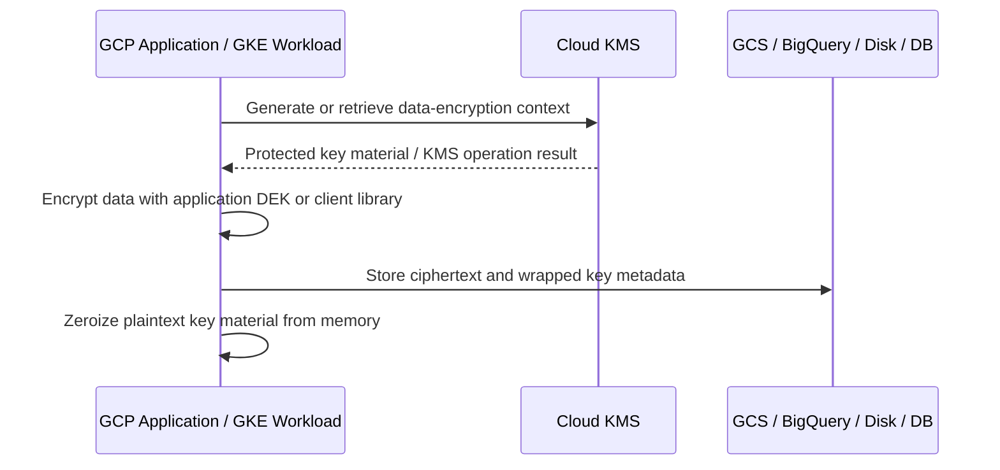

#### GCP Terraform Example Key Ring and CMEK

```hcl
resource "google_kms_key_ring" "prod_restricted" {
  name     = "prod-restricted-ring"
  location = "asia-east2"
}

resource "google_kms_crypto_key" "gcs_cmek" {
  name            = "gcs-restricted-cmek"
  key_ring        = google_kms_key_ring.prod_restricted.id
  rotation_period = "7776000s"

  version_template {
    algorithm        = "GOOGLE_SYMMETRIC_ENCRYPTION"
    protection_level = "HSM"
  }
}

resource "google_storage_bucket" "restricted_bucket" {
  name     = "example-prod-restricted-bucket"
  location = "ASIA-EAST2"

  encryption {
    default_kms_key_name = google_kms_crypto_key.gcs_cmek.id
  }
}
```

#### GCP Example Asymmetric Signing with Cloud KMS

```python
from google.cloud import kms

client = kms.KeyManagementServiceClient()
key_version_name = "projects/PROJECT/locations/asia-east2/keyRings/prod-restricted-ring/cryptoKeys/jwt-signing/cryptoKeyVersions/1"

digest = kms.Digest(sha384=b"digest-bytes")
response = client.asymmetric_sign(
    request={"name": key_version_name, "digest": digest}
)

signature = response.signature
```

#### GKE and Secret Retrieval Example

```yaml
apiVersion: v1
kind: ServiceAccount
metadata:
  name: app-sa
  namespace: production
  annotations:
    iam.gke.io/gcp-service-account: app-sa@example-project.iam.gserviceaccount.com
---
apiVersion: apps/v1
kind: Deployment
metadata:
  name: api
  namespace: production
spec:
  template:
    spec:
      serviceAccountName: app-sa
      containers:
        - name: api
          image: asia-east2-docker.pkg.dev/example-project/prod/api:1.0.0
```

---

## 9. Developer and Delivery Patterns

### 9.1 Implementation Decision Flow

Use the decision process below before implementing a cryptographic control. Then complete the design template in Appendix B.

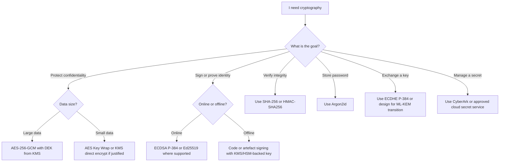

### 9.2 Design Record Process

Every new implementation SHALL complete the template in Appendix B before production deployment. The design record is the formal artefact that documents what cryptography is used, why it was selected, how keys are managed, and which dependencies or interoperability constraints apply.

#### Example Design Record Summary

| Field | Example |
| :-- | :-- |
| Business purpose | Protect customer profile export files before transfer to third-party processor |
| Function type | Symmetric encryption with key wrapping |
| Selected algorithm | AES-256-GCM for file encryption; AWS KMS CMK for DEK protection |
| Why this choice | Approved AEAD algorithm, envelope encryption supported by platform, auditable KMS use |
| Key source | `GenerateDataKey` from AWS KMS |
| Key storage | Plaintext DEK in memory only; ciphertext DEK stored with file metadata |
| Rotation | CMK annual auto-rotation; per-file DEK generated per encryption event |
| Dependencies | AWS KMS, S3 SSE-KMS, third-party HTTPS endpoint, approved crypto library |
| Monitoring | CloudTrail KMS events to SIEM; failed encryption alerts |
| PQC path | No immediate symmetric change; asymmetric transport dependencies tracked separately |

### 9.3 Secrets Management Patterns

Applications MUST retrieve secrets at runtime using workload identity and approved vault / KMS services. Secrets MUST NOT be embedded in code, images, or plaintext configuration files.

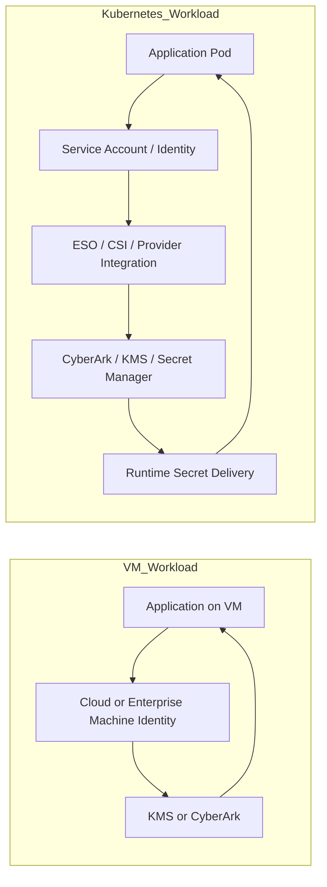

### 9.4 TLS and mTLS Patterns

- Use TLS 1.3 by default.
- Use approved certificates and explicit trust-store management.
- Use mTLS for service-to-service traffic in sensitive internal environments.
- Prefer ECDSA P-384 certificates unless documented compatibility requires otherwise.

### 9.5 JWT and Signing Patterns

| Algorithm | Status | Use Case |
| :-- | :-- | :-- |
| ES384 | Preferred | New JWT issuance |
| EdDSA / Ed25519 | Approved where supported | Modern ecosystems with verifier support |
| RSA-PSS | Legacy only | Backward compatibility |
| HS256 | Restricted | Intra-service only, with design approval |

#### JWKS Rotation Flow

1. Generate new signing key in KMS.
2. Publish new `kid` in JWKS alongside old key.
3. Start issuing with the new key.
4. Wait for old token TTL to expire.
5. Remove old key from JWKS and disable old material.

### 9.6 Database and Storage Patterns

- Use provider-native encryption with customer-managed or enterprise-controlled keys where supported.
- Add application-layer AES-256-GCM where platform-native controls are insufficient for the trust model.
- Separate storage keys by environment and classification.
- Record database and storage encryption dependencies in inventory.

### 9.7 Container Image Signing

All production container images MUST be signed and SHOULD be verified at admission.

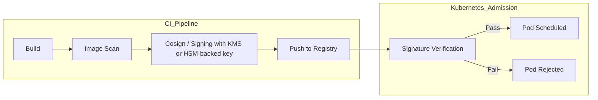

---

## 10. LOG — Logging, Monitoring, and Detection

### 10.1 Control Objective

Ensure that cryptographic control-plane events, secret-access activity, certificate lifecycle events, and high-risk administrative operations are centrally logged, reviewed, and monitored for misuse, failure, and compromise.

### 10.2 Log Sources and SIEM Integration

Relevant log sources include cloud-native audit logs from KMS, vault, IAM, and secret services; HSM, CA, and private-cloud audit trails; Kubernetes secret-delivery events; certificate lifecycle events; CI/CD signing events; and identity or policy changes affecting cryptographic services.

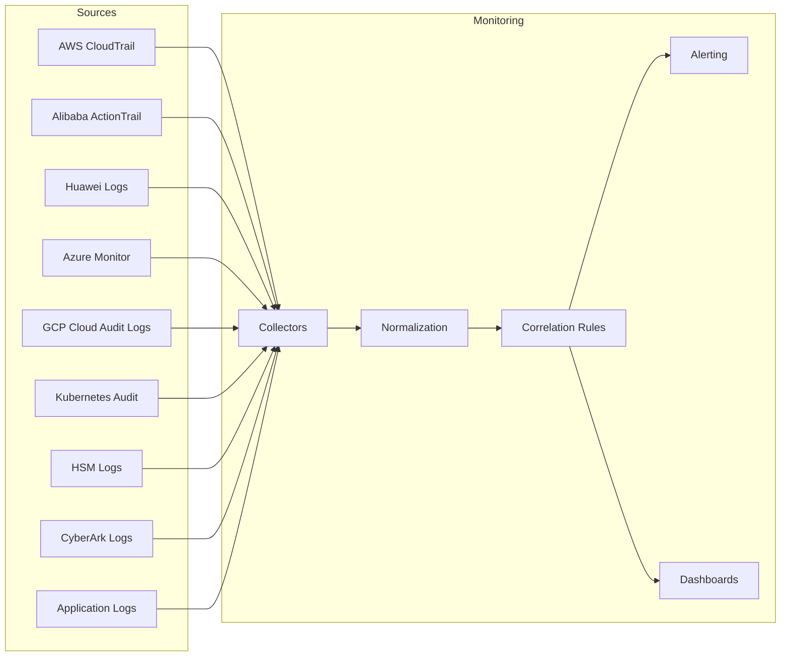

### 10.3 Detection Rules

- **CRYPTO-MON-001** — Cryptographic control-plane and key-usage events SHALL be logged and reviewed.
- **CRYPTO-MON-002** — Unusual secret-access patterns SHALL generate alerts.
- **CRYPTO-MON-003** — Deprecated or forbidden cryptographic configurations SHALL be detectable by telemetry, configuration scanning, or audit review.
- **CRYPTO-MON-004** — Certificate expiry, failed renewal, and unexpected trust-store changes SHALL be monitored.
- **CRYPTO-MON-005** — High-risk signing activity SHALL be monitored for abnormal volume, timing, or execution source.

#### Key SIEM Correlation Rules

- Detect mass `Decrypt` spikes outside approved batch roles.
- Detect CMK administrative changes outside approved change windows.
- Alert on certificates with fewer than 30 days remaining.
- Alert on forbidden algorithms negotiated in network traffic or application telemetry.
- Alert on unexpected secret access principals.
- Alert on HSM tamper and administration events.

---

## 11. IR — Incident Response and Recovery

### 11.1 Control Objective

Ensure that suspected or confirmed compromise of keys, certificates, secrets, trust anchors, or cryptographic service configurations is rapidly contained, investigated, remediated, and followed by validated recovery.

### 11.2 Compromise Indicators

Examples include:
- Unexplained sign or decrypt operations.
- Unexpected secret-retrieval volume.
- Private-key exposure in repositories, tickets, or logs.
- Unauthorised administrative changes.
- Suspicious certificate issuance.
- Loss of custody evidence for HSM-protected material.

### 11.3 Emergency Response Flow

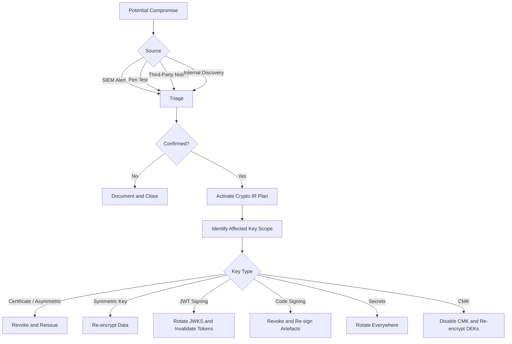

### 11.4 IR Control Statements

- **CRYPTO-IR-001** — Suspected compromise SHALL trigger immediate triage and scope identification.
- **CRYPTO-IR-002** — Affected keys, certificates, secrets, or trust relationships SHALL be disabled, revoked, or restricted as appropriate to business impact.
- **CRYPTO-IR-003** — All affected applications, signatures, ciphertext dependencies, and third-party integrations SHALL be assessed.
- **CRYPTO-IR-004** — Logs, approvals, and operational evidence SHALL be preserved for investigation.
- **CRYPTO-IR-010** — Replacement keys or certificates SHALL be issued under approved controls.
- **CRYPTO-IR-011** — Re-encryption SHALL be performed where compromise risk affects protected data.
- **CRYPTO-IR-012** — Inventory, design records, and monitoring configurations SHALL be updated after recovery.
- **CRYPTO-IR-013** — Recovery SHALL include explicit validation that trust has been re-established and old material is no longer in use.

---

## 12. STA — Supply Chain and Third-Party Assurance

### 12.1 Control Objective

Ensure that third-party products, external PKI dependencies, SaaS integrations, and open source cryptographic libraries do not weaken enterprise cryptographic control requirements.

### 12.2 Third-Party Cryptography Review

Before adopting a third-party service or product, the following SHALL be assessed:
- What cryptographic functions are performed.
- Whether keys are customer-controlled, provider-controlled, or shared-responsibility.
- Whether keys are exportable or non-exportable.
- What algorithms, key sizes, and certificate models are used.
- How logging, rotation, and revocation are handled.
- What jurisdictional or interoperability constraints apply.

### 12.3 Open Source Library Governance

- **CRYPTO-OSL-001** — Approved libraries SHALL be tracked with dependency vulnerability scanning.
- **CRYPTO-OSL-002** — Teams SHALL use approved cryptographic libraries rather than home-grown implementations.
- **CRYPTO-OSL-003** — Cryptographic library versions SHALL be pinned or otherwise controlled.
- **CRYPTO-OSL-004** — Unsupported or high-risk cryptographic libraries SHALL be removed or formally excepted.
- **CRYPTO-OSL-010** — Dependency scanning SHALL occur at pull request, build, and scheduled intervals.
- **CRYPTO-OSL-011** — High-severity vulnerabilities in cryptographic dependencies SHALL block production promotion unless formally excepted.
- **CRYPTO-OSL-012** — Teams SHALL maintain a remediation process for dependency advisories affecting cryptographic libraries.
- **CRYPTO-OSL-013** — Signing, secret retrieval, and other security-sensitive build steps SHALL run only in approved CI/CD contexts.

#### Examples of Suitable Dependency and SCA Tooling

| Tool | Primary Function | Typical Use |
| :-- | :-- | :-- |
| OWASP Dependency-Check | Dependency CVE identification | CLI, Maven, Gradle, Jenkins, GitHub Actions |
| Dependabot | Dependency alerts and update PRs | GitHub repositories |
| Snyk Open Source | Vulnerability discovery and prioritised fixes | CI/CD pipelines and developer workflows |
| Renovate / Mend | Dependency update automation | Large multi-repo environments |
| Trivy | Container, dependency, and SBOM scanning | CI and container workflows |
| Grype | Package and SBOM vulnerability scanning | CI pipelines and release review |

---

## 13. PQC and Crypto-Agility Programme

### 13.1 Rationale

The organisation MUST plan for harvest-now-decrypt-later risk. Long-lived confidential data and long-lived signature trust require asymmetric protection that can survive the arrival of cryptographically relevant quantum computers.

### 13.2 Enterprise PQC Direction

| Purpose | Current | Transition | Target |
| :-- | :-- | :-- | :-- |
| Key exchange | ECDH P-384 / X25519 | Hybrid with ML-KEM-768 | ML-KEM-768 |
| Signatures | ECDSA P-384 | Hybrid with ML-DSA-65 | ML-DSA-65 |
| Stateless signatures | Classical only where needed | Classical + SLH-DSA | SLH-DSA |
| Symmetric encryption | AES-256-GCM | No change required | AES-256-GCM |

### 13.3 Migration Roadmap

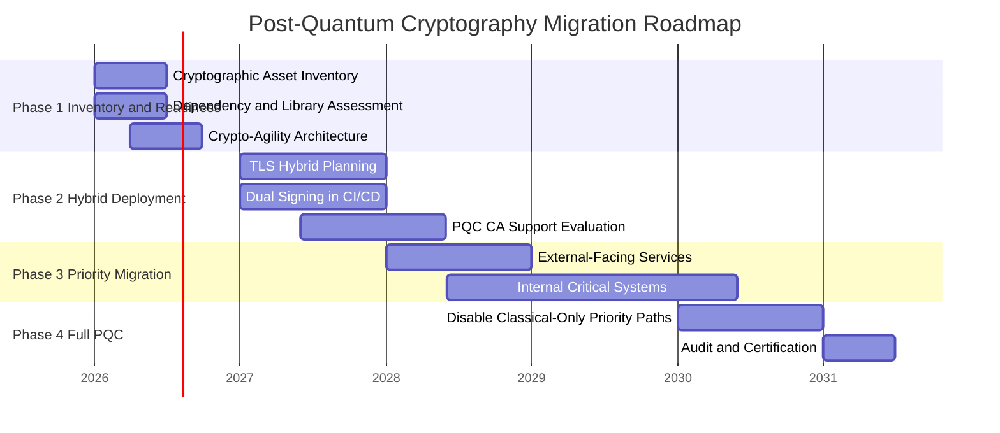

### 13.4 Crypto-Agility Requirements

Applications MUST NOT hard-code algorithm choices inside business logic. Use provider abstractions, versioned key metadata, and libraries that support planned PQC transitions.

---

## 14. Appendices

### Appendix A — Platform Integration Technical Reference

#### A.1 AWS KMS and Secrets Manager Examples

##### A.1.1 AWS Terraform CMK Example

```hcl
resource "aws_kms_key" "restricted_data" {
  description             = "CMK for Restricted data"
  enable_key_rotation     = true
  deletion_window_in_days = 30
}

resource "aws_kms_alias" "restricted_data_alias" {
  name          = "alias/prod-restricted-data"
  target_key_id = aws_kms_key.restricted_data.key_id
}
```

##### A.1.2 AWS Envelope Encryption Pattern

```python
# Pseudocode example
plaintext_dek, ciphertext_dek = kms.generate_data_key(cmk_id)
ciphertext = aes_gcm_encrypt(plaintext_dek, plaintext)
store(ciphertext, ciphertext_dek)
zeroize(plaintext_dek)
```

##### A.1.3 AWS Runtime Secret Retrieval Pattern

```python
# Pseudocode example
secret = secrets_manager.get_secret_value(secret_id)
use_secret(secret)
zeroize(secret)
```

##### A.1.4 AWS Kubernetes Secret Delivery Pattern

```yaml
apiVersion: external-secrets.io/v1beta1
kind: ExternalSecret
metadata:
  name: app-secret
  namespace: production
spec:
  refreshInterval: 1h
  secretStoreRef:
    name: aws-secrets
    kind: SecretStore
  target:
    name: app-secret
  data:
    - secretKey: password
      remoteRef:
        key: /production/app/db-password
```

#### A.2 Alibaba Cloud KMS Examples

##### A.2.1 Alibaba KMS Envelope Encryption Pattern

```python
# Pseudocode example
plaintext_dek, ciphertext_dek = kms.generate_data_key(cmk_id)
ciphertext = aes_gcm_encrypt(plaintext_dek, plaintext)
store(ciphertext, ciphertext_dek)
zeroize(plaintext_dek)
```

##### A.2.2 Alibaba Runtime Secret Retrieval Pattern

Applications SHALL retrieve secrets at runtime through approved managed secret or enterprise vault integration and SHALL NOT embed secrets in source code, images, or plaintext configuration.

#### A.3 Huawei Private Cloud DEW and Dedicated HSM Examples

##### A.3.1 Huawei DEW Envelope Encryption Pattern

```python
# Pseudocode example
plaintext_dek, ciphertext_dek = dew.create_data_key(cmk_id)
ciphertext = aes_gcm_encrypt(plaintext_dek, plaintext)
store(ciphertext, ciphertext_dek)
zeroize(plaintext_dek)
```

##### A.3.2 Huawei Private-Cloud Runtime Secret Pattern

CCE and VM workloads SHALL retrieve secrets through approved runtime identity and vault or KMS integration patterns rather than static secret distribution.

#### A.4 On-Premises HSM and Private-Cloud Trust Services Examples

##### A.4.1 HSM Signing Example

```python
# Pseudocode example
digest = sha384(data)
signature = hsm.sign(key_label="prod-code-signing", digest=digest)
```

##### A.4.2 Private-Cloud Database Encryption Pattern

On-premises or private-cloud database encryption SHOULD use TDE or application-layer AES-256-GCM with an HSM-backed KEK / CMK aligned to the platform trust model.

##### A.4.3 VM Machine Identity Secret Retrieval Pattern

VM workloads SHALL authenticate with approved machine identity or mTLS and retrieve required secrets only at runtime from CyberArk or approved private-cloud vault services.

#### A.5 CyberArk and Kubernetes Secret Delivery Examples

##### A.5.1 ESO Conjur Delivery Example

```yaml
apiVersion: external-secrets.io/v1beta1
kind: ExternalSecret
metadata:
  name: app-secret
  namespace: production
spec:
  refreshInterval: 1h
  secretStoreRef:
    name: conjur-store
    kind: SecretStore
  target:
    name: app-secret
  data:
    - secretKey: password
      remoteRef:
        key: production/app/db-password
```

##### A.5.2 Kubernetes Runtime Secret Delivery Note

Secrets delivered to Kubernetes SHALL originate from an approved upstream vault or KMS-backed service and SHALL be rotated through the source system rather than by manual editing of cluster-local plaintext values.

#### A.6 Azure Key Vault and Entra ID Examples

##### A.6.1 Azure Signing Pattern

```python
# Pseudocode example
digest = sha384(data)
signature = key_vault.sign(key_name="jwt-signing", algorithm="ES384", digest=digest)
```

##### A.6.2 Azure Managed Identity Secret Retrieval Concept

Azure workloads SHALL use managed identity or approved federation for runtime secret retrieval and signing operations.

#### A.7 GCP Cloud KMS and CMEK Examples

##### A.7.1 Bucket with CMEK

```hcl
resource "google_storage_bucket" "analytics" {
  name     = "example-analytics-prod"
  location = "ASIA-EAST2"

  encryption {
    default_kms_key_name = google_kms_crypto_key.analytics_cmek.id
  }
}
```

##### A.7.2 BigQuery Dataset with CMEK

```hcl
resource "google_bigquery_dataset" "restricted" {
  dataset_id = "restricted_dataset"
  location   = "asia-east2"

  default_encryption_configuration {
    kms_key_name = google_kms_crypto_key.analytics_cmek.id
  }
}
```

### Appendix B — Cryptographic Design Record Template

| Field | Value |
| :-- | :-- |
| Function name / description |  |
| System / microservice |  |
| Repository and module path |  |
| Data classification |  |
| Cryptographic function type |  |
| Selected algorithm |  |
| Key length / parameters |  |
| Justification |  |
| Key generation method |  |
| Key storage location |  |
| Rotation schedule |  |
| External dependencies |  |
| Library and version |  |
| Error handling |  |
| Logging check: no key material logged |  |
| Developer sign-off |  |
| Security Architect sign-off |  |

### Appendix C — Key Inventory Registry Template

| Field | Description |
| :-- | :-- |
| Key ID | Unique identifier |
| Key Name / Alias | Human-readable name |
| Key Type | Symmetric / Asymmetric / HMAC / Secret / Certificate |
| Algorithm | Algorithm used |
| Key Length | Bits / curve |
| Purpose | Protected function |
| Data Classification | Classification level |
| Owning System | System name |
| System Owner | Owner role |
| Key Custodian | Responsible role |
| Storage Location | ARN / URI / path / vault location |
| Creation Date | Date created |
| Activation Date | Date activated |
| Rotation Due | Next rotation date |
| Last Rotation Date | Previous rotation date |
| Lifecycle State | Current state |
| PQC Migration Priority | Critical / High / Medium / Low |
| Exception Reference | Exception ID if any |

### Appendix D — Compliance Checklist

- [ ] Design record completed.
- [ ] Approved algorithm baseline selected.
- [ ] Forbidden algorithms not used.
- [ ] Runtime secret retrieval pattern approved.
- [ ] Logging and SIEM forwarding defined.
- [ ] Incident response dependencies documented.
- [ ] Inventory entry created.
- [ ] Exceptions formally approved where applicable.

### Appendix E — Approved Algorithm Quick Reference Card

| Purpose | Algorithm |
| :-- | :-- |
| Data encryption | AES-256-GCM |
| Alternative symmetric | ChaCha20-Poly1305 |
| Key exchange | ECDHE P-384 / X25519 |
| Signatures | ECDSA P-384 / Ed25519 |
| Hash | SHA-256 / SHA-384 / SHA-3 |
| HMAC | HMAC-SHA256 |
| Password storage | Argon2id |

### Appendix F — Requirement Traceability Matrix

| Requirement ID | Domain | Control Summary | Primary Section | Evidence Example |
| :-- | :-- | :-- | :-- | :-- |
| CRYPTO-GOV-001 | GRC | Design record required before production deployment | 4 | Approved Appendix B record |
| CRYPTO-ALG-001 | CEK | Forbidden algorithms not permitted | 5 | Config review or scan evidence |
| CRYPTO-KM-002 | CEK | HSM-backed protection required for root CA and high-assurance keys | 5 | HSM evidence |
| CRYPTO-IAM-010 | IAM | Workloads use managed identity, federation, mTLS, or equivalent | 6 | Runtime auth configuration |
| CRYPTO-DSP-010 | DSP | TLS 1.3 required for new endpoints unless excepted | 7 | TLS configuration review |
| CRYPTO-AWS-001 | TVM | AWS Confidential or Restricted workloads use customer-managed keys where supported | 8.4 | KMS configuration evidence |
| CRYPTO-ALI-001 | TVM | Alibaba workloads use enterprise-selected encryption controls where supported | 8.5 | KMS evidence |
| CRYPTO-HPC-006 | TVM | Huawei Dedicated HSM protection used where high assurance or regulated use requires it | 8.6 | Dedicated HSM evidence |
| CRYPTO-AZR-003 | TVM | Azure workloads use managed identity or federation | 8.7 | Managed identity evidence |
| CRYPTO-GCP-003 | TVM | GCP workloads use Workload Identity or equivalent federation | 8.8 | Workload Identity evidence |
| CRYPTO-MON-001 | LOG | Cryptographic events logged and reviewed | 10 | SIEM forwarding evidence |
| CRYPTO-IR-001 | IR | Suspected compromise triggers triage and scope identification | 11 | Incident record |
| CRYPTO-OSL-001 | STA | Approved libraries tracked with vulnerability scanning | 12 | SCA report |

### Appendix G — Operational Checklists

#### G.1 New Implementation Checklist
- [ ] Business purpose documented.
- [ ] Cryptographic function identified.
- [ ] Approved algorithm selected.
- [ ] Key generation and custody model approved.
- [ ] Runtime secret retrieval approved.
- [ ] Monitoring defined.
- [ ] Incident-response path defined.
- [ ] Inventory created.

#### G.2 Rotation Readiness Checklist
- [ ] Rotation due date current.
- [ ] Dependencies identified.
- [ ] Overlap window defined.
- [ ] Rollback plan exists.
- [ ] Monitoring will detect failure.
- [ ] Evidence retained.

#### G.3 Key Compromise Checklist
- [ ] Scope affected keys and secrets.
- [ ] Disable, revoke, or restrict immediately.
- [ ] Preserve evidence.
- [ ] Assess impact to ciphertext, signatures, tokens, and third parties.
- [ ] Reissue or replace material.
- [ ] Re-encrypt where required.
- [ ] Update inventory and monitoring.
- [ ] Complete post-incident review.

### Appendix H — Cross-Standard Algorithm Comparison

| Use Case | Enterprise Baseline | NIST-Aligned Direction | China / ShangMi Option | Europe / General Guidance Note |
| :-- | :-- | :-- | :-- | :-- |
| Bulk encryption | AES-256-GCM | AES-GCM widely aligned | SM4-GCM / SM4-CCM where required | AEAD preferred |
| Key exchange | ECDHE P-384 or X25519 | ECDH now, ML-KEM for transition planning | SM2 key exchange where required | Strong curves and modern TLS profiles preferred |
| Digital signatures | ECDSA P-384, Ed25519 where supported | ECDSA now, ML-DSA transition planning | SM2 + SM3 where required | Strong signature schemes and larger key strengths preferred |
| Hashing | SHA-256 minimum, SHA-384 preferred | SHA-2 / SHA-3 family | SM3 where required | SHA-2 family widely accepted |
| Message authentication | HMAC-SHA256 / SHA384 | HMAC-SHA2 family | HMAC-SM3 where required | Strong MACs preferred |
| Password storage | Argon2id | Memory-hard password hashing best practice | No separate enterprise baseline | Strong adaptive password storage required |
| TLS server auth | ECDSA P-384 certificates, TLS 1.3 | Strong modern PKI and TLS | SM2 certificates for ShangMi TLS | Modern TLS and strong certificate profiles preferred |
| PQC planning | Crypto-agile now; hybrid migration later | ML-KEM / ML-DSA / SLH-DSA direction | No separate enterprise China PQC baseline adopted | Crypto-agility and transition planning important |

### Appendix I — Control Clustering Crosswalk

| Guideline Domain | NIST CSF 2.0 | NIST SP 800-53 Families | Notes |
| :-- | :-- | :-- | :-- |
| GRC | Govern | PL, PM, RA, CA | Governance, oversight, exceptions, planning |
| CEK | Protect / Identify | SC, CM, MP | Algorithms, lifecycle, inventory, custody |
| IAM | Protect | AC, IA | Identity, authentication, access control |
| DSP | Protect | SC, SI | Data-at-rest, transit, integrity, certificates |
| TVM | Protect | SC, CM, SA | Platform implementation and repeatable architecture patterns |
| LOG | Detect | AU, SI | Monitoring, audit, anomaly detection |
| IR | Respond / Recover | IR, CP | Incident handling and restoration |
| STA | Govern / Identify | SR, SA, CA | Suppliers, services, library, trust assurance |

### Appendix J — CSA CCM Crosswalk

CSA CCM is structured into 17 domains and is intended to support systematic assessment of cloud implementations, clarify which actor in the cloud supply chain should implement controls, and improve alignment across standards and regulations.

| Guideline Domain | CSA CCM Domain(s) | Why It Matters for Cryptography |
| :-- | :-- | :-- |
| GRC | GRC | Policy, legal and contractual alignment, risk acceptance, and governance for encryption and key decisions |
| CEK | CEK | Encryption policy, algorithms, key lifecycle, key inventory, compromise, recovery, and customer key management capability |
| IAM | IAM | Administrative and workload access to KMS, vault, CA, and secrets systems |
| DSP | DSP | Data classification, lifecycle controls, encryption expectations, and privacy-linked protection requirements |
| TVM | IVS, CCC, TVM | Infrastructure security, segmentation, secure configuration, cloud-native deployment hardening, and vulnerability reduction |
| LOG | LOG | Cryptographic event monitoring, auditability, evidence retention, and anomaly review |
| IR | SEF, BCR | Security incident management, cloud forensics, business continuity, and trust restoration |
| STA | STA, A&A, IPY | External service assurance, portability, assessment transparency, and supply-chain trust |

#### CSA CEK Areas Most Relevant to This Guideline

The CSA CEK domain includes policy and procedures, roles and responsibilities, data encryption, encryption algorithms, encryption change management, encryption risk management, customer key management capability, encryption audit, and key lifecycle activities including generation, rotation, revocation, destruction, activation, suspension, deactivation, archival, compromise, recovery, and inventory management.

### Appendix K — SaaS PaaS IaaS Shared-Responsibility Overlay

This overlay is intended to help apply the same cryptographic policy logic to cloud providers and cloud services, while recognizing that the enterprise cannot control every layer equally across service models.

| Requirement Theme | SaaS Application | PaaS Application | IaaS Application |
| :-- | :-- | :-- | :-- |
| Verify provider encryption at rest and in transit | Strongly applicable | Strongly applicable | Strongly applicable |
| Require customer-managed keys where available | Applicable where supported | Strongly applicable | Strongly applicable |
| Enforce guest OS hardening | Usually not applicable to customer | Partially applicable | Strongly applicable |
| Enforce workload identity and secret retrieval pattern | Limited to integrations and APIs | Strongly applicable | Strongly applicable |
| Enforce provider control-plane logging and evidence review | Shared | Shared | Shared |
| Enforce app-layer signing and token controls | Usually customer-owned for integrations | Customer-owned | Customer-owned |
| Assess incident response obligations and evidence rights | Strongly applicable | Strongly applicable | Strongly applicable |
| Assess exit, portability, and key-destruction obligations | Strongly applicable | Strongly applicable | Strongly applicable |

#### Provider-Oriented Future Use

When this guideline is applied to SaaS, PaaS, or IaaS providers, teams should classify each requirement as one of the following:
- **Customer enforced** — fully under enterprise control.
- **Provider dependent** — requires a provider capability, attestation, or contractual commitment.
- **Shared** — requires both provider capability and customer configuration.
- **Not applicable** — clearly outside the customer control boundary for that service model.

The enterprise objective should be to secure what it can directly control, verify what the provider controls, and contract for evidence where technical control is not directly possible.

---

### Appendix L — Cap. 653 Control Overlay for Financial Services Critical Infrastructure

This appendix maps the Ordinance into enterprise control language for a financial services critical infrastructure operator.

| Cap. 653 Theme | Enterprise Implementation Expectation |
| :-- | :-- |
| Office in Hong Kong and operator accountability | Maintain a named legal and operational point of contact for regulator engagement and evidence production |
| Security management unit | Establish a formal cyber and cryptographic governance function with named leadership and documented responsibilities |
| Material change notification | Treat architecture, hosting, KMS, identity, and major dependency changes affecting critical services as governed events |
| Security management plan | Maintain an approved management plan covering asset identification, security controls, risk treatment, logging, response, and recovery |
| Annual risk assessment | Perform at least annual risk assessment for CCS and equivalent critical systems |
| Biennial security audit | Arrange independent assurance testing and retain evidence |
| Incident reporting and response | Maintain regulator-ready incident playbooks, contact paths, and evidence handling |
| CCS identification | Identify critical computer systems based on core function, interdependency, and resilience impact |

#### Cap. 653 Implementation Principle

Where this guideline applies enterprise-wide, systems that support the core delivery, protection, recovery, or trust boundary of regulated financial services should be treated conservatively. If compromise of a system could materially disrupt regulated services or the security of a critical computer system, the safer default is to classify it into a stricter tier and apply stronger controls.

---

### Appendix M — Policy to Control Traceability Matrix

| Policy ID | High-Level Requirement Summary | Primary Domain(s) | NIST CSF 2.0 | CSA CCM | Lower-Level Control Sources | Evidence / Owner Example |
| :-- | :-- | :-- | :-- | :-- | :-- | :-- |
| POLICY-CI-001 | Enterprise-approved controls with stricter critical-system protection | GRC, TVM | Govern, Protect | GRC, IVS, CCC, TVM | NIST SP 800-53 PL/RA/SC/CM; enterprise architecture review | Tiering record, design approval, system owner |
| POLICY-CI-002 | Identify Critical Systems and CCS | GRC, TVM | Identify, Govern | GRC, IVS | Cap. 653 scoping process; asset inventory process | Criticality register, architecture board |
| POLICY-CI-003 | Security management capability including cryptographic governance | GRC, CEK | Govern | GRC, CEK | NIST SP 800-53 PM/PL/RA; enterprise governance process | Management unit charter, governance committee |
| POLICY-CI-004 | Management plan includes crypto, identity, logging, IR, recovery | GRC, CEK, IAM, LOG, IR | Govern, Protect, Detect, Respond, Recover | GRC, CEK, IAM, LOG, SEF, BCR | NIST SP 800-57; NIST SP 800-53 IR/CP/AU/SC; OWASP operational guidance | Management plan, runbooks, evidence owners |
| POLICY-CI-005 | Risk assessment, audit, drill, incident readiness | GRC, LOG, IR | Govern, Detect, Respond, Recover | GRC, LOG, SEF, BCR | NIST SP 800-53 RA/CA/AU/IR/CP | Risk report, audit report, drill evidence |
| POLICY-CI-006 | Govern material changes affecting critical trust boundaries | GRC, TVM | Govern | GRC, TVM | Change-management and architecture review control set | Change record, security sign-off |
| POLICY-CI-007 | Cryptography supports resilience and recoverability | CEK, IR, TVM | Protect, Recover | CEK, BCR | NIST SP 800-57 lifecycle; NIST SP 800-53 CP/SC | Backup and recovery evidence |
| POLICY-SFC-001 | Strong encryption in transit for sensitive trading and access channels | DSP, CEK, TVM | Protect | DSP, CEK, TVM | TLS/mTLS standards, certificate policy, network encryption patterns | TLS configs, gateway evidence |
| POLICY-SFC-002 | 2FA / MFA for regulated access | IAM | Protect | IAM | NIST SP 800-53 IA/AC; enterprise IAM standards | MFA settings, access review |
| POLICY-SFC-003 | Strong protection for stored passwords and authentication secrets | DSP, CEK | Protect | DSP, CEK | OWASP password storage guidance; approved algorithm catalogue | Application review, credential test evidence |
| POLICY-SFC-004 | Monitoring and surveillance for unauthorised access | LOG, IAM | Detect | LOG, IAM | NIST SP 800-53 AU/SI/AC; detection engineering patterns | SIEM rules, SOC evidence |
| POLICY-SFC-005 | Security-significant notification capability | LOG, IR, TVM | Detect, Respond | LOG, SEF | Incident and notification procedures | Notification workflow evidence |
| POLICY-SFC-006 | Integrity, availability, and auditability of regulated services | DSP, LOG, IR, TVM | Protect, Detect, Recover | DSP, LOG, BCR, TVM | NIST SP 800-53 SC/SI/AU/CP/IR | Service assurance evidence |

---

## 15. References

| Ref ID | Source | Link |
| :-- | :-- | :-- |
| R1 | NIST SP 800-53 Rev. 5 | https://csrc.nist.gov/pubs/sp/800/53/r5/upd1/final |
| R2 | NIST CSF 2.0 | https://nvlpubs.nist.gov/nistpubs/CSWP/NIST.CSWP.29.pdf |
| R3 | NIST SP 800-57 Part 1 Rev. 5 | https://csrc.nist.gov/pubs/sp/800/57/pt1/r5/final |
| R4 | NIST SP 800-175B Rev. 1 | https://csrc.nist.gov/pubs/sp/800/175/b/r1/final |
| R5 | FIPS 203 | https://csrc.nist.gov/pubs/fips/203/final |
| R6 | FIPS 204 | https://csrc.nist.gov/pubs/fips/204/final |
| R7 | FIPS 205 | https://csrc.nist.gov/pubs/fips/205/final |
| R8 | ISO/IEC 27001 | https://www.iso.org/standard/27001 |
| R9 | ISO/IEC 19790 | https://www.iso.org/standard/52906.html |
| R10 | BSI TR-02102 | https://www.bsi.bund.de/EN/Themen/Oeffentliche-Verwaltung/Mindeststandards/Architektur/BSI-TR-02102/bsitr-02102_node.html |
| R11 | OWASP Cryptographic Storage Cheat Sheet | https://cheatsheetseries.owasp.org/cheatsheets/Cryptographic_Storage_Cheat_Sheet.html |
| R12 | AWS KMS Documentation | https://docs.aws.amazon.com/kms/ |
| R13 | AWS Secrets Manager Documentation | https://docs.aws.amazon.com/secretsmanager/ |
| R14 | Alibaba Cloud KMS Documentation | https://www.alibabacloud.com/help/en/kms/ |
| R15 | Huawei Cloud DEW Documentation | https://support.huaweicloud.com/intl/en-us/dew/ |
| R16 | Microsoft Azure Key Vault Documentation | https://learn.microsoft.com/azure/key-vault/ |
| R17 | Microsoft Entra Documentation | https://learn.microsoft.com/entra/ |
| R18 | Google Cloud KMS Documentation | https://cloud.google.com/kms/docs |
| R19 | Google Secret Manager Documentation | https://cloud.google.com/secret-manager/docs |
| R20 | Google Kubernetes Engine Workload Identity | https://cloud.google.com/kubernetes-engine/docs/how-to/workload-identity |
| R21 | CyberArk Documentation | https://docs.cyberark.com/ |
| R22 | External Secrets Operator Documentation | https://external-secrets.io/latest/ |
| R23 | RFC 8998 — ShangMi Cipher Suites for TLS 1.3 | https://www.rfc-editor.org/rfc/rfc8998 |
| R29 | SFC Cybersecurity FAQ for Internet Trading | https://www.sfc.hk/en/faqs/intermediaries/supervision/Cybersecurity/Cybersecurity |
| R30 | SFC Internet Trading Hacking Risks summary (Charltons) | https://www.charltonslaw.com/legal/newsletters/387/new-sfc-guidelines-on-internet-trading-hacking-risks.pdf |
| R31 | KPMG summary of SFC internet trading cybersecurity controls | https://assets.kpmg.com/content/dam/kpmg/cn/pdf/en/2017/11/sfc-strengthens-internet-trading-regulatory-controls.pdf |
| R24 | CSA Cloud Controls Matrix (CCM) | https://cloudsecurityalliance.org/research/cloud-controls-matrix |
| R25 | CSA Implementing CCM: Cryptography, Encryption, and Key Management | https://cloudsecurityalliance.org/blog/2025/03/10/implementing-ccm-cryptography-encryption-and-key-management |
| R26 | Hong Kong e-Legislation Cap. 653 | https://www.elegislation.gov.hk/hk/cap653 |
| R27 | Hong Kong e-Legislation Cap. 653 Schedule 1 | https://www.elegislation.gov.hk/hk/cap653!en/sch1?_lang=en |
| R28 | Communications Authority summary of PCICSO | https://www.coms-auth.hk/en/policies_regulations/other/pcicso/index.html |

