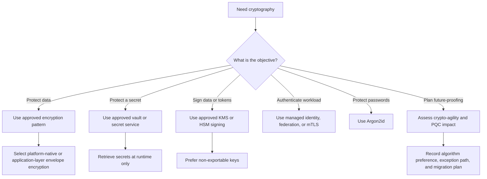

# Enterprise Cryptographic Implementation Guide

**Classification:** Internal — Restricted  
**Version:** 1.2  
**Date:** March 2026  
**Owner:** Information Security Architecture  
**Supports:** [Enterprise Cryptographic Policy](1-Enterprise-Cryptographic-Policy-v1_2.md), [Enterprise Cryptographic Standard](2-Enterprise-Cryptographic-Standard-v1_2.md)

---

## Table of Contents

- [1. Purpose](#1-purpose)
- [2. How to use this guide](#2-how-to-use-this-guide)
- [3. Engineering decision flow](#3-engineering-decision-flow)
- [4. Platform patterns](#4-platform-patterns)
- [5. Common implementation requirements](#5-common-implementation-requirements)
- [6. Quantum-safe and crypto-agility implementation](#6-quantum-safe-and-crypto-agility-implementation)
- [7. Delivery and operational patterns](#7-delivery-and-operational-patterns)
- [8. References](#8-references)

---

## 1. Purpose

This document provides the enterprise **implementation** guidance for cryptographic and secret-management controls.

Use this guide together with:
- [Enterprise Cryptographic Policy](1-Enterprise-Cryptographic-Policy-v1_2.md)
- [Enterprise Cryptographic Standard](2-Enterprise-Cryptographic-Standard-v1_2.md)

## 2. How to use this guide

1. Start with the [Enterprise Cryptographic Policy](1-Enterprise-Cryptographic-Policy-v1_2.md) to identify the governing requirement.
2. Confirm the mandatory lower-level requirement in the [Enterprise Cryptographic Standard](2-Enterprise-Cryptographic-Standard-v1_2.md).
3. Use this guide to choose the correct platform pattern and engineering approach.
4. Record the design, inventory, evidence, ownership, exception status, and PQC impact for production use.

## 3. Engineering decision flow

## 4. Platform patterns

### 4.1 On-premises HSM and private cloud

Use on-premises HSM or equivalent private-cloud trust services where direct custody of root material, regulated signing keys, or trust anchors is required.

- Use dual control and split knowledge for high-assurance administration.
- Keep root CA and high-value signing keys non-exportable.
- Export logs to central monitoring.

### 4.2 CyberArk and enterprise vault patterns

Use CyberArk or approved enterprise vault services for privileged secrets, application secrets, and selected cryptographic key-adjacent materials.

- Retrieve secrets at runtime.
- Do not embed secrets in code, images, or plaintext configuration.
- Treat the upstream vault as the source of record.

### 4.3 AWS pattern

- Use AWS KMS for CMKs, envelope encryption, and asymmetric signing where supported.
- Use AWS Secrets Manager or approved enterprise vault integration for runtime secret retrieval.
- Use stronger custody patterns for crown-jewel use cases.

### 4.4 Alibaba Cloud pattern

- Use Alibaba Cloud KMS for envelope encryption and CMK lifecycle control.
- Use approved managed secret workflows for runtime access.
- Separate keys by environment and data classification.

### 4.5 Huawei private cloud pattern

- Use DEW / KMS and Dedicated HSM capabilities for enterprise-controlled encryption and private-cloud storage protection.
- Document custody boundaries, operational roles, and recovery procedures.
- Forward audit events to enterprise monitoring.

### 4.6 Azure pattern

- Use Azure Key Vault for keys, secrets, and certificates.
- Use Entra-managed identity or equivalent federation for runtime access.
- Prefer non-exportable keys for signing and sensitive trust functions.

### 4.7 GCP pattern

- Use Cloud KMS and Cloud HSM-backed protection where sensitivity requires it.
- Use Secret Manager for runtime secret retrieval.
- Use Workload Identity rather than long-lived service account keys.

## 5. Common implementation requirements

### 5.1 Encryption and TLS

- Use TLS 1.3 by default for new services.
- Use approved certificates and trust stores.
- Protect internet and private extranet channels carrying sensitive data.
- Add application-layer encryption where storage-native controls do not meet the trust model.
- Treat RSA-2048 certificates as an approved exception case only, not the preferred baseline for new services.

### 5.2 Passwords and authentication

- Use Argon2id for password storage.
- Use 2FA or stronger MFA for regulated and privileged access.
- Do not use dual-password models as a substitute for MFA.

### 5.3 Secrets and keys

- Use envelope encryption for application-managed protected data.
- Use runtime secret retrieval only.
- Zeroize plaintext key or secret material after use where technically feasible.
- Link keys, certificates, managed secrets, and material cryptographic settings to inventory and ownership.

### 5.4 Signing and certificates

- Use centrally managed signing keys.
- Keep high-value signing keys non-exportable where supported.
- Manage JWKS rotation and certificate renewal through controlled workflows.
- Record current and target certificate profiles where RSA-based profiles remain in use by exception.

## 6. Quantum-safe and crypto-agility implementation

### 6.1 Engineering principles

- Do not hard-code asymmetric algorithm choices into business logic.
- Preserve algorithm identifiers, versioning, key metadata, and preference order in interfaces and stored records.
- Prefer cryptographic libraries and services that allow algorithm substitution or parallel algorithm support.
- Record whether a service protects long-lived confidential data or requires long-lived signature validation.

### 6.2 Practical transition approach

| Phase | Implementation focus |
| :-- | :-- |
| Phase 1 | Inventory keys, certificates, signing flows, trust dependencies, cipher settings, negotiated protocols, and long-lived encrypted data |
| Phase 2 | Add crypto-agility to service interfaces, metadata, and libraries |
| Phase 3 | Classify each major cryptographic usage as preferred baseline, permitted by exception, deprecated, or forbidden |
| Phase 4 | Prioritise hybrid planning for key exchange, signatures, and externally validated artefacts |
| Phase 5 | Introduce ML-KEM-768 and ML-DSA-65 in approved transition pilots where ecosystem support exists |
| Phase 6 | Retire deprecated classical-only designs according to approved migration plans |

### 6.3 Algorithm retirement guidance

| Category | Implementation action |
| :-- | :-- |
| Forbidden | Remove immediately from production use |
| Deprecated | Create remediation plan, tracking owner, and target retirement date |
| Permitted by exception | Maintain documented justification, inventory visibility, and review expiry |
| Preferred baseline | Use by default in new or materially changed systems |

### 6.4 Inventory guidance for future change

The implementation inventory should support future settings changes and large-scale remediation campaigns.

| Inventory field | Why it matters |
| :-- | :-- |
| Service / application | Defines change scope |
| Business tier | Prioritises CCS and Critical Systems first |
| Environment | Separates production from non-production |
| Protocol version | Identifies legacy protocol exposure |
| Certificate profile | Identifies RSA or ECDSA certificate dependencies |
| Key type and size | Identifies upgrade target and exception status |
| Cipher suites or crypto settings | Supports direct settings change work |
| Counterparty / client dependency | Identifies interoperability constraints |
| Exception status | Shows what can stay temporarily and why |
| Target configuration | Defines future desired state |

## 7. Delivery and operational patterns

### 7.1 CI/CD and signing

- Sign production artefacts and container images.
- Do not store private signing keys on developer laptops.
- Use approved KMS or HSM-backed signing in build pipelines.

### 7.2 Logging and monitoring

- Log create, decrypt, sign, secret-read, disable, policy-change, and administrative events.
- Alert on suspicious access or usage anomalies.
- Ensure Critical Systems and CCS have stronger monitoring and evidence retention.
- Detect forbidden or deprecated algorithm use where telemetry, scanning, or configuration review can support it.

### 7.3 Incident response and recovery

- Prepare runbooks for key compromise, certificate compromise, secret exposure, and trust restoration.
- Revoke, rotate, reissue, or re-encrypt as needed.
- Validate dependency updates and trusted recovery before closure.

## 8. References

| Ref ID | Reference | Link |
| :-- | :-- | :-- |
| I-R1 | Enterprise Cryptographic Policy | [1-Enterprise-Cryptographic-Policy-v1_2.md](1-Enterprise-Cryptographic-Policy-v1_2.md) |
| I-R2 | Enterprise Cryptographic Standard | [2-Enterprise-Cryptographic-Standard-v1_2.md](2-Enterprise-Cryptographic-Standard-v1_2.md) |
| I-R3 | OWASP Cryptographic Storage Cheat Sheet | [https://cheatsheetseries.owasp.org/cheatsheets/Cryptographic_Storage_Cheat_Sheet.html](https://cheatsheetseries.owasp.org/cheatsheets/Cryptographic_Storage_Cheat_Sheet.html) |
| I-R4 | Google Cloud KMS Documentation | [https://cloud.google.com/kms/docs](https://cloud.google.com/kms/docs) |
| I-R5 | AWS KMS Documentation | [https://docs.aws.amazon.com/kms/](https://docs.aws.amazon.com/kms/) |
| I-R6 | Azure Key Vault Documentation | [https://learn.microsoft.com/azure/key-vault/](https://learn.microsoft.com/azure/key-vault/) |
| I-R7 | Huawei Cloud DEW Documentation | [https://support.huaweicloud.com/intl/en-us/dew/](https://support.huaweicloud.com/intl/en-us/dew/) |
| I-R8 | Alibaba Cloud KMS Documentation | [https://www.alibabacloud.com/help/en/kms/](https://www.alibabacloud.com/help/en/kms/) |
| I-R9 | External Secrets Operator Documentation | [https://external-secrets.io/latest/](https://external-secrets.io/latest/) |
| I-R10 | CyberArk Documentation | [https://docs.cyberark.com/](https://docs.cyberark.com/) |
| I-R11 | FIPS 203 | [https://csrc.nist.gov/pubs/fips/203/final](https://csrc.nist.gov/pubs/fips/203/final) |
| I-R12 | FIPS 204 | [https://csrc.nist.gov/pubs/fips/204/final](https://csrc.nist.gov/pubs/fips/204/final) |
| I-R13 | FIPS 205 | [https://csrc.nist.gov/pubs/fips/205/final](https://csrc.nist.gov/pubs/fips/205/final) |
| I-R14 | Enterprise Cryptography and Key/Secret Management Document Plan | [4-Enterprise-Cryptography-and-Key-Secret-Management-Document-Plan-v1_0.md](4-Enterprise-Cryptography-and-Key-Secret-Management-Document-Plan-v1_0.md) |
