# Enterprise Cryptographic Management Guideline

**Classification:** Internal — Restricted  
**Version:** 1.0 (DRAFT)  
**Date:** March 2026  
**Owner:** Information Security Architecture  
**Review Cycle:** Annual, or upon regulatory change, platform adoption, or key compromise event  
**Status:** DRAFT — Pending Security Architect Review

---

## Table of Contents

- [1. Introduction & Purpose](#1-introduction--purpose)
  - [1.1 Document Purpose](#11-document-purpose)
  - [1.2 Applicability & Scope](#12-applicability--scope)
  - [1.3 Maintenance & Review Cycle](#13-maintenance--review-cycle)
- [2. Regulatory & Standards Framework](#2-regulatory--standards-framework)
  - [2.1 Governing Regulatory Hierarchy](#21-governing-regulatory-hierarchy)
  - [2.2 HK CoP Cryptographic Requirements Mapping](#22-hk-cop-cryptographic-requirements-mapping)
  - [2.3 Compliance Calendar](#23-compliance-calendar)
- [3. Cryptographic Taxonomy & Definitions](#3-cryptographic-taxonomy--definitions)
  - [3.1 Terminology Glossary](#31-terminology-glossary)
  - [3.2 Cryptographic Function Types](#32-cryptographic-function-types)
  - [3.3 Forbidden & Deprecated Algorithm List](#33-forbidden--deprecated-algorithm-list)
- [4. Key Management Lifecycle](#4-key-management-lifecycle)
  - [4.1 Key Generation](#41-key-generation)
  - [4.2 Key Storage & Protection](#42-key-storage--protection)
  - [4.3 Key Distribution & Wrapping](#43-key-distribution--wrapping)
  - [4.4 Key Usage Controls](#44-key-usage-controls)
  - [4.5 Key Rotation](#45-key-rotation)
  - [4.6 Key Backup & Recovery](#46-key-backup--recovery)
  - [4.7 Key Revocation & Suspension](#47-key-revocation--suspension)
  - [4.8 Key Archival & Destruction](#48-key-archival--destruction)
- [5. Algorithm Approval Policy & Cipher Suite Standards](#5-algorithm-approval-policy--cipher-suite-standards)
  - [5.1 Approved TLS Cipher Suites](#51-approved-tls-cipher-suites)
  - [5.2 SSH Configuration Standards](#52-ssh-configuration-standards)
  - [5.3 Data-at-Rest Encryption Standards](#53-data-at-rest-encryption-standards)
  - [5.4 Code Signing & Container Image Signing](#54-code-signing--container-image-signing)
  - [5.5 Certificate Authority Policy](#55-certificate-authority-policy)
- [6. Quantum-Safe Migration Programme](#6-quantum-safe-migration-programme)
  - [6.1 Threat Timeline & Business Rationale](#61-threat-timeline--business-rationale)
  - [6.2 PQC Algorithm Adoption](#62-pqc-algorithm-adoption)
  - [6.3 Migration Phases](#63-migration-phases)
  - [6.4 Crypto-Agility Implementation Guidelines](#64-crypto-agility-implementation-guidelines)
- [7. Cryptographic Architecture — Technology Stack](#7-cryptographic-architecture--technology-stack)
  - [7.1 On-Premises HSM](#71-on-premises-hsm)
  - [7.2 CyberArk Vault & Conjur](#72-cyberark-vault--conjur)
  - [7.3 AWS KMS & Secrets Manager](#73-aws-kms--secrets-manager)
  - [7.4 Alibaba Cloud KMS](#74-alibaba-cloud-kms)
  - [7.5 Huawei Private Cloud — DEW & KMS](#75-huawei-private-cloud--dew--kms)
  - [7.6 Azure Key Vault & Entra ID](#76-azure-key-vault--entra-id)
  - [7.7 GCP Cloud KMS (Future State)](#77-gcp-cloud-kms-future-state)
- [8. Developer Implementation Guide](#8-developer-implementation-guide)
  - [8.1 How to Use This Guide](#81-how-to-use-this-guide)
  - [8.2 Cryptographic Function Design Template](#82-cryptographic-function-design-template)
  - [8.3 Secrets Management for Applications](#83-secrets-management-for-applications)
  - [8.4 TLS/mTLS Implementation Patterns](#84-tlsmtls-implementation-patterns)
  - [8.5 JWT & Token Signing](#85-jwt--token-signing)
  - [8.6 Database & Storage Encryption](#86-database--storage-encryption)
  - [8.7 Container Image Signing](#87-container-image-signing)
- [9. Monitoring, Detection & SIEM Integration](#9-monitoring-detection--siem-integration)
  - [9.1 Cryptographic Events to Monitor](#91-cryptographic-events-to-monitor)
  - [9.2 Log Sources & SIEM Integration](#92-log-sources--siem-integration)
  - [9.3 Key SIEM Correlation Rules](#93-key-siem-correlation-rules)
- [10. Key Compromise & Incident Response](#10-key-compromise--incident-response)
  - [10.1 Compromise Indicators](#101-compromise-indicators)
  - [10.2 Emergency Revocation Procedures](#102-emergency-revocation-procedures)
  - [10.3 Regulatory Notification Obligations](#103-regulatory-notification-obligations)
  - [10.4 Post-Compromise Recovery](#104-post-compromise-recovery)
- [11. Roles, Responsibilities & Governance](#11-roles-responsibilities--governance)
  - [11.1 Role Definitions](#111-role-definitions)
  - [11.2 Separation of Duties & RACI](#112-separation-of-duties--raci)
- [12. Third-Party & Supply Chain Cryptography](#12-third-party--supply-chain-cryptography)
  - [12.1 External PKI & Certificate Authority Policy](#121-external-pki--certificate-authority-policy)
  - [12.2 Third-Party Integration Assessment Checklist](#122-third-party-integration-assessment-checklist)
  - [12.3 Open Source Library Governance](#123-open-source-library-governance)
- [13. Appendices](#13-appendices)
  - [Appendix A — Platform Integration Technical Reference](#appendix-a--platform-integration-technical-reference)
  - [Appendix B — Cryptographic Function Design Template](#appendix-b--cryptographic-function-design-template)
  - [Appendix C — Key Inventory Registry Template](#appendix-c--key-inventory-registry-template)
  - [Appendix D — Compliance Checklist](#appendix-d--compliance-checklist)
  - [Appendix E — Approved Algorithm Quick Reference Card](#appendix-e--approved-algorithm-quick-reference-card)
- [14. References](#14-references)

---

## 1. Introduction & Purpose

### 1.1 Document Purpose

This Enterprise Cryptographic Management Guideline establishes the authoritative standards, policies, and implementation procedures for all cryptographic functions across the organisation. It serves a dual mandate: providing governance-level policy that satisfies Hong Kong regulatory obligations and developer-level implementation guidance enabling engineers to correctly and consistently apply cryptography across all platforms.

Cryptography is a foundational security control. Incorrectly implemented, it provides a false sense of security; correctly implemented, it protects confidentiality, integrity, authenticity, and non-repudiation. This document governs what cryptography must be used, how it must be managed, and who is responsible for each aspect of the cryptographic lifecycle.

This document is aligned to, and must be interpreted in the context of, the broader Information Security Policy. In the event of a conflict between this document and any other internal policy, this document takes precedence for all cryptographic matters.

### 1.2 Applicability & Scope

This guideline applies to all personnel — employees, contractors, and third parties — who design, build, operate, or maintain systems using cryptographic functions on behalf of the organisation.

**In-scope platforms:**

| Platform | Services Covered |
|----------|-----------------|
| AWS | KMS, Secrets Manager, CloudHSM, S3 SSE, RDS TDE, EC2, EKS |
| Alibaba Cloud | KMS, Secrets Manager, OSS SSE, RDS TDE, ECS, ACK |
| Azure / Microsoft 365 | Azure Key Vault, Entra ID token signing, M365 Customer Key, AKS |
| Huawei Private Cloud | DEW, KMS, Dedicated HSM, OBS SSE, EVS, CCE, ECS, RDS |
| On-Premises | HSMs, internal CA, CyberArk Vault |
| Kubernetes | Secret encryption at rest, External Secrets Operator, CSI driver, mTLS |
| Virtual Machines | Hypervisor-level and guest OS cryptographic functions |
| CI/CD Pipelines | Secrets management, image signing, code signing |

**Future in-scope:** GCP / Google AI PaaS (Cloud KMS, Vertex AI CMEK, Workload Identity Federation).

### 1.3 Maintenance & Review Cycle

This document must be reviewed annually and also upon adoption of a new cloud platform or KMS service, publication of material algorithm deprecations or new standards, any cryptographic compromise event, or material changes to quantum threat timelines.

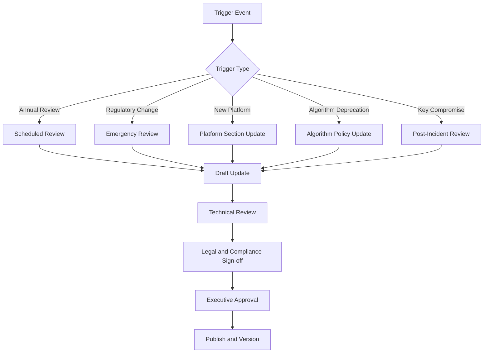

---

## 2. Regulatory & Standards Framework

### 2.1 Governing Regulatory Hierarchy

All cryptographic controls in this document derive from the following hierarchy. Higher tiers take precedence. Within the same tier, Hong Kong-specific requirements take precedence over international standards.

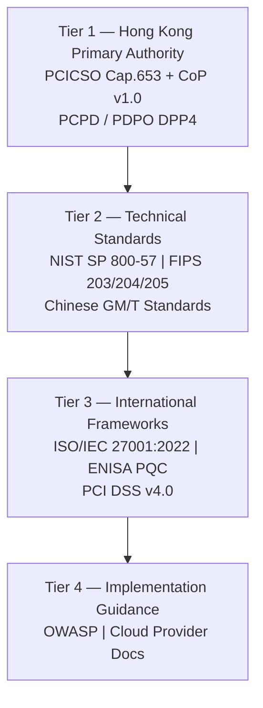

| Tier | Framework | Status | Core Relevance |
|------|-----------|--------|----------------|
| 1 | HK PCICSO CoP v1.0 | Mandatory | Proper use of cryptography; define key management policy |
| 1 | HK PCICSO Cap. 653 | Mandatory | Governing legislation |
| 1 | PCPD data security guidance | Mandatory | Encrypt sensitive personal data |
| 2 | NIST SP 800-57 Part 1 Rev. 5 / Rev. 6 IPD | Normative | Full key lifecycle and cryptoperiod guidance |
| 2 | FIPS 203 / 204 / 205 | Normative | PQC standards |
| 2 | NIST SP 800-175B | Normative | Guidance on using cryptographic standards |
| 2 | Chinese GM/T standards | Conditional | Mainland China interoperability/compliance |
| 3 | ISO/IEC 27001:2022 | Certification control | Cryptographic policy and key management |
| 3 | ISO/IEC 19790 | Normative | HSM and cryptographic module requirements |
| 3 | ENISA PQC roadmap | Informative | PQC migration planning |
| 4 | OWASP Cryptographic Storage Cheat Sheet | Informative | Developer patterns |

### 2.2 HK CoP Cryptographic Requirements Mapping

| CoP Area | Requirement | Implementing Section |
|----------|-------------|---------------------|
| Proper use of cryptography | Apply effective cryptography aligned to current standards | [§3](#3-cryptographic-taxonomy--definitions), [§5](#5-algorithm-approval-policy--cipher-suite-standards) |
| Key management policy | Define lifecycle management policy | [§4](#4-key-management-lifecycle), [§11](#11-roles-responsibilities--governance) |
| Key protection | Protect and manage keys through lifecycle | [§4](#4-key-management-lifecycle) |
| Standards alignment | Use latest national / international standards | [§2.1](#21-governing-regulatory-hierarchy), [§6](#6-quantum-safe-migration-programme) |
| Monitoring | Log and monitor relevant security events | [§9](#9-monitoring-detection--siem-integration) |
| Incident reporting | Report significant cyber incidents | [§10.3](#103-regulatory-notification-obligations) |

### 2.3 Compliance Calendar

| Date / Milestone | Action Required |
|------------------|-----------------|
| 2026 | Complete baseline cryptographic asset inventory |
| 2026 | Confirm no forbidden algorithms remain in production |
| 2027 | Deploy crypto-agility architecture for new systems |
| 2028 | Retire RSA-2048 for standard new use |
| 2030 | Complete high-priority hybrid / PQC migrations |
| 2031 | Target full PQC for priority asymmetric use cases |

---

## 3. Cryptographic Taxonomy & Definitions

### 3.1 Terminology Glossary

| Term | Definition |
|------|-----------|
| Cryptoperiod | The approved period during which a key is authorised for use |
| CMK | Customer Master Key in KMS used to protect DEKs |
| DEK | Data Encryption Key used to encrypt application data |
| KEK | Key Encryption Key used to wrap other keys |
| Envelope Encryption | DEK encrypts data; CMK encrypts the DEK |
| HSM | Hardware Security Module providing strong protection for key material |
| KMS | Key Management System for centralised lifecycle management |
| CA | Certificate Authority issuing digital certificates |
| CRL | Certificate Revocation List |
| OCSP | Online Certificate Status Protocol |
| Crypto-Agility | Ability to change algorithms with minimal system impact |
| PQC | Post-Quantum Cryptography |
| Hybrid Cryptography | Simultaneous use of classical and PQC algorithms during transition |
| Zeroization | Sanitising key material so it cannot be recovered |

### 3.2 Cryptographic Function Types

#### 3.2.1 Symmetric Encryption

| Attribute | Detail |
|-----------|--------|
| Purpose | Bulk confidentiality for data at rest and in transit |
| Approved algorithms | AES-256-GCM, ChaCha20-Poly1305 |
| Key length | 256-bit minimum |
| Quantum status | Resistant with sufficient key size |
| Typical use cases | Database TDE, object storage, session payloads |

#### 3.2.2 Asymmetric Encryption / Key Encapsulation

| Attribute | Detail |
|-----------|--------|
| Purpose | Key establishment and public-key encryption of small payloads |
| Approved algorithms | ECDH P-384, X25519, RSA-4096 OAEP for legacy interop |
| Quantum status | Vulnerable |
| PQC path | ML-KEM-768 |
| Typical use cases | TLS key exchange, SSH session establishment |

#### 3.2.3 Digital Signatures

| Attribute | Detail |
|-----------|--------|
| Purpose | Authenticity, integrity, non-repudiation |
| Approved algorithms | ECDSA P-384, Ed25519, RSA-PSS 4096 |
| Quantum status | Vulnerable |
| PQC path | ML-DSA-65 and SLH-DSA |
| Typical use cases | JWT signing, code signing, TLS certificates |

#### 3.2.4 Hash Functions

| Attribute | Detail |
|-----------|--------|
| Purpose | Integrity verification and fingerprinting |
| Approved algorithms | SHA-256, SHA-384, SHA-512, SHA-3-256, BLAKE3 |
| Forbidden | MD5, SHA-1 |
| Typical use cases | File integrity, certificate fingerprints |

#### 3.2.5 HMAC

| Attribute | Detail |
|-----------|--------|
| Purpose | Integrity plus authentication |
| Approved algorithms | HMAC-SHA256, HMAC-SHA384, HMAC-SHA3-256 |
| Typical use cases | API request signing, webhook verification |

#### 3.2.6 Key Derivation Functions

| Attribute | Detail |
|-----------|--------|
| Purpose | Deriving keys from master secrets or passwords |
| Approved algorithms | Argon2id, PBKDF2-SHA256 in FIPS contexts, HKDF-SHA256 |
| Typical use cases | Password storage, key derivation |

#### 3.2.7 PKI & X.509 Certificates

| Attribute | Detail |
|-----------|--------|
| Purpose | Binding public keys to identities |
| Format | X.509 v3 |
| Approved signature algorithms | ECDSA P-384, RSA-PSS 4096 |
| Typical use cases | TLS, mTLS, code signing |

#### 3.2.8 Chinese Cryptographic Standards

| Attribute | Detail |
|-----------|--------|
| Algorithms | SM2, SM3, SM4 |
| Applicability | Mainland China operations and interoperability |
| Approach | Hybrid alongside international algorithms |

#### 3.2.9 Secrets (Non-Cryptographic Keys)

| Attribute | Detail |
|-----------|--------|
| Purpose | API tokens, passwords, service credentials |
| Protection | Must be encrypted at rest and retrieved at runtime |
| Platforms | CyberArk, cloud secrets services |

### 3.3 Forbidden & Deprecated Algorithm List

| Algorithm / Protocol | Status | Action |
|----------------------|--------|--------|
| MD5 | Forbidden | Replace immediately |
| SHA-1 for signatures | Forbidden | Replace immediately |
| SSL 2.0 / 3.0 | Forbidden | Disable immediately |
| TLS 1.0 / 1.1 | Forbidden | Disable immediately |
| RC4 | Forbidden | Remove immediately |
| DES / 3DES | Forbidden | Replace immediately |
| RSA < 2048 | Forbidden | Regenerate |
| AES-ECB | Forbidden | Replace with AEAD |
| HMAC-SHA1 | Deprecated | Sunset by 2027 |
| RSA-2048 | Deprecated | Sunset by 2028 |
| ECDSA P-256 | Deprecated for new use | Prefer P-384 |
| AES-128 in high-security contexts | Deprecated for new use | Prefer AES-256 |

---

## 4. Key Management Lifecycle

All keys must be registered in the Key Inventory Registry in [Appendix C](#appendix-c--key-inventory-registry-template).

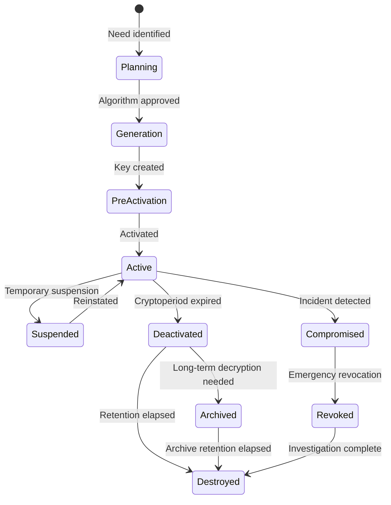

### 4.1 Key Generation

Production keys must be generated from approved entropy sources. HSM-generated keys are mandatory for root CA keys, externally trusted signing keys, and highly sensitive master keys. Software generation is acceptable only for ephemeral session keys or DEKs generated under a KMS control plane.

### 4.2 Key Storage & Protection

Envelope encryption is mandatory for application data. Plaintext CMKs must never be exposed to applications. Root keys belong in the on-prem HSM or equivalent HSM-backed cloud service.

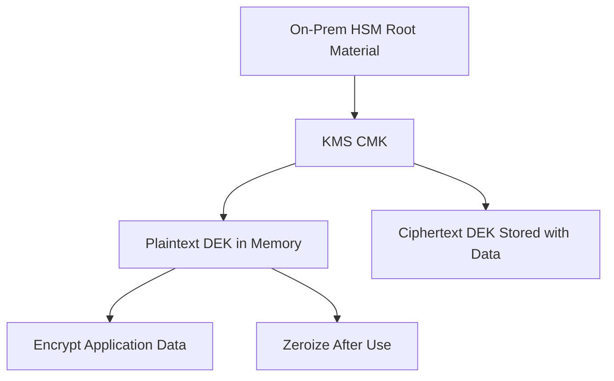

### 4.3 Key Distribution & Wrapping

Key transport must use AES Key Wrap, platform-native import mechanisms, or an HSM-backed trust path. Plaintext key material must never traverse a network unprotected or be written to logs.

### 4.4 Key Usage Controls

Cryptoperiods must be defined by key type and enforced operationally.

| Key Type | Standard Cryptoperiod |
|----------|-----------------------|
| DEK | Up to 2 years |
| Session key | Single session |
| TLS private key | 1 year |
| HMAC key | 1 year |
| KMS CMK | 1–3 years depending on platform and rotation policy |
| Root CA key | 10–25 years under offline protection |

### 4.5 Key Rotation

Automated rotation is preferred wherever supported by the platform. Manual rotation is permitted only with documented runbooks and evidence.

### 4.6 Key Backup & Recovery

Key backups must be encrypted under a separate backup KEK and tested at least annually. RTO for production CMK recovery should be less than 1 hour unless formally excepted.

### 4.7 Key Revocation & Suspension

Revocation triggers include confirmed or suspected key compromise, unauthorised use, staff departure affecting privileged key access, and third-party PKI compromise notifications.

### 4.8 Key Archival & Destruction

Key destruction must follow NIST SP 800-88 style zeroization where applicable and be evidenced with a destruction record retained for audit.

---

## 5. Algorithm Approval Policy & Cipher Suite Standards

### 5.1 Approved TLS Cipher Suites

TLS 1.3 is mandatory for all new service endpoints. TLS 1.2 is allowed only for documented legacy interop.

**TLS 1.3 preferred suites:**

```text
TLS_AES_256_GCM_SHA384
TLS_CHACHA20_POLY1305_SHA256
TLS_AES_128_GCM_SHA256
```

**TLS 1.2 legacy-approved suites:**

```text
TLS_ECDHE_ECDSA_WITH_AES_256_GCM_SHA384
TLS_ECDHE_RSA_WITH_AES_256_GCM_SHA384
TLS_ECDHE_ECDSA_WITH_CHACHA20_POLY1305_SHA256
```

### 5.2 SSH Configuration Standards

Approved SSH standards require Ed25519 or ECDSA host keys, modern key exchange, and password authentication disabled in production.

```text
HostKey /etc/ssh/ssh_host_ed25519_key
HostKey /etc/ssh/ssh_host_ecdsa_key
KexAlgorithms curve25519-sha256,ecdh-sha2-nistp384
Ciphers chacha20-poly1305@openssh.com,aes256-gcm@openssh.com
MACs hmac-sha2-512-etm@openssh.com,hmac-sha2-256-etm@openssh.com
PasswordAuthentication no
PermitRootLogin no
```

### 5.3 Data-at-Rest Encryption Standards

| Storage Type | Required Encryption | Key Management |
|-------------|--------------------|----------------|
| AWS S3 | SSE-KMS with CMK | AWS KMS |
| AWS RDS | TDE with CMK | AWS KMS |
| Alibaba OSS | SSE-KMS | Alibaba KMS |
| Huawei OBS | SSE-KMS | Huawei DEW |
| Kubernetes etcd secrets | Envelope encryption | KMS plugin |
| On-prem databases | TDE or application-layer encryption | HSM-backed key |

### 5.4 Code Signing & Container Image Signing

All container images promoted to production must be signed. Signing keys must be held in KMS or HSM-backed systems, never on developer workstations.

### 5.5 Certificate Authority Policy

Public certificates may be sourced only from approved public CAs. Internal PKI must use an HSM-backed root CA with offline protection. Wildcard certificates should be minimised and explicitly approved.

---

## 6. Quantum-Safe Migration Programme

### 6.1 Threat Timeline & Business Rationale

The organisation must plan for harvest-now-decrypt-later risk. Long-lived confidential data requires asymmetric protection that can survive the arrival of cryptographically relevant quantum computers.

### 6.2 PQC Algorithm Adoption

| Purpose | Current | Transition | Target |
|---------|---------|-----------|--------|
| Key exchange | ECDH P-384 | ECDH + ML-KEM-768 | ML-KEM-768 |
| Signatures | ECDSA P-384 | ECDSA + ML-DSA-65 | ML-DSA-65 |
| Stateless signatures | RSA-PSS | RSA-PSS + SLH-DSA | SLH-DSA |
| Symmetric encryption | AES-256-GCM | No change | AES-256-GCM |

### 6.3 Migration Phases

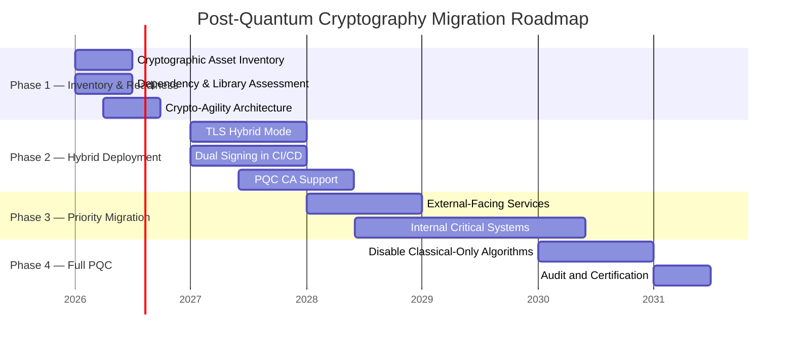

### 6.4 Crypto-Agility Implementation Guidelines

Applications must not hard-code algorithm choices inside business logic. Use provider abstractions, versioned key metadata, and libraries that support planned PQC transitions.

---

## 7. Cryptographic Architecture — Technology Stack

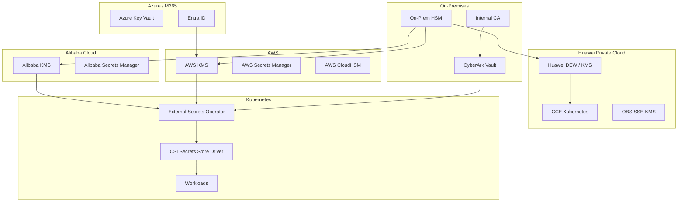

### 7.1 On-Premises HSM

Use cases include root CA storage, high-assurance signing keys, and trust anchoring for cross-cloud key strategies. Dual control and split knowledge are mandatory for administration.

### 7.2 CyberArk Vault & Conjur

CyberArk is the strategic vault for privileged secrets, application secrets, and selected cryptographic key-adjacent materials across both VM and Kubernetes environments.

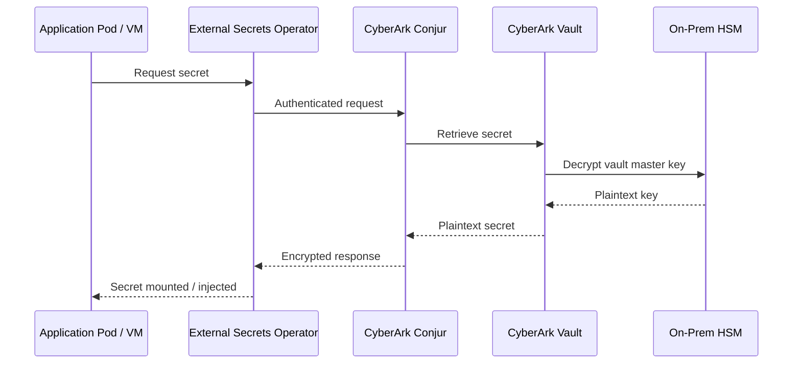

### 7.3 AWS KMS & Secrets Manager

AWS KMS should manage CMKs per region and classification tier. Enable automatic rotation, CloudTrail logging, and CloudHSM-backed custom key stores for the most sensitive use cases.

### 7.4 Alibaba Cloud KMS

Alibaba KMS should be used for envelope encryption, CMK management, and integration with OSS, ECS, and RDS encryption controls.

### 7.5 Huawei Private Cloud — DEW & KMS

Huawei DEW and Dedicated HSM should be used for private cloud key control, storage encryption, and CCE secret protection.

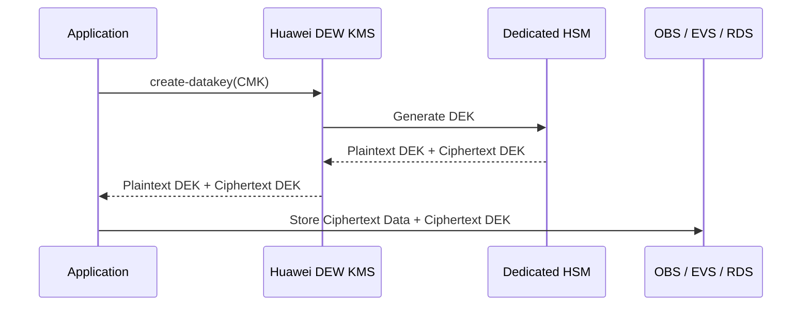

### 7.6 Azure Key Vault & Entra ID

Azure Key Vault should manage certificates, secrets, and keys for Azure workloads, while Entra ID manages token-signing and identity-driven access patterns.

### 7.7 GCP Cloud KMS (Future State)

Upon adoption, GCP workloads must use Cloud KMS and CMEK for regulated data. Workload Identity Federation should be preferred over long-lived service account keys.

---

## 8. Developer Implementation Guide

### 8.1 How to Use This Guide

Use the decision process below before implementing a cryptographic control. Then complete the design template in [Appendix B](#appendix-b--cryptographic-function-design-template).

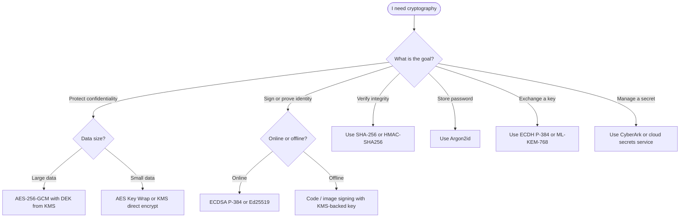

### 8.2 Cryptographic Function Design Template

Every new implementation must complete the template in Appendix B covering function purpose, algorithm selection, key source, storage, rotation, dependencies, implementation library, and sign-off.

### 8.3 Secrets Management for Applications

Applications must retrieve secrets at runtime using workload identity and approved vault/KMS services. Secrets must not be embedded in code, images, or plaintext configuration files.

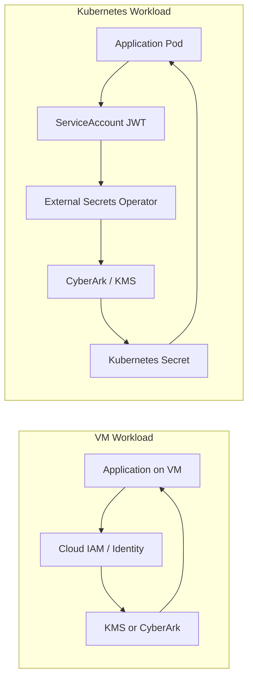

### 8.4 TLS/mTLS Implementation Patterns

Service-to-service traffic in Kubernetes should use strict mTLS via service mesh or cert-manager managed certificates. Certificates must auto-renew before expiry and use approved key types.

### 8.5 JWT & Token Signing

**Approved JWT signing algorithms:**

| Algorithm | Status | Use Case |
|-----------|--------|---------|
| ES384 | Preferred | New JWT issuance |
| EdDSA (Ed25519) | Approved | Where ecosystem support exists |
| RS256 / RSA-PSS | Legacy only | Backward compatibility |
| HS256 | Restricted | Intra-service only |

**JWKS rotation flow:**
1. Generate new signing key in KMS.
2. Publish new `kid` in JWKS alongside old key.
3. Start issuing with the new key.
4. Wait for old token TTL to expire.
5. Remove old key from JWKS and disable old key material.

### 8.6 Database & Storage Encryption

| Scenario | Recommended Approach | Rationale |
|----------|----------------------|-----------|
| Cloud-managed DB | TDE with CMK | Strong baseline with managed controls |
| Sensitive fields | Application-layer AES-256-GCM | Protects against DB admin access |
| Object storage | SSE-KMS with CMK | Centralised lifecycle and auditing |
| On-prem DB | Application-layer or HSM-backed TDE | Aligns to HSM trust model |

Production and non-production environments must use separate keys.

### 8.7 Container Image Signing

All production container images must be signed and verified at admission.

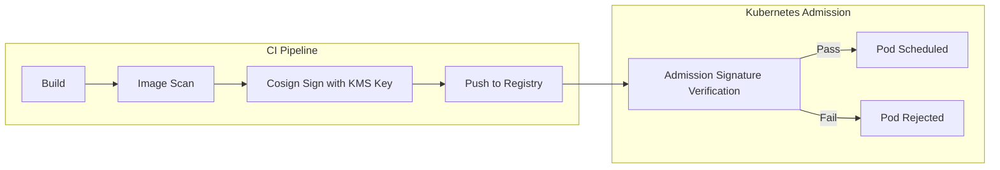

---

## 9. Monitoring, Detection & SIEM Integration

Cryptographic events are high-value security telemetry and must be forwarded into enterprise monitoring pipelines.

### 9.1 Cryptographic Events to Monitor

| Event Category | Example Events | Severity | Action |
|----------------|---------------|----------|--------|
| Key access anomaly | Mass decrypt spike, off-hours access | High | Alert + ticket |
| Algorithm violation | Forbidden ciphers or protocols observed | Critical | Alert + contain |
| Certificate anomaly | Expiry, revoked cert presented | High | Alert + renew |
| Admin operation | Key deletion, policy change, new CMK | Medium | Notify Security |
| Rotation overdue | Cryptoperiod exceeded | High | Enforce remediation |
| HSM admin event | Admin login, tamper alert | Critical | Immediate escalation |

### 9.2 Log Sources & SIEM Integration

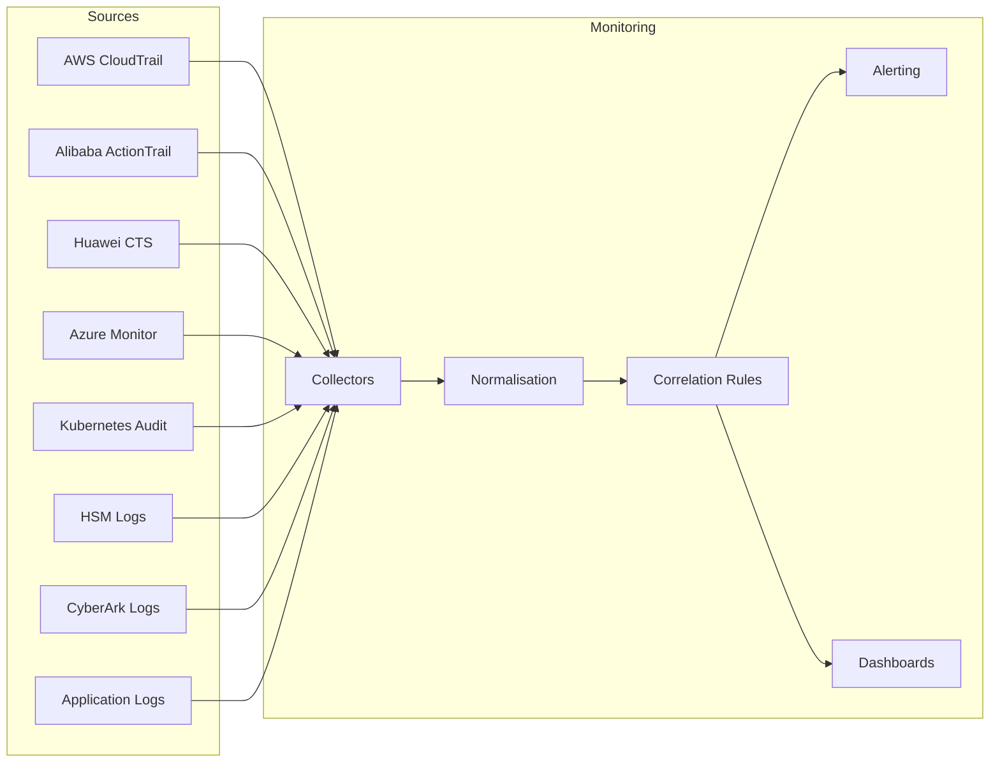

### 9.3 Key SIEM Correlation Rules

- Detect mass `Decrypt` spikes outside approved batch roles.
- Detect CMK administrative changes outside change windows.
- Alert on certificates with fewer than 30 days remaining.
- Alert on forbidden algorithms negotiated in network traffic or application telemetry.
- Alert on unexpected secret access principals.
- Alert on HSM tamper and administration events.

---

## 10. Key Compromise & Incident Response

### 10.1 Compromise Indicators

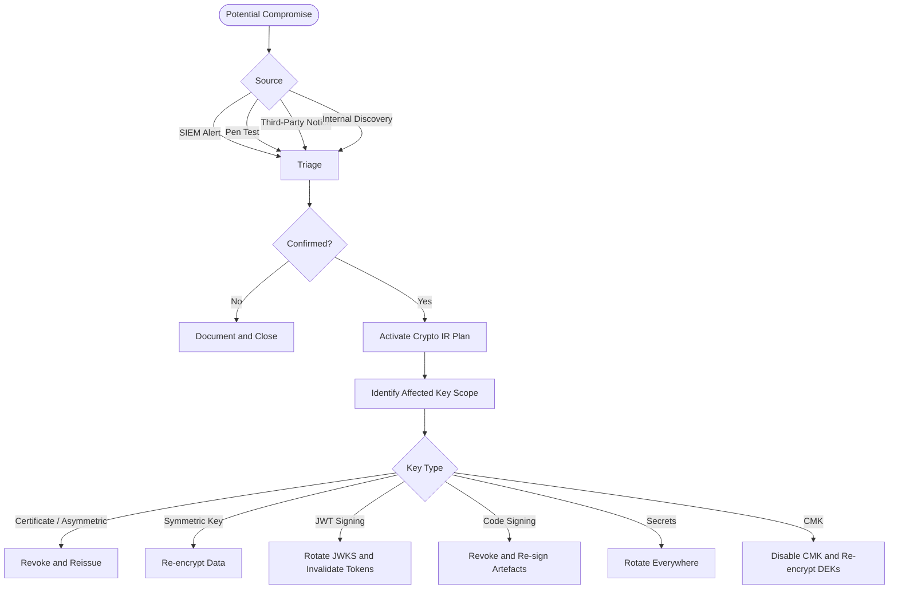

### 10.2 Emergency Revocation Procedures

| Platform | Immediate Action |
|----------|------------------|
| AWS KMS | Disable key |
| Alibaba KMS | Disable CMK |
| Huawei DEW | Disable key version |
| Azure Key Vault | Disable key version |
| CyberArk | Rotate and disable affected account |
| X.509 PKI | Revoke via CRL + OCSP |
| JWKS / JWT | Remove old key and invalidate active tokens |
| Kubernetes Secret | Rotate source secret and restart workloads if required |

### 10.3 Regulatory Notification Obligations

Assess whether the incident is significant under HK critical infrastructure obligations and whether it affects personal data subject to PCPD expectations. Legal and compliance review is mandatory for regulated incidents.

### 10.4 Post-Compromise Recovery

Perform independent scoping, replace root material where needed, verify re-encryption completion, review root cause, document lessons learned, and update the Key Inventory Registry.

---

## 11. Roles, Responsibilities & Governance

### 11.1 Role Definitions

| Role | Responsibilities |
|------|------------------|
| Crypto Officer | Owns policy, approves exceptions, chairs key ceremonies |
| Key Custodian | Operates rotation, inventory, backups, revocation steps |
| Security Architect | Reviews designs and platform implementations |
| Developer | Implements approved patterns; completes design template |
| Crypto Auditor | Independently reviews logs, rotations, and compliance |
| System Owner | Accountable for system-specific compliance |

### 11.2 Separation of Duties & RACI

| Operation | Crypto Officer | Key Custodian | Security Architect | Developer | Crypto Auditor | CISO |
|-----------|:--------------:|:-------------:|:-----------------:|:---------:|:--------------:|:----:|
| Standard key generation | A | R | C | I | I | I |
| Root key ceremony | A/R | R | C | - | I | I |
| Rotation | A | R | C | I | I | - |
| Emergency revocation | A/R | R | C | I | I | I |
| Exception approval | A | - | C | I | - | C |
| Annual policy review | A | C | R | C | C | A |

---

## 12. Third-Party & Supply Chain Cryptography

### 12.1 External PKI & Certificate Authority Policy

Approved public CAs are restricted to named providers. Internal PKI must use HSM-backed roots and controlled subordinate issuance. CAA DNS records must be configured for organisation-managed domains.

### 12.2 Third-Party Integration Assessment Checklist

| Assessment Area | Requirement |
|-----------------|-------------|
| Key custody | Customer-managed or BYOK preferred for sensitive data |
| Data residency | Must align to HK and contractual obligations |
| HSM validation | Minimum assurance defined by sensitivity tier |
| Algorithm support | Must support TLS 1.3 and published roadmap |
| Compliance | Validate relevant certifications |
| Exit strategy | Key portability and recovery must be defined |
| Notification SLA | Compromise notification timeline must be contractual |

### 12.3 Open Source Library Governance

All cryptographic implementations must use approved libraries. Custom cryptographic algorithm implementations are strictly forbidden.

**Approved libraries by language:**

| Language | Approved Library | Notes |
|----------|------------------|-------|
| Python | `cryptography` (PyCA) | Use high-level APIs where possible |
| Java | Bouncy Castle, JDK crypto with approved provider | Bouncy Castle useful for PQC pathfinding |
| Go | Standard `crypto/*`, `golang.org/x/crypto` | Keep packages current |
| Node.js | Built-in `crypto` module | Avoid unmaintained packages |
| .NET | `System.Security.Cryptography` | Prefer framework-native primitives |
| Rust | `ring`, `rustls` | Review PQC support separately |

**Software composition analysis and vulnerability management function:**
- Identify direct and transitive open-source dependencies used by the application.
- Detect publicly disclosed vulnerabilities in those dependencies.
- Alert developers and platform owners when vulnerable libraries are present.
- Generate update recommendations or automated pull requests where supported.
- Provide evidence for audit that dependency vulnerabilities are being monitored and remediated.

**Examples of suitable dependency / SCA tools:**

| Tool | Primary Function | Typical Use |
|------|------------------|-------------|
| OWASP Dependency-Check | Scans project dependencies and maps them to known CVEs | CLI, Maven, Gradle, Jenkins, GitHub Actions |
| GitHub Dependabot | Surfaces dependency alerts and creates security or version update pull requests | GitHub-hosted repositories |
| Snyk Open Source | Detects vulnerable open-source dependencies and helps prioritise and fix them | CI/CD pipelines and developer workflows |
| Mend / Renovate | Dependency update automation and policy-driven dependency maintenance | Large multi-repo environments |
| Trivy | Dependency and container vulnerability scanning | CI pipelines and container/image workflows |
| Grype | Vulnerability scanning for packages and SBOMs | CI pipelines and SBOM-driven review |

**Governance requirements:**
- Dependency scanning must run at pull request, build, and scheduled repository scan intervals.
- Critical vulnerabilities in cryptographic libraries must be triaged immediately and patched within the defined security SLA.
- Dependency manifests and lock files must be committed and version controlled.
- Exceptions for vulnerable libraries require documented approval, compensating controls, and an expiry date.

---

## 13. Appendices

### Appendix A — Platform Integration Technical Reference

#### A.1 AWS KMS — Terraform CMK Example

```hcl
resource "aws_kms_key" "restricted_data" {
  description             = "CMK for Restricted data"
  enable_key_rotation     = true
  deletion_window_in_days = 30
}
```

#### A.2 Alibaba KMS — Envelope Encryption Pattern

```python
# Pseudocode example
plaintext_dek, ciphertext_dek = kms.generate_data_key(cmk_id)
ciphertext = aes_gcm_encrypt(plaintext_dek, plaintext)
store(ciphertext, ciphertext_dek)
zeroize(plaintext_dek)
```

#### A.3 Huawei DEW — Envelope Encryption Pattern

```python
# Pseudocode example
plaintext_dek, ciphertext_dek = dew.create_datakey(cmk_id)
ciphertext = aes_gcm_encrypt(plaintext_dek, plaintext)
store(ciphertext, ciphertext_dek)
zeroize(plaintext_dek)
```

#### A.4 CyberArk Conjur — External Secrets Operator Example

```yaml
apiVersion: external-secrets.io/v1beta1
kind: SecretStore
metadata:
  name: cyberark-conjur
spec:
  provider:
    conjur:
      url: https://conjur.internal.example.com
```

#### A.5 On-Prem HSM to AWS XKS Concept

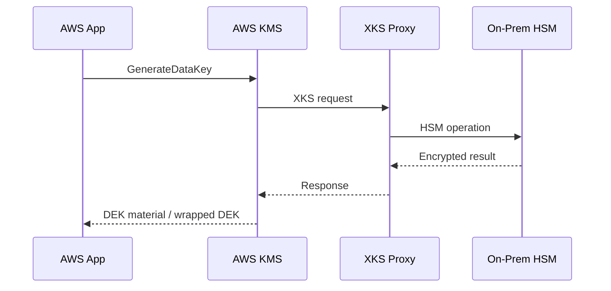

#### A.6 Azure Key Vault — Certificate Rotation Concept

```bicep
resource cert 'Microsoft.KeyVault/vaults/certificates@2023-07-01' = {
  name: 'production-tls'
}
```

#### A.7 GCP Cloud KMS Placeholder

Add Cloud KMS, Cloud HSM, CMEK, and Workload Identity Federation patterns upon GCP adoption.

### Appendix B — Cryptographic Function Design Template

| Field | Value |
|-------|-------|
| Function name / description | |
| System / microservice | |
| Repository and module path | |
| Data classification | |
| Cryptographic function type | |
| Selected algorithm | |
| Key length / parameters | |
| Justification | |
| Key generation method | |
| Key storage location | |
| Rotation schedule | |
| External dependencies | |
| Library and version | |
| Error handling | |
| Logging check (no key material logged) | |
| Developer sign-off | |
| Security Architect sign-off | |

### Appendix C — Key Inventory Registry Template

| Field | Description |
|-------|-------------|
| Key ID | Unique identifier |
| Key Name / Alias | Human-readable name |
| Key Type | Symmetric / Asymmetric / HMAC / Secret / Certificate |
| Algorithm | Algorithm used |
| Key Length | Bits |
| Purpose | Protected function |
| Data Classification | Classification level |
| Owning System | System name |
| System Owner | Owner role |
| Key Custodian | Responsible role |
| Storage Location | ARN / path / vault location |
| Creation Date | Date created |
| Activation Date | Date activated |
| Rotation Due | Next rotation date |
| Last Rotation Date | Previous rotation date |
| Lifecycle State | Current state |
| PQC Migration Priority | Critical / High / Medium / Low |
| Exception Reference | Exception ID if any |

### Appendix D — Compliance Checklist

- [ ] Current cryptographic policy exists and has been reviewed within 12 months.
- [ ] All keys are recorded in the key inventory.
- [ ] No forbidden algorithms remain in production.
- [ ] Rotation is current for all production keys.
- [ ] KMS and vault audit logs are forwarded for monitoring.
- [ ] Certificate expiry monitoring is active.
- [ ] Container image signing is enforced in production.
- [ ] PQC migration priorities are assigned.

### Appendix E — Approved Algorithm Quick Reference Card

#### Use These

| Purpose | Algorithm |
|---------|-----------|
| Data encryption | AES-256-GCM |
| Alternative symmetric | ChaCha20-Poly1305 |
| Key exchange | ECDH P-384 |
| Signatures | ECDSA P-384 / Ed25519 |
| Hash | SHA-256 / SHA-384 / SHA-3 |
| HMAC | HMAC-SHA256 |
| Password storage | Argon2id |

#### Never Use

| Algorithm | Reason |
|-----------|--------|
| MD5 | Broken |
| SHA-1 | Broken for signatures |
| DES / 3DES | Obsolete |
| RC4 | Broken |
| AES-ECB | Unsafe mode |
| SSLv2 / SSLv3 / TLS1.0 / TLS1.1 | Obsolete protocols |
| DIY crypto | Unacceptable risk |

---

## 14. References

### Hong Kong Regulatory

- **[R1]** Office of the Commissioner for Critical Infrastructure and Cybersecurity Supervision (OCCICS). *Protection of Critical Infrastructures (Computer Systems) Code of Practice, Version 1.0.* <https://www.occics.gov.hk/filemanager/en/content_19/CoP_en_v1.0.pdf>
- **[R2]** Hong Kong SAR Government. *Protection of Critical Infrastructures (Computer Systems) Ordinance, Cap. 653.* <https://www.elegislation.gov.hk/hk/cap653>
- **[R3]** Office of the Privacy Commissioner for Personal Data (PCPD). *Guidance on Data Security Measures for Information and Communications Technology.* <https://www.pcpd.org.hk/english/resources_centre/publications/files/guidance_datasecurity_e.pdf>

### NIST Standards

- **[R4]** NIST. *SP 800-57 Part 1 Rev. 6 (IPD).* <https://csrc.nist.gov/pubs/sp/800/57/pt1/r6/ipd>
- **[R5]** NIST. *SP 800-57 Part 1 Rev. 5.* <https://csrc.nist.gov/pubs/sp/800/57/pt1/r5/final>
- **[R6]** NIST. *FIPS 203 — ML-KEM.* <https://csrc.nist.gov/pubs/fips/203/final>
- **[R7]** NIST. *FIPS 204 — ML-DSA.* <https://csrc.nist.gov/pubs/fips/204/final>
- **[R8]** NIST. *FIPS 205 — SLH-DSA.* <https://csrc.nist.gov/pubs/fips/205/final>
- **[R9]** NIST. *SP 800-175B Rev. 1.* <https://csrc.nist.gov/publications/detail/sp/800-175b/rev-1/final>
- **[R10]** NIST. *SP 800-88 Rev. 1.* <https://csrc.nist.gov/publications/detail/sp/800-88/rev-1/final>

### International and Cloud Provider References

- **[R11]** European Commission. *EU Coordinated Implementation Roadmap for the Transition to Post-Quantum Cryptography.* <https://digital-strategy.ec.europa.eu/en/library/coordinated-implementation-roadmap-transition-post-quantum-cryptography>
- **[R12]** ISO. *ISO/IEC 27001:2022.* <https://www.iso.org/standard/27001>
- **[R13]** ISO. *ISO/IEC 19790:2012.* <https://www.iso.org/standard/52906.html>
- **[R14]** AWS. *AWS KMS Best Practices.* <https://docs.aws.amazon.com/prescriptive-guidance/latest/encryption-best-practices/kms.html>
- **[R15]** AWS. *Choosing a Key Store.* <https://docs.aws.amazon.com/prescriptive-guidance/latest/aws-kms-best-practices/key-management.html>
- **[R16]** Alibaba Cloud. *Use Envelope Encryption with KMS.* <https://www.alibabacloud.com/help/en/kms/key-management-service/use-cases/use-envelope-encryption>
- **[R17]** Huawei Cloud. *Data Encryption Workshop.* <https://www.huaweicloud.com/intl/en-us/product/dew.html>
- **[R18]** Huawei Cloud. *Using KMS for Encryption.* <https://support.huaweicloud.com/intl/en-us/usermanual-dew/dew_01_0094.html>
- **[R19]** CyberArk. *Secrets Manager Kubernetes Architecture.* <https://docs.cyberark.com/secrets-manager-sh/latest/en/content/integrations/k8s-ocp/k8s-architecture.htm>
- **[R20]** External Secrets Operator. *CyberArk Conjur Provider.* <https://external-secrets.io/latest/provider/conjur/>
- **[R21]** OWASP. *Cryptographic Storage Cheat Sheet.* <https://cheatsheetseries.owasp.org/cheatsheets/Cryptographic_Storage_Cheat_Sheet.html>
- **[R22]** OWASP. *OWASP Dependency-Check.* <https://owasp.org/www-project-dependency-check/>
- **[R23]** GitHub Docs. *Dependabot quickstart guide.* <https://docs.github.com/en/code-security/tutorials/secure-your-dependencies/dependabot-quickstart-guide>
- **[R24]** Snyk. *Open Source Security Management.* <https://snyk.io/product/open-source-security-management/>

---

*End of Enterprise Cryptographic Management Guideline v1.0 DRAFT*
